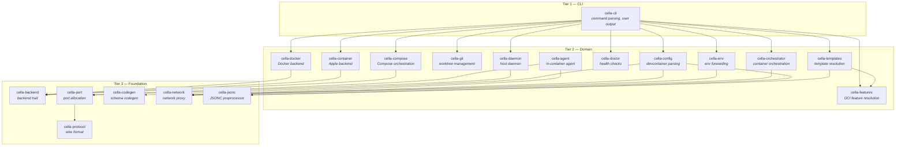

# cella

*Latin: "small room, chamber"*

A terminal-native devcontainer CLI. Built for agents.

[](LICENSE)
[](https://www.rust-lang.org/)
[](#)
[](https://github.com/eve0415/cella)

> [!WARNING]
> cella is in early development. Core commands work, but expect breaking changes.

## Why

**The spec is great. The tooling isn't.** The [Dev Container specification](https://containers.dev/) ([spec](https://github.com/devcontainers/spec)) has become a de facto standard — adopted by VS Code, JetBrains, GitHub Codespaces, CodeSandbox, and others. But the spec defines features like `forwardPorts` and `portsAttributes` that the [reference CLI](https://github.com/devcontainers/cli) simply doesn't implement. SSH agent forwarding, credential forwarding, port forwarding, and BROWSER interception all require the [VS Code Dev Containers extension](https://marketplace.visualstudio.com/items?itemName=ms-vscode-remote.remote-containers) (which runs vscode-server inside the container) to work. The CLI is a CI build tool, not a general-purpose devcontainer runtime.

**Agents are the first developers now.** AI coding agents — Claude Code, Codex, Gemini CLI — are terminal-based. They're the primary developers on many projects today. Dev containers should integrate with the terminal, not require a GUI editor. Use your own tools — Ghostty, WezTerm, Windows Terminal, tmux, Neovim — or just let the agent work headless.

**VS Code is becoming Copilot-first.** Every update pushes Copilot deeper — the sidebar opens on every new directory, features compete for attention with AI integrations. If you're not using Copilot, you're paying the overhead anyway. Dev containers shouldn't require VS Code for basic functionality like port forwarding.

**Agents pollute workspaces.** AI agents treat `/tmp` as free storage — throwaway scripts, diff files, temp artifacts, no cleanup. Containers are the answer: destroy and rebuild clean. One branch, one container, clean slate.

**The official CLI has real gaps.** It requires Node.js to run (ironic for a container tool). The maintainers confirmed: SSH agent forwarding is ["part of the extension, not the CLI"](https://github.com/devcontainers/cli/issues/441). Port forwarding was left out because ["it requires NodeJS inside the container"](https://github.com/devcontainers/cli/issues/22). No `stop` or `down` command exists ([cli#386](https://github.com/devcontainers/cli/issues/386)). cella fixes all of this with a single native binary.

## Installation

### Homebrew

```sh
brew install eve0415/tap/cella
```

### Install script

```sh
curl -fsSL https://raw.githubusercontent.com/eve0415/cella/main/install.sh | sh
```

### From source

Requires a [Rust toolchain](https://rustup.rs/) (1.95+).

```sh
cargo install --git https://github.com/eve0415/cella cella-cli
```

### Pre-built binaries

Download from [GitHub Releases](https://github.com/eve0415/cella/releases). Binaries are available for macOS (Intel, Apple Silicon) and Linux (x86_64, aarch64).

## Quick Start

Requires a Docker-compatible runtime (Docker Engine, OrbStack, or similar).

```sh
# Start a dev container
cella up

# Open a shell inside the container
cella shell

# Run a command
cella exec cargo test

# Stop and remove the container
cella down
```

## cella vs @devcontainers/cli

The [Dev Container specification](https://containers.dev/) ([spec repo](https://github.com/devcontainers/spec)) defines the standard. The [@devcontainers/cli](https://github.com/devcontainers/cli) is the official reference implementation, but many spec-defined features only work with the [VS Code extension](https://marketplace.visualstudio.com/items?itemName=ms-vscode-remote.remote-containers) (which runs vscode-server inside the container).

| | cella | @devcontainers/cli |
|---|---|---|
| Language | Rust (single native binary) | TypeScript (requires Node.js) |
| Runtime dependency | None | Node.js 14+ |
| `stop` / `down` command | Yes | No ([cli#386](https://github.com/devcontainers/cli/issues/386)) |
| Port forwarding | Automatic (daemon + in-container agent) | No — [VS Code extension only](https://github.com/devcontainers/cli/issues/22) ([cli#186](https://github.com/devcontainers/cli/issues/186)) |
| SSH agent forwarding | Platform-aware (Docker Desktop, OrbStack, Colima, Linux) | No — [VS Code extension only](https://github.com/devcontainers/cli/issues/441) |
| Git credential forwarding | gh CLI via socket + TCP, auto-on | No — [VS Code extension only](https://github.com/microsoft/vscode-remote-release/issues/4202) |
| BROWSER interception | Host browser opens for OAuth | No — [VS Code extension only](https://github.com/microsoft/vscode-remote-release/issues/9935) |
| Clipboard forwarding | Bidirectional (xsel/xclip) | No — VS Code extension only |
| Container listing | `cella list` | No ([cli#843](https://github.com/devcontainers/cli/issues/843)) |
| `runArgs` | 30+ docker create flags parsed | Yes |
| `hostRequirements` | CPU/memory/storage/GPU validation | Partial (informational only) |
| `waitFor` | Return after specified lifecycle phase | No |
| Config validation | Source-positioned diagnostics | Basic |
| Docker Compose | Yes | Yes |
| Container backends | Docker, Apple Container (experimental), Colima (experimental) | Docker, Podman |
| Podman | Not yet | Yes |
| Editor requirement | None (any terminal) | VS Code for full feature set |

## Features

### Container Lifecycle

- [x] `cella up` / `cella down` — start and stop containers
- [x] `cella shell` — attach to container shell
- [x] `cella exec` — run commands (interactive and detached)
- [x] `cella build` — pre-build images
- [x] `cella list` — list containers with status and ports
- [x] `cella logs` — container logs with `--follow`
- [x] `cella doctor` — system diagnostics with PII redaction
- [x] `read-configuration` — resolved devcontainer config output (devcontainer CLI compatible)
- [x] Docker Compose support (`dockerComposeFile`)
- [x] Git worktree integration (`cella branch`, `cella switch`, `cella prune`) — [guide](docs/worktrees.md)
- [x] Devcontainer Features (OCI registry resolution, install ordering, caching)
- [x] Feature management (`cella features edit`, `cella features list`, `cella features update`)
- [x] Project initialization (`cella init`) — interactive wizard with OCI template/feature selection
- [x] Lifecycle commands (initializeCommand, postCreate, postStart, postAttach, updateContentCommand)
- [x] Image and Dockerfile builds
- [x] Config validation with source-positioned diagnostics (`cella config validate`)
- [x] Shell completions (`cella completions`)

### Environment & Credentials

- [x] SSH agent forwarding (Docker Desktop, OrbStack, Colima, Linux)
- [x] Git config forwarding
- [x] gh CLI credential forwarding (auto-on)
- [x] AI agent config forwarding (Claude Code, Codex, Gemini CLI)
- [x] AI provider API key forwarding (read live from the host on every exec/shell — never baked into the container)
- [x] Environment variable forwarding (remoteEnv, containerEnv)
- [x] User environment probing
- [x] Bidirectional clipboard forwarding (xsel/xclip)
- [x] Bubblewrap installed for Codex sandbox support

### Spec Compliance

- [x] `runArgs` (30+ docker create flags — networking, resources, security, devices, GPU)
- [x] `hostRequirements` validation (CPU, memory, storage, GPU)
- [x] `waitFor` lifecycle phasing
- [x] `shutdownAction`
- [x] `updateContentCommand` on workspace change detection
- [x] GPU passthrough (`hostRequirements.gpu` + `runArgs --gpus`)
- [x] `appPort` deprecation warning

### Port Forwarding

- [x] Automatic port detection via /proc/net/tcp
- [x] Host daemon + in-container agent
- [x] BROWSER interception (OAuth callbacks)
- [x] Reverse tunnel port forwarding (Colima, Docker Desktop for Mac)
- [x] OrbStack-aware port handling

### Network Proxy

- [x] Path-level HTTPS blocking (denylist and allowlist modes) — [guide](docs/network-proxy.md)
- [x] Auto-generated CA certificates for HTTPS interception
- [x] Host proxy environment forwarding (HTTP_PROXY, HTTPS_PROXY, NO_PROXY)
- [x] Glob-based domain and path matching rules
- [x] Configuration via `cella.toml` and `devcontainer.json` customizations

### Editor & Terminal Integration

- [x] `cella code` — open VS Code connected to the container
- [x] `cella nvim` — open Neovim connected to the container
- [x] `cella tmux` — open tmux session inside the container
- [x] Terminal title integration (sets the host terminal title to reflect the active container/branch)

### Runtime Support

- [x] Docker Engine
- [x] OrbStack
- [x] Colima / Lima (experimental — reverse tunnel port forwarding)
- [ ] Podman

### Experimental Backends

- [x] Apple Container (macOS 26+, Apple Silicon only — pre-1.0 CLI, no Compose support)

### Planned

- [ ] `cella template new/list/edit` — template authoring (subcommands exist as stubs, not yet implemented)
- [ ] `cella config show/global/dotfiles/agent` — global/dotfiles/agent config management (subcommands exist as stubs, not yet implemented; only `cella config validate` is live)
- [ ] Podman backend

## Commands

### Container Lifecycle

| Command | Description |
|---------|-------------|
| `cella up` | Start a dev container for the current workspace |
| `cella down` | Stop and remove the dev container |
| `cella shell` | Open a shell inside the running container |
| `cella exec` | Execute a command inside the running container |
| `cella build` | Build the dev container image without starting it |
| `cella list` | List all dev containers with status and ports |
| `cella logs` | View container logs (`--follow` for streaming) |
| `cella init` | Initialize a devcontainer configuration (interactive wizard) |

### Git Worktrees

| Command | Description |
|---------|-------------|
| `cella branch <name>` | Create a new worktree-backed branch with its own container |
| `cella down --branch <name>` | Stop a worktree branch's container |
| `cella up --branch <name>` | Start or restart a worktree branch's container |
| `cella switch <name>` | Switch to a different worktree-backed branch |
| `cella prune` | Remove stale worktrees and their associated containers |

See the [worktree guide](docs/worktrees.md) for the full workflow, in-container commands, and background task system.

### Features & Templates

| Command | Description |
|---------|-------------|
| `cella features list` | List installed and available devcontainer features |
| `cella features edit` | Add, remove, or modify features in devcontainer.json |
| `cella features update` | Update features to latest versions |

### Configuration & Diagnostics

| Command | Description |
|---------|-------------|
| `cella config validate` | Validate a devcontainer.json file |
| `cella read-configuration` | Output resolved devcontainer config as JSON |
| `cella doctor` | Check system dependencies and configuration |
| `cella network` | Inspect network proxy and blocking configuration |
| `cella completions` | Generate shell completions (bash, zsh, fish, etc.) |

### Port & Credential Management

| Command | Description |
|---------|-------------|
| `cella ports` | View port forwarding status |
| `cella credential` | Manage credential forwarding |

### Editor & Terminal Integration

| Command | Description |
|---------|-------------|
| `cella code` | Open VS Code connected to the container |
| `cella nvim` | Open Neovim connected to the container |
| `cella tmux` | Open a tmux session inside the container |

## Architecture

cella is a Rust workspace with 19 focused crates. The CLI delegates all business logic to library crates — no logic lives in the binary entry point.



See [docs/architecture.md](docs/architecture.md) for details.

## Contributing

Contributions welcome. See the [contributing guide](docs/contributing.md) for build instructions and code style.

- Questions and ideas: [GitHub Discussions](https://github.com/eve0415/cella/discussions)
- Bug reports: [GitHub Issues](https://github.com/eve0415/cella/issues)

---

If you find cella useful, consider giving it a star on [GitHub](https://github.com/eve0415/cella). It helps others discover the project.

## License

[GPL-3.0](LICENSE)
