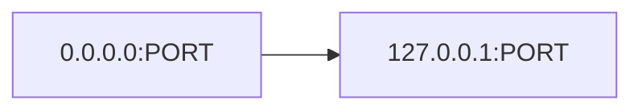
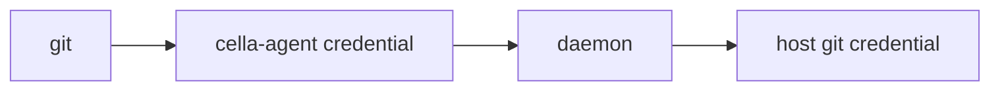

# Agent Architecture

## Overview

The cella agent runs inside each devcontainer, providing port detection,
credential forwarding, and browser integration by communicating with the
host daemon.

## Modes

### Connected Mode

When the daemon is reachable, the agent connects via TCP and operates in
full mode:

1. **Port watcher** — polls `/proc/net/tcp` for listener changes, reports
   `PortOpen`/`PortClosed` to the daemon, receives `PortMapping` responses
2. **Credential forwarder** — intercepts `git credential` requests and
   forwards them to the daemon for host-side resolution
3. **Health reporter** — sends periodic heartbeats with uptime and port
   count

### Standalone Mode

When the daemon is unreachable (timeout after retries), the agent falls back
to standalone mode:

- Port watcher runs locally without daemon communication
- Only starts localhost→all-interfaces proxies (no host port allocation)
- No credential forwarding or browser integration

## Port Watcher (`port_watcher.rs`)

Polls `/proc/net/tcp` and `/proc/net/tcp6` at a configurable interval.

### Detection loop

Each cycle:
1. Scan current listeners
2. Diff against known set
3. For new listeners: send `PortOpen`, receive `PortMapping`, start local
   proxy if localhost-bound
4. For closed listeners: send `PortClosed`, stop local proxy

### Port mapping

When the daemon responds with `PortMapping`, the agent:
- Stores the mapping in a shared `HashMap<u16, u16>` (container → host)
- Writes the map to `/tmp/cella-port-map` as JSON

This allows child processes to discover how their ports are exposed on the
host (useful for OAuth callbacks, browser-open URLs, etc.).

### Reconnection

The agent uses `ReconnectingClient` which:
- Retries initial connection with timeout
- Attempts single reconnect on send failure
- Sets `reconnected` flag so the port watcher re-reports all known ports

## Localhost Proxy (`port_proxy.rs`)

For listeners bound to `127.0.0.1` only:



Runs inside the container so the service is reachable from the container's
external network interface. The daemon's host-side proxy then reaches this.

## BrowserOpen

When a process inside the container requests a browser open (via the agent's
API), the agent sends `AgentMessage::BrowserOpen { url }` to the daemon.

The daemon:
1. Rewrites the URL if the port is remapped
2. Waits for proxy readiness (up to 2 s)
3. Opens the URL in the host browser

## Credential Forwarding

Git credential requests are handled by the agent binary via its `credential`
subcommand. Git is configured with `credential.helper = /cella/bin/cella-agent credential`,
so credential requests flow:



The agent assigns a unique ID to each request and waits for the matching
`CredentialResponse` from the daemon.

## Startup

The agent is started by the container entrypoint script:

```sh
if [ -x "$AGENT_PATH" ]; then
  "$AGENT_PATH" daemon --poll-interval "${CELLA_PORT_POLL_INTERVAL:-1000}" &
fi
```

It reads the daemon's address and auth token from environment variables
injected during container creation.
