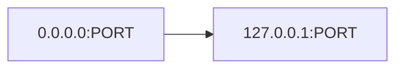
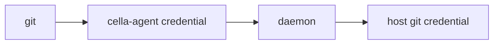

# Agent Architecture

## Overview

The cella agent runs inside each devcontainer, providing port detection,
credential forwarding, browser integration, bidirectional clipboard
forwarding, reverse tunnel port forwarding, and SSH agent bridging by
communicating with the host daemon.

## Modes

### Connected Mode (default)

When a daemon address is available (either from `CELLA_DAEMON_ADDR` or
from `/cella/.daemon_addr`), the agent retries the connection
**indefinitely** and operates in full mode once it succeeds:

1. **Port watcher** — polls `/proc/net/tcp` and `/proc/net/tcp6` for
   listener changes, reports `PortOpen`/`PortClosed` to the daemon,
   receives `PortMapping` responses
2. **Credential forwarder** — intercepts `git credential` requests and
   forwards them to the daemon for host-side resolution
3. **Browser forwarder** — forwards `BrowserOpen` requests to the
   host browser (for OAuth callbacks, etc.)
4. **Health reporter** — sends periodic heartbeats with uptime and
   port count
5. **Clipboard forwarder** — intercepts `xsel`/`xclip` invocations
   (agent binary is symlinked as both) and forwards clipboard
   copy/paste operations to the daemon via `ClipboardCopy`/`ClipboardPaste`
   messages
6. **Reverse tunnel handler** — responds to `TunnelRequest` messages
   from the daemon by opening a TCP connection back to the daemon and
   relaying to the local service, enabling port forwarding on runtimes
   without direct container-IP routing (Colima, Docker Desktop for Mac)
7. **SSH agent bridge** — listens on a Unix socket inside the container
   (`/run/host-services/ssh-auth.sock`) and bridges each connection
   over TCP to the daemon, which connects to the host's real
   `SSH_AUTH_SOCK`. Required for Colima where bind-mounting host Unix
   sockets fails due to virtiofs limitations
8. **Worktree/task proxy** — in CLI mode (see below) forwards
   `branch`, `exec`, `prune`, `down`, `up`, `switch`, and `task run/list/
   logs/wait/stop` commands to the daemon for host-side execution

### Standalone Mode (fallback only when no address is configured)

Entered only when there is no daemon address at all. In this mode the
agent runs localhost→all-interfaces proxies locally but does not
communicate with any daemon. This is a last-resort mode — when a
daemon address exists but the daemon is temporarily unreachable, the
agent stays in connecting state and retries until the daemon comes
back (it does **not** fall through to standalone).

## Port Watcher (`port_watcher.rs`)

Polls `/proc/net/tcp` and `/proc/net/tcp6` at a configurable interval.

### Detection loop

Each cycle:
1. Scan current listeners
2. Diff against known set
3. For new listeners: send `PortOpen`, receive `PortMapping`, start local
   proxy if localhost-bound
4. For closed listeners: send `PortClosed`, stop local proxy

### Port mapping

When the daemon responds with `PortMapping`, the agent:
- Stores the mapping in a shared `HashMap<u16, u16>` (container → host)
- Writes the map to `/tmp/cella-port-map` as JSON

This allows child processes to discover how their ports are exposed on the
host (useful for OAuth callbacks, browser-open URLs, etc.).

### Reconnection

The agent uses `ReconnectingClient` which:
- **Retries the initial connection indefinitely** (`connect_with_retry`),
  logging a progress warning every 30 s so the log isn't silent. The
  agent never gives up — if the daemon is late coming up, the agent
  will still be there when it arrives.
- Re-reads `/cella/.daemon_addr` on every attempt, so a new daemon
  address (e.g. after a `cella up` that restarted the daemon or
  replaced the binary) is picked up automatically without restarting
  the agent.
- On a send failure during normal operation, attempts reconnect; on
  success, sets a `reconnected` flag so the port watcher re-reports
  all known ports and state is restored.

## Localhost Proxy (`port_proxy.rs`)

For listeners bound to `127.0.0.1` only:



Runs inside the container so the service is reachable from the container's
external network interface. The daemon's host-side proxy then reaches this.

## BrowserOpen

When a process inside the container requests a browser open (via the agent's
API), the agent sends `AgentMessage::BrowserOpen { url }` to the daemon.

The daemon:
1. Rewrites the URL if the port is remapped
2. Waits for proxy readiness (up to 2 s)
3. Opens the URL in the host browser

## Credential Forwarding

Git credential requests are handled by the agent binary via its `credential`
subcommand. Git is configured with `credential.helper = /cella/bin/cella-agent credential`,
so credential requests flow:



The agent assigns a unique ID to each request and waits for the matching
`CredentialResponse` from the daemon.

## Startup

The agent is started by the container entrypoint script under a
restart loop so the daemon binary can be replaced in place (e.g. after
`cella up` upgrades the agent). From `cella-orchestrator`'s perspective
a restart is `pkill -f 'cella-agent daemon'; sleep 1; pgrep ... ||
spawn`. The loop (in newer containers) picks it back up; the manual
spawn is a backward-compat fallback for images created before the
restart loop existed.

```sh
if [ -x "$AGENT_PATH" ]; then
  "$AGENT_PATH" daemon --poll-interval "${CELLA_PORT_POLL_INTERVAL:-1000}" &
fi
```

Configuration sources, in priority order:

1. **`CELLA_DAEMON_ADDR`** / **`CELLA_CONTROL_TOKEN`** env vars,
   injected at container creation time.
2. **`/cella/.daemon_addr`** file, refreshed by the CLI on every
   `cella up` so agents that were running before a daemon restart pick
   up the new address without intervention.

## Clipboard Forwarding (`clipboard.rs`)

The agent binary is symlinked as `/cella/bin/xsel` and `/cella/bin/xclip`
inside the container. When invoked under either name, it parses the
command-line arguments to determine the clipboard operation:

- **Copy** (`xsel -i` / `xclip -i`): reads stdin (up to 10 MiB),
  base64-encodes it, and sends `AgentMessage::ClipboardCopy` to the daemon
- **Paste** (`xsel -o` / `xclip -o`): sends `AgentMessage::ClipboardPaste`
  to the daemon, receives `DaemonMessage::ClipboardContent`, base64-decodes,
  and writes to stdout
- **Clear** (`xsel -c`): sends a zero-length copy

The daemon handles the actual clipboard access on the host using
platform-specific backends (pbcopy/pbpaste on macOS, wl-copy/wl-paste
on Wayland, xsel on X11).

## Reverse Tunnel (`tunnel.rs`)

For runtimes where the host cannot directly reach container IPs (Colima,
Docker Desktop for Mac), the daemon sends `DaemonMessage::TunnelRequest`
messages to the agent instead of opening a direct TCP proxy. The agent
handles each request by:

1. Opening a new TCP connection back to the daemon's control port
2. Sending a `TunnelHandshake` with the auth token and connection ID
3. Connecting to `127.0.0.1:<target_port>` inside the container
4. Bidirectionally copying bytes between the daemon tunnel and the local
   service

This reverses the connection direction: instead of the daemon connecting
to the container, the container connects back to the daemon, working
around the lack of direct IP routing.

## SSH Agent Bridge (`ssh_agent_bridge.rs`)

Bridges the host's SSH agent into the container over TCP. Needed for
Colima where bind-mounting host Unix sockets fails (`mkdir` on virtiofs
rejects socket paths).

The bridge:
1. Creates a Unix socket at `/run/host-services/ssh-auth.sock` (or the
   configured path) with mode 0666
2. Accepts connections from `ssh-add`, `git`, etc.
3. For each connection, opens a TCP connection to
   `host.docker.internal:<bridge_port>`, sends the auth token, then
   bidirectionally copies SSH agent protocol bytes

The daemon side (`ssh_proxy.rs`) accepts these TCP connections and
forwards each to the host's real `SSH_AUTH_SOCK` via a Unix socket
connection.

## CLI Mode

The agent binary is symlinked to `/cella/bin/cella` inside the container
so that invoking `cella` from a shell prompt enters CLI mode instead of
agent-daemon mode. CLI subcommands (`branch`, `list`, `exec`, `down`,
`up`, `switch`, `prune`, `task run/list/logs/wait/stop`) are parsed by
`cli.rs` and converted to `AgentMessage` requests sent over the
already-established control connection. Each response is streamed back
from the host daemon (progress, stdout/stderr chunks, final result) and
rendered on the caller's terminal. Manual argument parsing keeps the
binary small (no clap dependency).
