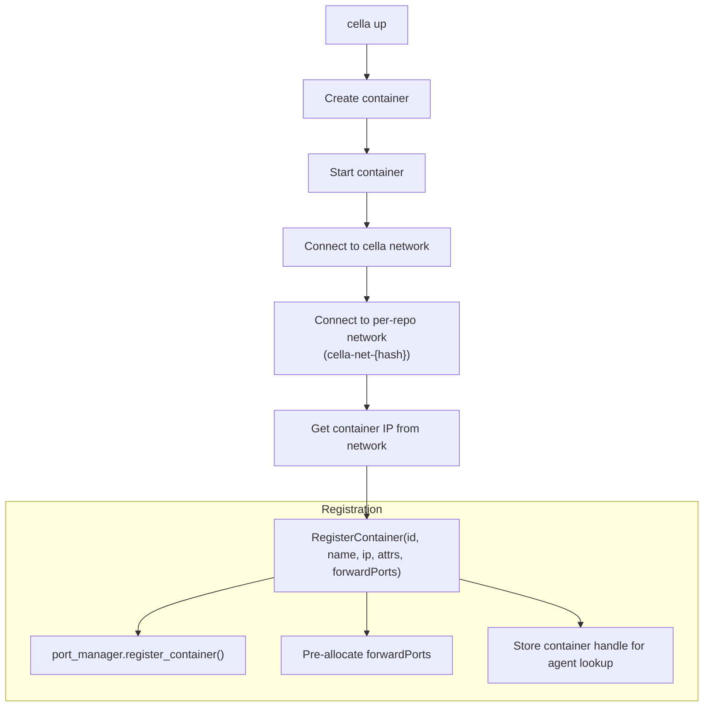
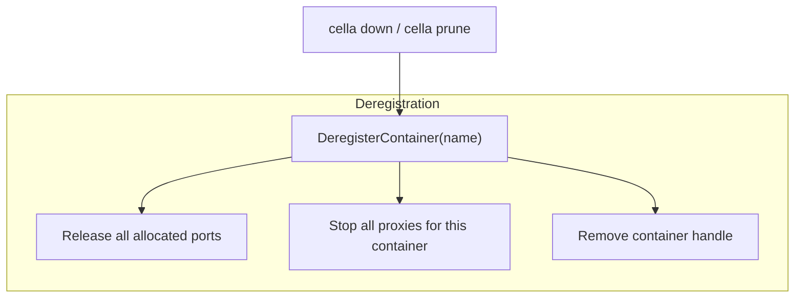

# Daemon Architecture

## Lifecycle

The cella daemon is a long-running host process that manages port
forwarding, credential forwarding, browser integration, clipboard
forwarding, reverse tunnel port forwarding, and SSH agent bridging for
all active devcontainers.

### Startup

1. CLI (`cella up`) spawns the daemon if not already running.
2. Daemon writes PID to `~/.cella/daemon.pid` and control port + auth
   token to `~/.cella/daemon.control`. On restart these are reclaimed
   from the previous run so the TCP port and token stay stable across
   binary upgrades (important so already-running agents can reconnect
   without needing a restart).
3. Binds the management socket at `~/.cella/daemon.sock`.
4. Binds the TCP control server on an ephemeral port (reported in
   status).
5. Starts the proxy coordinator task.
6. Detects OrbStack runtime (for display and `.orb.local` URLs).
7. CLI writes `/cella/.daemon_addr` into every container it starts
   (or re-starts) so the in-container agent can pick up the current
   address on its next reconnection attempt. The write happens
   **before** the agent is launched on compose workspaces so the
   agent doesn't enter the indefinite-retry state for its very first
   connection.

### Shutdown

The daemon shuts down when:
- Explicit `cella daemon stop` / `ManagementRequest::Shutdown`
- Idle timeout (no containers, no activity)
- Signal (SIGTERM)

## Components

### Management Server (`management.rs`)

Unix socket at `~/.cella/daemon.sock`. Accepts `ManagementRequest` messages
from CLI commands:

- `RegisterContainer` — registers a container with its IP, port
  attributes, `forwardPorts`, `shutdownAction`, `backend_kind`, and
  `docker_host`. For compose workspaces the CLI pre-registers with
  `container_ip: None` before the container has an IP.
- `UpdateContainerIp` — supplies the IP once the container is running
  (paired with the pre-registration flow above).
- `DeregisterContainer` — releases ports, stops proxies.
- `QueryPorts` — lists all forwarded ports across containers.
- `QueryStatus` — daemon health, uptime, container list, OrbStack
  flag, TCP control port, auth token.
- `Ping` / `Shutdown` — health check and graceful stop.

### Control Server (`control_server.rs`)

TCP server authenticated by a shared token. Accepts connections from
in-container agents. Each connection:

1. Reads `AgentHello` with container name, agent version, auth token
2. Looks up the container in registered handles
3. Retrieves the container's IP from the port manager
4. Sends `DaemonHello`
5. Enters message loop routing `AgentMessage` to handlers

### Port Manager (`port_manager.rs`)

Central state for all port forwarding:

- Per-container tracking: name, IP, detected ports, port attributes
- Global port allocation table (prevents host port conflicts)
- `ForwardedPortInfo` with `url()` (always localhost) and `orb_url()`
  (OrbStack alternative)

### Proxy Coordinator (`proxy.rs`)

Receives `ProxyCommand::Start` and `ProxyCommand::Stop` messages:

- Binds `127.0.0.1:HOST_PORT`
- Forwards TCP connections to `CONTAINER_IP:CONTAINER_PORT`
- Supports readiness notification via oneshot channel
- Proxies run unconditionally on all runtimes (including OrbStack)

### Browser Handler (`browser.rs`)

Opens URLs in the host's default browser. The daemon rewrites URLs before
opening to account for port remapping, and waits for proxy readiness.

### Task Manager (`task_manager.rs`)

Tracks `cella task run` background processes per branch/container.
Each entry holds the Docker exec abort handle, a captured output log,
an exit-code slot, and a broadcast channel so multiple
`cella task logs -f` subscribers can tail the same output live.
Exposed via the `TaskRun/TaskList/TaskLogs/TaskWait/TaskStop`
`AgentMessage` variants routed through the control server.

### Stream Bridge (`stream_bridge.rs`)

Per-exec TCP stream for interactive TTY forwarding. Opens a
short-lived listener on a random port, accepts one connection, and
bidirectionally proxies bytes between the accepted TCP stream and a
PTY master. Used by `cella switch` so in-container users get a full
PTY-backed shell in the target container via the agent → daemon →
docker-exec path.

### Clipboard Handler (`clipboard.rs`)

Handles `ClipboardCopy` and `ClipboardPaste` messages from agents.
Auto-detects the host clipboard backend at startup:

- **macOS**: `pbcopy`/`pbpaste`
- **Wayland**: `wl-copy`/`wl-paste`
- **X11**: `xsel`

Copy operations receive base64-encoded data from the agent, decode it,
and write to the host clipboard. Paste operations read from the host
clipboard and return the content as a `ClipboardContent` message with
base64-encoded data.

### Tunnel Broker (`tunnel.rs`)

Manages reverse tunnel connections for runtimes without direct
container-IP routing (Colima, Docker Desktop for Mac). Instead of the
daemon connecting directly to `CONTAINER_IP:PORT`, the daemon:

1. Allocates a connection ID via the `TunnelBroker`
2. Sends `DaemonMessage::TunnelRequest { connection_id, port }` to the
   agent over the control connection
3. The agent opens a new TCP connection back to the daemon with a
   `TunnelHandshake`
4. The broker matches the connection by ID and returns the TCP stream
   to the proxy coordinator

This reverses the connection direction, working around the lack of
direct container-IP routing on non-Linux Docker hosts.

### SSH Proxy (`ssh_proxy.rs`)

Per-workspace TCP listener that bridges the host's `SSH_AUTH_SOCK` to
in-container agents. Each accepted TCP connection:

1. Reads the auth token line
2. Opens a `UnixStream` to the host's `$SSH_AUTH_SOCK`
3. Bidirectionally copies SSH agent protocol bytes

The bridge port is communicated to the agent at registration time.
Required for Colima where bind-mounting host Unix sockets fails due to
virtiofs limitations.

## OrbStack Detection

The daemon detects OrbStack at startup. When running on OrbStack:

- TCP proxies still run (for `localhost` access)
- `ForwardedPortInfo::orb_url()` provides `container.orb.local:PORT` as an
  alternative access method (available on the `ForwardedPortInfo` type but
  not currently exposed through `QueryPorts`)

## Container Registration Flow

## Container Deregistration Flow

