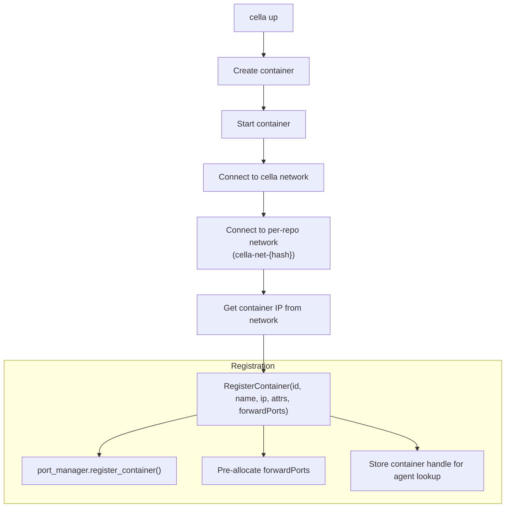
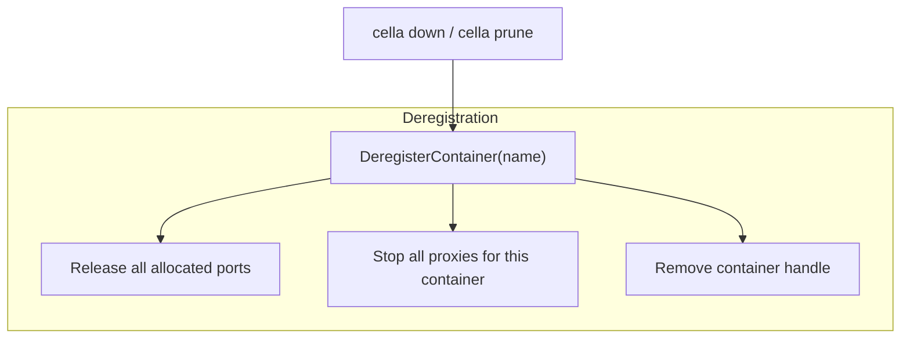

# Daemon Architecture

## Lifecycle

The cella daemon is a long-running host process that manages port
forwarding, credential forwarding, and browser integration for all active
devcontainers.

### Startup

1. CLI (`cella up`) spawns the daemon if not already running.
2. Daemon writes PID and auth token to `~/.cella/daemon.pid`.
3. Binds the management socket at `~/.cella/daemon.sock`.
4. Binds the TCP control server on an ephemeral port (reported in status).
5. Starts the proxy coordinator task.
6. Detects OrbStack runtime (for display and `.orb.local` URLs).

### Shutdown

The daemon shuts down when:
- Explicit `cella daemon stop` / `ManagementRequest::Shutdown`
- Idle timeout (no containers, no activity)
- Signal (SIGTERM)

## Components

### Management Server (`management.rs`)

Unix socket at `~/.cella/daemon.sock`. Accepts `ManagementRequest` messages
from CLI commands:

- `RegisterContainer` — registers a container with its IP, port attributes,
  and `forwardPorts` from devcontainer.json
- `DeregisterContainer` — releases ports, stops proxies
- `QueryPorts` — lists all forwarded ports across containers
- `QueryStatus` — daemon health, uptime, container list
- `Ping` / `Shutdown` — health check and graceful stop

### Control Server (`control_server.rs`)

TCP server authenticated by a shared token. Accepts connections from
in-container agents. Each connection:

1. Reads `AgentHello` with container name, agent version, auth token
2. Looks up the container in registered handles
3. Retrieves the container's IP from the port manager
4. Sends `DaemonHello`
5. Enters message loop routing `AgentMessage` to handlers

### Port Manager (`port_manager.rs`)

Central state for all port forwarding:

- Per-container tracking: name, IP, detected ports, port attributes
- Global port allocation table (prevents host port conflicts)
- `ForwardedPortInfo` with `url()` (always localhost) and `orb_url()`
  (OrbStack alternative)

### Proxy Coordinator (`proxy.rs`)

Receives `ProxyCommand::Start` and `ProxyCommand::Stop` messages:

- Binds `127.0.0.1:HOST_PORT`
- Forwards TCP connections to `CONTAINER_IP:CONTAINER_PORT`
- Supports readiness notification via oneshot channel
- Proxies run unconditionally on all runtimes (including OrbStack)

### Browser Handler (`browser.rs`)

Opens URLs in the host's default browser. The daemon rewrites URLs before
opening to account for port remapping, and waits for proxy readiness.

## OrbStack Detection

The daemon detects OrbStack at startup. When running on OrbStack:

- TCP proxies still run (for `localhost` access)
- `ForwardedPortInfo::orb_url()` provides `container.orb.local:PORT` as an
  alternative access method
- Status output shows both URLs

## Container Registration Flow

## Container Deregistration Flow

