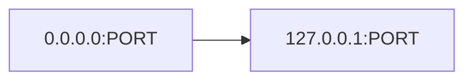
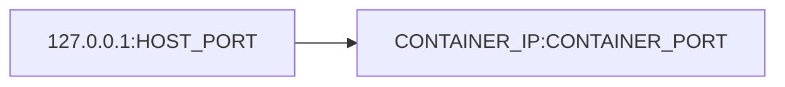

# Port Forwarding

## Port Detection

The in-container agent polls `/proc/net/tcp` and `/proc/net/tcp6` at a
configurable interval (default 1 s) to discover listening sockets.

Each scan returns a list of `DetectedListener` entries containing:

- Port number
- Protocol (TCP / UDP)
- Bind address (localhost-only vs all-interfaces)
- Inode (used to resolve the process name via `/proc/<pid>/fd`)

New listeners are reported to the daemon via `AgentMessage::PortOpen`.
Closed listeners trigger `AgentMessage::PortClosed`.

### Bind address handling

If a listener binds to `127.0.0.1` (localhost only), the agent starts a
local proxy (`0.0.0.0:PORT` → `127.0.0.1:PORT`) so the port is reachable
from outside the container's network namespace.

### IPv6

IPv6 loopback (`::1`) and wildcard (`::`) addresses are classified the same
as their IPv4 counterparts.

## Port Allocation

The daemon maintains a global `PortAllocationTable` shared across all
containers. When a container reports a new port:

1. Try to allocate the same port on the host (preferred — no rewrite needed).
2. If the port is already taken by another container, allocate the next
   available port starting from `container_port + 1`.
3. If `requireLocalPort` is set in `portsAttributes`, allocation fails
   instead of remapping.

The allocated host port is returned to the agent as a
`DaemonMessage::PortMapping` so the container can expose mappings to child
processes via `/tmp/cella-port-map`.

## Agent↔Daemon Protocol

Messages are newline-delimited JSON over a TCP connection authenticated by
a shared token.

### Agent → Daemon

| Message | Fields | Description |
|---------|--------|-------------|
| `PortOpen` | port, protocol, process, bind | New listener detected |
| `PortClosed` | port, protocol | Listener closed |
| `BrowserOpen` | url | Open URL in host browser |
| `CredentialRequest` | id, operation, fields | Git credential forwarding |
| `Health` | uptime_secs, ports_detected | Periodic heartbeat |

### Daemon → Agent

| Message | Fields | Description |
|---------|--------|-------------|
| `PortMapping` | container_port, host_port | Allocated host port |
| `CredentialResponse` | id, fields | Git credential result |
| `Config` | poll_interval_ms, proxy_localhost | Runtime config |
| `Ack` | id | Generic acknowledgment |

## Proxy Architecture

### Agent-side (inside container)

For localhost-bound listeners, the agent runs a TCP proxy:

This makes the service reachable from the container's external network
interface.

### Daemon-side (on host)

For every allocated port, the daemon runs a TCP proxy:

This makes the service reachable via `localhost:HOST_PORT` on the host,
regardless of runtime (Docker Desktop, OrbStack, Podman, etc.).

On OrbStack, `container.orb.local:PORT` also works as an alternative via
OrbStack's built-in DNS.

### Browser URL rewriting

When the agent requests `BrowserOpen`, the daemon rewrites the URL if the
target port has been remapped (e.g. `localhost:3000` → `localhost:3001`).
The daemon waits up to 2 seconds for the proxy to accept connections before
opening the browser.
