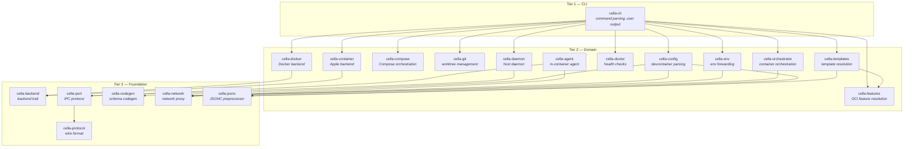

# Architecture

## System Overview



**Tier 1 — CLI:** cella-cli is the host binary entry point. cella-agent is the in-container binary (also serves as the `cella` CLI inside containers). Neither contains business logic.

**Tier 2 — Domain:** The crates that implement cella's core functionality. Each owns a distinct domain: container runtime, compose orchestration, git worktrees, environment forwarding, host daemon, system diagnostics, worktree orchestration, in-container agent, configuration parsing, and feature resolution.

**Tier 3 — Foundation:** Shared infrastructure crates. Backend trait abstraction, IPC protocol, code generation, network proxy, and JSONC preprocessing.

## Crate Responsibilities

### cella-cli

The binary entry point. Handles argument parsing via clap, initializes tracing, and dispatches to the appropriate command handler. Contains no business logic — it delegates everything to the library crates.

### cella-docker

The Docker backend. Implements `cella-backend`'s `ContainerBackend` trait against the bollard Docker API client (itself wrapped behind a `DockerApi` trait for testability and future runtime support). Manages the full container lifecycle (create, start, stop, remove), image building, and runtime detection. Handles `runArgs` parsing (30+ docker create flags), lifecycle command execution, file uploads, and spec compliance features like `shutdownAction`, `waitFor`, and `appPort` deprecation.

### cella-container

The Apple Container backend (experimental, macOS 26+ Apple Silicon only). Implements `cella-backend`'s `ContainerBackend` trait against Apple's `container` CLI. Pre-1.0 surface with no Docker Compose support; gated behind `cfg(target_os = "macos")` so non-Apple builds never pull it in. Advertises its lack of compose support via the backend `BackendCapabilities` flags so the orchestrator refuses compose workflows up front rather than failing mid-pipeline.

### cella-compose

Docker Compose orchestration. Generates override compose files that layer cella's customizations on top of user compose files, shells out to the `docker compose` V2 CLI, discovers compose-managed containers via Docker labels, and detects config changes via multi-file SHA-256 hashing. Also resolves the final `USER` for Compose+Features builds by parsing the combined Dockerfile (`find_user_statement`) so lifecycle commands and cella-agent run as the correct user, and reaches mount parity with single-container by emitting the same `/workspaces` bind, SSH-agent forwarding, and agent-volume mount in the override file.

### cella-git

Git worktree management and branch resolution. Creates, lists, and removes worktrees, resolves branch state (new, existing, merged, tracking-gone), discovers repository metadata, and computes content hashes (git HEAD + dirty files) for `updateContentCommand` change detection. All git operations run through a central command runner with exponential backoff retry on lock contention.

### cella-env

Environment forwarding orchestration. Detects the host environment (SSH agent, git config, credential proxies, AI agent tools) and produces the mounts, environment variables, and post-start commands needed to forward that environment into containers. Includes platform-aware runtime detection (Docker Desktop, OrbStack, Linux native, Colima, Podman, Rancher Desktop), AI agent config forwarding for Claude Code, Codex, and Gemini CLI, and AI provider API-key forwarding (`ai_keys` reads known provider env vars live on every `exec`/`shell` rather than persisting them in container labels).

### cella-daemon

Unified host-side daemon for credential forwarding, port management, browser handling, worktree operations, and background tasks. Runs as a background process, accepting TCP connections from in-container agents and Unix-socket connections from the CLI. Includes OrbStack-specific port coordination, health monitoring, auth token management, file-based logging, a per-exec TCP stream bridge for TTY forwarding (used by `cella switch`), and a task manager that tracks `cella task run` background processes with live output broadcast.

### cella-agent

In-container binary uploaded during `cella up`. Polls `/proc/net/tcp` for new listeners and reports them to the host daemon for automatic port forwarding. Proxies localhost-bound applications to `0.0.0.0`, handles `BROWSER` environment variable interception for OAuth callbacks, and forwards git credential requests to the host. The initial daemon connect retries indefinitely (so containers that start before the daemon is ready eventually reconnect), and the agent transparently reconnects after daemon restarts (including binary upgrades). When the binary is invoked as `cella` via an in-container symlink, it enters CLI mode instead of daemon mode — worktree and task commands inside the container delegate to the host daemon over the existing TCP control connection. Uses manual argument parsing (no clap) to minimize binary size.

### cella-doctor

System diagnostics and health checking. Runs structured checks across six categories (system, Docker, git/credentials, daemon, configuration, containers) with per-category timeouts. Validates `hostRequirements` from the devcontainer spec (CPU, memory, storage, GPU). Includes PII redaction for safe sharing of diagnostic output.

### cella-config

Devcontainer configuration parsing, validation, and layer merging. Handles JSONC (comments + trailing commas) with byte offset preservation for source-positioned diagnostics. Uses build-time code generation via cella-codegen to produce typed Rust structs from the devcontainer JSON Schema. Manages cella-specific TOML settings (`~/.cella/config.toml`, `.devcontainer/cella.toml`).

### cella-features

Dev Container Features resolution. Parses feature references (OCI, local path, HTTP URL), fetches artifacts from OCI registries with authentication, reads feature metadata, computes install ordering via topological sort, generates multi-stage Dockerfiles, caches artifacts locally, and merges feature configuration back into the devcontainer config.

### cella-templates

Devcontainer template lifecycle. Discovers templates from OCI registries (default: `ghcr.io/devcontainers/templates`), fetches and caches artifacts with a 24-hour TTL, reads template metadata (`devcontainer-template.json`), validates and substitutes template options, merges selected features, and generates the final `devcontainer.json` in JSONC or JSON format. Powers `cella init`.

### cella-backend

The backend abstraction layer. Defines the `ContainerBackend` trait that every backend (`cella-docker`, `cella-container`) implements, plus the shared types every consumer works against: `ContainerInfo`, `ContainerState`, `CreateContainerOptions`, `ExecOptions`, `BuildOptions`, `MountConfig`, `PortBinding`, and the `BackendError` unified error type. Also owns container/image naming conventions and label generation so all backends emit the same `dev.cella.*` and spec-standard `devcontainer.*` labels. Uses `BoxFuture` return types for object safety so callers can work against `dyn ContainerBackend` without knowing which runtime is underneath.

### cella-port

Port allocation and detection. Provides `/proc/net/tcp` and `/proc/net/tcp6` parsing for detecting listening sockets inside containers and manages host port allocation to avoid conflicts across concurrent containers.

### cella-orchestrator

Container lifecycle orchestration shared by both the CLI and daemon. Owns the full container-up pipeline for both single-container and Docker Compose workflows, image resolution, lifecycle phase execution, host requirements validation, shell detection, tool installation (Claude Code, Codex, Gemini), environment caching, config-to-container mapping, worktree branch helpers, and pruning. All operations go through the `cella-backend` abstraction — no direct Docker dependency. Reports progress through a channel-based `ProgressSender` that consumers render however they choose.

### cella-network

Network proxy configuration, blocking rules, and CA certificate management. Provides glob-based domain and path matching for HTTPS interception (denylist and allowlist modes), auto-generated CA certificates for MITM proxying, host proxy environment variable detection (`HTTP_PROXY`, `HTTPS_PROXY`, `NO_PROXY`), and rule merging from multiple configuration sources (`cella.toml` and `devcontainer.json` customizations).

### cella-codegen

Build-time code generator. Transforms the devcontainer JSON Schema into typed Rust structs and validators. Runs during `cargo build` via cella-config's `build.rs` and produces formatted Rust source for `include!()`. Not a runtime dependency.

### cella-protocol

IPC wire format definitions for agent<->daemon and CLI<->daemon communication. Defines the newline-delimited JSON message types (`AgentMessage`, `DaemonMessage`, `ManagementRequest`, `ManagementResponse`), connection handshake (`AgentHello`, `DaemonHello`), and git credential helper format. Not a runtime logic crate — it only defines types and serialization.

### cella-jsonc

JSONC (JSON with Comments) preprocessor. Strips `//` and `/* */` comments and trailing commas from JSONC source, returning strict JSON with byte offsets preserved (`output.len() == input.len()`). Used by cella-config and cella-templates to parse devcontainer.json files while keeping source positions accurate for miette diagnostics.

## Dependency Graph

The dependency graph evolves as crates are added. To view the current graph:

```sh
cargo tree --depth 1 -p cella-cli    # direct dependencies of the CLI
cargo tree -i cella-port --depth 1   # reverse dependencies of a specific crate
```

## Config Layer Merge Order

At resolve time, cella merges three devcontainer.json layers from lowest to highest priority:

1. **Global** — user-wide overrides at `~/.config/cella/global.jsonc` (optional)
2. **Workspace** — `.devcontainer/devcontainer.json` in the repo
3. **Local** — per-workspace overrides at `.devcontainer/devcontainer.local.jsonc` (optional, typically gitignored)

Per-key merge semantics implemented in `cella-config`'s `merge::layers`:

- **Scalars** — later layer wins
- **Deep-merge objects** — `features`, `containerEnv`, `remoteEnv`, `customizations`, `portsAttributes`, `otherPortsAttributes`
- **Concat arrays** — `mounts`, `runArgs`, `overrideFeatureInstallOrder`
- **Union arrays** (dedup) — `forwardPorts`, `capAdd`, `securityOpt`
- **Boolean OR** — `init`, `privileged` (any `true` wins)
- **`hostRequirements`** — per-key maximum (cpu/memory/storage/gpu)
- **Lifecycle commands** — later layer wins entirely

Cella-specific settings (TOML) layer separately: `~/.cella/config.toml` provides user defaults; `.devcontainer/cella.toml` provides workspace overrides. The `customizations.cella` block inside `devcontainer.json` is deep-merged through the devcontainer layer pipeline above.

## Worktree-Container Binding

Each git worktree is bound to its own dev container instance. When you create a branch with `cella branch`, cella:

1. Creates a git worktree for the new branch
2. Resolves the devcontainer.json config for that worktree
3. Builds or pulls the container image
4. Starts the container with the worktree mounted
5. Allocates non-conflicting ports

The binding is tracked via Docker labels (`dev.cella.worktree`, `dev.cella.worktree_branch`, `dev.cella.parent_repo`) on the container itself — no separate state file. `cella switch` looks up the container by worktree-branch label, and `cella prune` walks worktrees and removes the labelled container and its host port allocations together.
