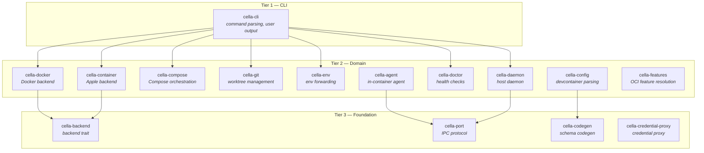

# Architecture

## System Overview



**Tier 1 — CLI:** cella-cli is the only binary entry point. It contains no business logic.

**Tier 2 — Domain:** The crates that implement cella's core functionality. Each owns a distinct domain: container runtime, compose orchestration, git worktrees, environment forwarding, host daemon, system diagnostics, and the in-container agent.

**Tier 3 — Foundation:** Shared infrastructure crates. Configuration parsing, feature resolution, port protocol, code generation, and the legacy credential proxy.

## Crate Responsibilities

### cella-cli

The binary entry point. Handles argument parsing via clap, initializes tracing, and dispatches to the appropriate command handler. Contains no business logic — it delegates everything to the library crates.

### cella-docker

Abstracts container runtime operations. Manages the full container lifecycle (create, start, stop, remove), image building, and runtime detection. Wraps the bollard Docker API client behind a `DockerApi` trait for testability and future runtime support (Podman). Handles `runArgs` parsing (30+ docker create flags), lifecycle command execution, UID remapping, file uploads, and spec compliance features like `shutdownAction`, `waitFor`, and `appPort` deprecation.

### cella-compose

Docker Compose orchestration. Generates override compose files that layer cella's customizations on top of user compose files, shells out to the `docker compose` V2 CLI, discovers compose-managed containers via Docker labels, and detects config changes via multi-file SHA-256 hashing.

### cella-git

Git worktree management and branch resolution. Creates, lists, and removes worktrees, resolves branch state (new, existing, merged, tracking-gone), discovers repository metadata, and computes content hashes (git HEAD + dirty files) for `updateContentCommand` change detection. All git operations run through a central command runner with exponential backoff retry on lock contention.

### cella-env

Environment forwarding orchestration. Detects the host environment (SSH agent, git config, credential proxies, AI agent tools) and produces the mounts, environment variables, and post-start commands needed to forward that environment into containers. Includes platform-aware runtime detection (Docker Desktop, OrbStack, Linux native, Colima) and AI agent config forwarding for Claude Code, Codex, and Gemini CLI.

### cella-daemon

Unified host-side daemon for port forwarding, credential proxying, and browser handling. Runs as a background process, accepting TCP connections from in-container agents. Includes OrbStack-specific port coordination, health monitoring, auth token management, and file-based logging.

### cella-agent

In-container binary uploaded during `cella up`. Polls `/proc/net/tcp` for new listeners and reports them to the host daemon for automatic port forwarding. Proxies localhost-bound applications to `0.0.0.0`, handles `BROWSER` environment variable interception for OAuth callbacks, and forwards git credential requests to the host. Uses manual argument parsing (no clap) to minimize binary size.

### cella-doctor

System diagnostics and health checking. Runs structured checks across six categories (system, Docker, git/credentials, daemon, configuration, containers) with per-category timeouts. Validates `hostRequirements` from the devcontainer spec (CPU, memory, storage, GPU). Includes PII redaction for safe sharing of diagnostic output.

### cella-config

Devcontainer configuration parsing, validation, and layer merging. Handles JSONC (comments + trailing commas) with byte offset preservation for source-positioned diagnostics. Uses build-time code generation via cella-codegen to produce typed Rust structs from the devcontainer JSON Schema. Manages cella-specific TOML settings (`~/.cella/config.toml`, `.devcontainer/cella.toml`).

### cella-features

Dev Container Features resolution. Parses feature references (OCI, local path, HTTP URL), fetches artifacts from OCI registries with authentication, reads feature metadata, computes install ordering via topological sort, generates multi-stage Dockerfiles, caches artifacts locally, and merges feature configuration back into the devcontainer config.

### cella-port

Port allocation, detection, and IPC protocol. Defines the wire format for daemon-agent communication (`AgentMessage`, `DaemonMessage`), provides `/proc/net/tcp` parsing for port detection, and manages host port allocation to avoid conflicts across concurrent containers.

### cella-codegen

Build-time code generator. Transforms the devcontainer JSON Schema into typed Rust structs and validators. Runs during `cargo build` via cella-config's `build.rs` and produces formatted Rust source for `include!()`. Not a runtime dependency.

### cella-credential-proxy

Legacy git credential forwarding proxy over Unix socket and TCP. Being consolidated into cella-daemon. Runs as a host daemon, forwarding git credential requests from containers to the host's credential store with automatic idle timeout.

## Dependency Graph

The dependency graph evolves as crates are added. To view the current graph:

```sh
cargo tree --depth 1 -p cella-cli    # direct dependencies of the CLI
cargo tree -i cella-port --depth 1   # reverse dependencies of a specific crate
```

## Config Layer Merge Order

Configuration is resolved by merging layers from lowest to highest priority:

1. **Defaults** — built-in cella defaults
2. **Template** — values from the selected template
3. **Workspace** — `.devcontainer/devcontainer.json` in the repo
4. **User** — user-level overrides (`~/.cella/config.toml`)

Later layers override earlier ones for scalar values. Arrays and objects follow devcontainer spec merge semantics.

## Worktree-Container Binding

Each git worktree is bound to its own dev container instance. When you create a branch with `cella branch`, cella:

1. Creates a git worktree for the new branch
2. Resolves the devcontainer.json config for that worktree
3. Builds or pulls the container image
4. Starts the container with the worktree mounted
5. Allocates non-conflicting ports

This binding is tracked so that `cella switch` can stop/start the correct containers, and `cella prune` can clean up both the worktree and its container.
