# AI Tool Integration

The key words "MUST", "MUST NOT", "REQUIRED", "SHALL", "SHALL NOT", "SHOULD", "SHOULD NOT", "RECOMMENDED", "MAY", and "OPTIONAL" in this document are to be interpreted as described in [RFC 2119](https://www.ietf.org/rfc/rfc2119.txt).

## Summary

cella installs and configures AI coding tools and supporting development tools inside dev containers. Three AI coding tools (Claude Code, Codex CLI, Gemini CLI) and two supporting tools (Neovim, tmux) are managed through a unified installation pipeline, host configuration forwarding (directory bind mounts plus seeded copies for single-file configs, with live bidirectional sync for `~/.claude.json`), and live credential injection at exec time. Tools are opt-in -- none are installed by default. The `cella-tool-install` crate centralizes all installation logic so that `cella up` and `cella install` share the same code paths, idempotency checks, and verification steps.

## Architecture

### Tool Lifecycle

```mermaid
flowchart TB
    subgraph "1. Installation"
        config["cella.toml<br/>[tools] install list"]
        cli["cella install<br/>(interactive / named)"]
        config --> resolve["resolve tool names"]
        cli --> resolve
        resolve --> deps["ensure dependencies<br/>(Node.js, bubblewrap,<br/>Alpine libs)"]
        deps --> install["run installer<br/>(curl, npm, apt/apk,<br/>GitHub release)"]
        install --> verify["verify callable<br/>(login-shell probe)"]
        verify -->|not on PATH| symlink["/usr/local/bin symlink"]
        verify -->|on PATH| done["tool ready"]
        symlink --> done
    end

    subgraph "2. Config Forwarding"
        hostcfg["host config<br/>(~/.claude/, ~/.codex/,<br/>~/.gemini/, etc.)"]
        hostcfg -->|bind mount at<br/>container creation| containercfg["container config<br/>($HOME/.claude/,<br/>$HOME/.codex/, etc.)"]
    end

    subgraph "3. Credential Injection"
        hostkeys["host env vars<br/>(ANTHROPIC_API_KEY,<br/>OPENAI_API_KEY, ...)"]
        hostkeys -->|read live on<br/>exec/shell| inject["inject into<br/>container env"]
        inject -->|protect=false| direct["direct value"]
        inject -->|protect=true| phantom["phantom token<br/>(see credential-protection.md)"]
    end
```



### Crate Responsibilities

| Crate | Role |
|---|---|
| `cella-tool-install` | Installation logic for all five tools: idempotency checks, dependency provisioning, installer execution, callable verification, `/usr/local/bin` symlinking |
| `cella-config` | `[tools]` TOML schema: `Tools`, `ClaudeCode`, `Codex`, `Gemini`, `Nvim`, `Tmux` settings structs with `deny_unknown_fields` |
| `cella-env` | Host config path detection (`claude_code`, `codex`, `gemini`, `nvim`, `tmux` modules), AI key detection (`ai_keys` module), container path computation |
| `cella-cli` | `cella install` command: interactive picker, `--version` override, `--all` flag. `cella exec` / `cella shell`: live credential injection |
| `cella-orchestrator` | Re-exports `cella-tool-install` as `tool_install`, wires installation into the `cella up` lifecycle, phantom token generation |

## Supported Tools

| Tool | Config Key | Binary | Package / Source | Install Method |
|---|---|---|---|---|
| Claude Code | `claude-code` | `claude` | `claude.ai/install.sh` | Native installer via curl |
| Codex CLI | `codex` | `codex` | `@openai/codex` (npm) | `npm install -g` |
| Gemini CLI | `gemini` | `gemini` | `@google/gemini-cli` (npm) | `npm install -g` |
| Neovim | `nvim` | `nvim` | GitHub releases | Tarball extract to `/usr/local` |
| tmux | `tmux` | `tmux` | System package manager | apt-get, apk, dnf, pacman, or zypper |

### Tool Categories

**AI coding tools** (Claude Code, Codex, Gemini) share three capabilities: version pinning, host config forwarding, and AI provider key injection. They are the primary consumers of the credential integration subsystem.

**Supporting tools** (Neovim, tmux) provide the terminal editing and multiplexing environment that AI coding tools operate within. They support config forwarding but have no credential requirements.

## Installation

### Entry Points

Tools are installed through two entry points:

1. **`cella up`** -- Installs tools listed in `[tools] install`:
   ```toml
   [tools]
   install = ["claude-code", "nvim"]
   ```
   Installation runs after the container is started and the user environment is probed.

2. **`cella install`** -- On-demand installation into a running container:
   ```sh
   cella install                           # interactive selector
   cella install claude-code nvim          # install specific tools
   cella install --all                     # install everything
   cella install codex --version 0.1.2     # pin a version
   ```

Both entry points use the same `install_tools()` function from `cella-tool-install`.

### Idempotency

Every installer MUST check whether the requested version is already present before running:

- **Claude Code**: `claude --version` -- if the output contains the pinned version (or any version when `"latest"` / `"stable"` is requested), installation is skipped.
- **Codex / Gemini**: `<binary> --version` -- same logic as Claude Code.
- **Neovim**: Separate install path (no pre-check against version output; always installs).
- **tmux**: `which tmux` -- installed if the binary exists on PATH.

When the idempotency check determines the tool is already installed, the installer returns `None` and no exec commands are issued.

### Dependency Provisioning

Tools that require runtime dependencies have them provisioned automatically:

| Tool | Dependency | Provisioning |
|---|---|---|
| Claude Code (Alpine) | `libgcc`, `libstdc++`, `ripgrep` | `apk add --no-cache` before installer; sets `USE_BUILTIN_RIPGREP=0` |
| Codex | `bubblewrap` (sandbox) | `apt-get` or `apk` depending on distro |
| Codex, Gemini | Node.js / npm | If npm is not on PATH (including probed user env), installs via `apt-get` or `apk` |

Node.js availability is checked using the probed user environment PATH (from `userEnvProbe`) to detect npm installed by devcontainer features (e.g., nvm). The implementation falls back to a login shell when no probed environment is available.

### Install Methods

**Claude Code** uses the official native installer:
```sh
curl -fsSL https://claude.ai/install.sh | bash -s <version>
```
The installer runs as the remote user (not root). On Alpine containers, `USE_BUILTIN_RIPGREP=0` is set in the environment to use the system ripgrep instead of the bundled binary.

**Codex and Gemini** use npm global install:
```sh
npm install -g @openai/codex          # latest
npm install -g @openai/codex@0.1.2    # pinned
npm install -g @google/gemini-cli     # latest
npm install -g @google/gemini-cli@1.0  # pinned
```
When `version = "latest"`, the `@version` suffix is omitted. npm commands run as the remote user with the probed PATH when available, falling back to a login shell otherwise.

**Neovim** downloads from GitHub releases:
```
https://github.com/neovim/neovim/releases/download/<tag>/nvim-linux-<arch>.tar.gz
```
Supported architectures: `x86_64` (`amd64`) and `aarch64` (`arm64`). The tarball is extracted to `/usr/local` with `--strip-components=1`. Bare semver versions (e.g., `"0.10.3"`) are normalized to `v0.10.3`; special tags like `"stable"` and `"nightly"` are used as-is. Unsupported architectures (e.g., `riscv64`) produce a clear error directing the user to install nvim in their container image.

**tmux** uses the container's system package manager with a fallback chain:
1. `apt-get update -qq && apt-get install -y -qq tmux`
2. `apk add --no-cache tmux`
3. `dnf install -y tmux`
4. `pacman -S --noconfirm tmux`
5. `zypper install -y tmux`

Each package manager is probed via `which` before attempting installation. If no supported package manager is found, the installer returns an error.

### Verification

After installation, every tool MUST be verified as callable through the same shell wrapping that `cella exec` uses. The verification runs a two-phase probe:

1. **Login shell probe**: `<shell> -lc "command -v <binary>"` with the probed PATH. This matches the exact wrapping `cella exec` uses.
2. **Interactive fallback**: `<shell> -lic "command -v <binary>"` -- catches installers that only modified `.bashrc` / `.zshrc` (which `-lc` does not source).

Three outcomes are possible:

| Outcome | Action |
|---|---|
| `Reachable` | Tool is on the login-shell PATH. No remediation needed. |
| `InstalledElsewhere(path)` | Binary found at an absolute path not on the login-shell PATH. A symlink is created at `/usr/local/bin/<binary>` pointing to the discovered path, then re-verified. |
| `NotInstalled` | Neither probe found the binary. Installation failed. |

The `/usr/local/bin` symlink remediation refuses to overwrite existing regular files (only replaces symlinks), making it safe across repeated `cella up` runs.

### Parallelism

`install_tools()` runs installation branches concurrently using `tokio::join!`:

- **Claude Code** runs independently (curl-based, no npm dependency).
- **Codex and Gemini** run sequentially within their branch to avoid npm global lock contention.
- **Neovim** runs independently.
- **tmux** runs independently.

This gives maximum parallelism: Claude Code, Neovim, and tmux install simultaneously, while Codex and Gemini serialize only against each other.

## Configuration Forwarding

Configuration forwarding shares host tool configuration into the container at creation time. Directories are bind-mounted; the two single-file configs are seeded as regular files (see [Single-File Configs](#single-file-configs-copy-instead-of-mount)). This preserves the user's settings, CLAUDE.md files, MCP server configurations, and plugin state across container rebuilds.

### Per-Tool Forwarding

Each tool's `forward_config` setting (default: `true`) controls whether its host config is forwarded. When enabled, cella pre-creates any absent config paths on the host before building mount specs.

| Tool | Host Path(s) | Container Path(s) | Mechanism |
|---|---|---|---|
| Claude Code | `~/.claude.json` | `$HOME/.claude.json` | **Seeded copy + live sync** (not a mount) |
| Claude Code | `~/.claude/` | `$HOME/.claude/` | Bind mount (empty dir pre-created, mode 0700) |
| Codex | `~/.codex/` | `$HOME/.codex/` | Bind mount (empty dir pre-created, mode 0700) |
| Gemini | `~/.gemini/` | `$HOME/.gemini/` | Bind mount (empty dir pre-created, mode 0700) |
| Neovim | `~/.config/nvim/` (or `config_path`) | `$HOME/.config/nvim/` | Bind mount (empty dir pre-created, mode 0700) |
| tmux | `~/.tmux.conf` | `$HOME/.tmux.conf` | **Seeded copy at create** (not a mount) |
| tmux | `~/.config/tmux/` (or `config_path`) | `$HOME/.config/tmux/` | Bind mount |

Container paths are computed from the remote user: `/home/<user>` for regular users, `/root` for root. Directory configs are bind-mounted; the two single-file configs (`~/.claude.json`, `~/.tmux.conf`) are **seeded as regular files** rather than bind-mounted — see below.

### Single-File Configs: Copy Instead of Mount

`~/.claude.json` and `~/.tmux.conf` are *not* bind-mounted. A single-file bind mount over a virtualized share (VirtioFS on OrbStack/macOS) ghosts the moment the host atomically replaces the file (`write temp` + `rename`, which Claude Code does on **every** config write): the guest's handle goes stale and the path becomes an unreadable, unremovable mountpoint (`-????????? ? … .claude.json`, source marked `//deleted`). Directory mounts are immune — the directory inode is stable.

Instead, cella **uploads the host file into the container as a regular file** at create time (`upload_files`, chowned to the remote user, mode 0600). A regular file cannot ghost on host replace. `~/.claude.json` is seeded only if absent, since its ongoing updates are owned by the live-sync layer below; `~/.tmux.conf` is seeded once at create (read-mostly).

#### `~/.claude.json` Bidirectional Live Sync

For a *running* container, `~/.claude.json` stays in sync between host and every opted-in container via the cella daemon (opt-in mirrors `forward_config`; the orchestrator sets `CELLA_SYNC_CLAUDE_CONFIG=1` and pins `CELLA_CLAUDE_JSON_PATH` at create time):

- The daemon (host-native) holds a canonical JSON value plus a per-source snapshot of the last content seen from the host and each container, watches the host `~/.claude.json`, and broadcasts changes to opted-in agents.
- Each agent watches its container `~/.claude.json` and reports changes back; the daemon diffs each change against that source's snapshot to derive a merge-patch (capturing deletions), applies it to the canonical, writes the host file, and re-broadcasts to the *other* containers.
- Loop suppression: each side records the SHA-256 of the bytes it last wrote/observed and drops watcher events that match. Watchers watch the *parent directory* (filtered to the filename) so they survive atomic-replace, and all writes are atomic (temp + rename).
- On (re)connect an agent re-announces its current config *before* it starts processing pushes; the daemon merges it and pushes the canonical back only when that agent is missing keys. This converges a reconnecting or briefly-disconnected container without a stale push clobbering local edits, and replaces the old unconditional push-on-connect.
- Opt-in is enforced on **both** directions: the daemon only broadcasts to agents that advertised sync, and it only *ingests* a container's `ClaudeConfigChanged` if that container opted in. A container without config forwarding can neither read pushes nor write the host/peer config.

**Merge semantics (RFC 7386).** Each change is diffed against the daemon's last-seen snapshot of that source into a JSON Merge Patch — an added or changed key carries its new value, a removed key becomes an explicit `null` — which is applied to the canonical config: objects merge key-by-key, `null` deletes, and a shared scalar is last-writer-wins. The `projects` map is path-namespaced — host keys (`/Users/...`) and container keys (`/workspaces/...`) are disjoint — so unrelated entries are preserved rather than thrashed by a whole-file overwrite.

**Behavior & accepted trade-offs:**
- **Propagation is effectively between `claude` runs, not mid-session.** Claude Code holds `~/.claude.json` in memory and rewrites it wholesale on change, so a sync write landing while a `claude` session is live is overwritten by that session's next save. (This was equally true of the old shared bind mount — not a regression.)
- **Deletions propagate.** Removing a key (e.g. disabling an MCP server) on the host or in a container removes it from the canonical config and from every other container. The only thing a merge-patch can't represent is setting a key to an explicit JSON `null` (RFC 7386), which `~/.claude.json` does not use.
- **`projects` accumulates** across the host and every container (keys are unioned), so the map grows with each environment's paths. Because every push carries the full canonical, any container can in principle delete another's `projects` entry — acceptable for the "one synced file" model.
- **Container→host is unrestricted (accepted risk).** A container can write any key — including executable config (`mcpServers`, `hooks`, `apiKeyHelper`, `env`) — and it is merged into the host `~/.claude.json` and executed on the host the next time Claude Code starts. This is the intended feature (configure once, sync everywhere) under the assumption that you trust what runs in your own containers. Note that `postCreateCommand`, build scripts, and dependencies also execute in a container, so a not-fully-trusted workspace can reach the host this way; no key allowlist is applied.
- **Legacy containers** created before this change keep the old (potentially ghosting) single-file mount; daemon pushes to them are best-effort no-ops until they are rebuilt. Migration is out of scope.

Observe / reproduce (inside a container after `cella up`):
```sh
findmnt -T ~/.claude.json      # expect: no output (regular file, not a mount)
stat ~/.claude.json && cat ~/.claude.json   # expect: succeeds, valid JSON (no ? ghost)
# host: edit ~/.claude.json (add an mcpServers entry) -> container reflects it within ~1s
# host: trigger Claude Code's atomic save repeatedly -> the container copy never ghosts
```

### Claude Code Specifics

Claude Code has additional forwarding logic beyond the basic bind mount:

**Home symlink**: When the host home directory differs from the container home directory (e.g., host is `/home/node`, container is `/home/vscode`), a symlink is created so that hardcoded paths in plugin manifests resolve transparently:
```
/home/node/.claude -> /home/vscode/.claude
```

**Plugin manifest handling**: The host `~/.claude/plugins/` directory receives special treatment:
1. A hidden bind mount at `/tmp/.cella/host-plugins/` provides access to the host plugins directory.
2. A tmpfs overlay shadows the `plugins/` subdirectory within the main `~/.claude/` bind mount.
3. Plugin data directories (`cache/`, `data/`, `marketplaces/`) are symlinked from the tmpfs to the hidden host mount.
4. Manifest files (`installed_plugins.json`, `known_marketplaces.json`) are copied with path rewriting -- a regex-based `sed` rewrites home paths from any previous container user to the current container user's path.

### Custom Config Paths

Neovim and tmux support a `config_path` override that changes the host source directory while keeping the container destination fixed:

```toml
[tools.nvim]
config_path = "~/dotfiles/nvim"    # host reads from here
# container always gets $HOME/.config/nvim/

[tools.tmux]
config_path = "~/dotfiles/tmux"    # host reads from here
# container always gets $HOME/.tmux.conf and $HOME/.config/tmux/
```

When `config_path` is set, the default host path is not pre-created. Tilde expansion is applied to custom paths.

## Credential Integration

AI coding tools require API keys to function. cella handles credential injection with two modes depending on the `credentials.protect` setting.

### Direct Injection (protect = false)

API keys are read live from the host environment on every `cella exec` or `cella shell` invocation and passed as environment variables to the container process (see [Environment Forwarding](environment-forwarding.md) for the general environment injection mechanism). Keys are never stored in container labels, image layers, or persistent environment configuration.

11 AI provider keys are supported:

| Provider | Environment Variable |
|---|---|
| Anthropic | `ANTHROPIC_API_KEY` |
| OpenAI | `OPENAI_API_KEY` |
| Gemini | `GEMINI_API_KEY` |
| Groq | `GROQ_API_KEY` |
| Mistral | `MISTRAL_API_KEY` |
| DeepSeek | `DEEPSEEK_API_KEY` |
| xAI | `XAI_API_KEY` |
| Fireworks | `FIREWORKS_API_KEY` |
| Together | `TOGETHER_API_KEY` |
| Perplexity | `PERPLEXITY_API_KEY` |
| Cohere | `COHERE_API_KEY` |

A key is injected only when all of the following hold:

1. `credentials.ai.enabled = true` (global toggle, default: `true`)
2. The per-provider toggle is `true` (default: `true` for all providers)
3. The host environment variable is set and non-empty
4. The variable is not already defined in the user's `containerEnv` or `remoteEnv`

### Protected Injection (protect = true)

When credential protection is active, real API keys never enter the container. Instead, opaque phantom tokens (`pt-<uuid-v4>`) are injected as environment variables. When a container process makes an HTTP request to a known credential domain, the in-container agent's MITM proxy intercepts it and tunnels the request to the host daemon, which replaces the phantom token with the real credential before making the upstream HTTPS request.

See [Credential Protection](credential-protection.md) for the full specification of phantom token generation, registration, wire protocol, and security properties.

### Provider Configuration

Per-provider toggles allow disabling key forwarding for specific providers:

```toml
[credentials.ai]
enabled = true       # global toggle
openai = false       # disable OpenAI key forwarding
anthropic = true     # explicitly enable (also the default)
```

When `enabled = false`, all per-provider toggles are ignored and no AI keys are forwarded regardless of individual settings. Unknown provider names default to enabled.

## Version Management

### Version Specifiers

Each tool accepts version specifiers in its configuration:

| Tool | Config Field | Accepted Values | Default |
|---|---|---|---|
| Claude Code | `tools.claude-code.version` | `"latest"`, `"stable"`, or pinned (e.g., `"1.0.58"`) | `"latest"` |
| Codex | `tools.codex.version` | `"latest"` or pinned (e.g., `"0.1.2"`) | `"latest"` |
| Gemini | `tools.gemini.version` | `"latest"` or pinned (e.g., `"0.1.2"`) | `"latest"` |
| Neovim | `tools.nvim.version` | `"stable"`, `"nightly"`, or pinned (e.g., `"0.10.3"`) | `"stable"` |
| tmux | N/A | Installed via system package manager; no version pinning | N/A |

### Version Override

The `cella install --version` flag overrides the configured version for a single tool:

```sh
cella install claude-code --version 1.0.58
```

Constraints:
- `--version` MUST specify exactly one tool name.
- `--version` MUST NOT be combined with `--all`.
- `--version` is not supported for tmux (system package manager controls the version).

When `--version` is specified, the idempotency check is bypassed -- the installer runs regardless of the installed version.

### Latest Resolution

For npm-based tools (Codex, Gemini), `"latest"` resolves to whatever version npm's registry returns for `npm install -g <package>` (no `@version` suffix). For Claude Code, `"latest"` and `"stable"` are passed directly to the native installer script. For Neovim, `"stable"` and `"nightly"` map to the corresponding GitHub release tags.

### Pinned Version Behavior

When a specific version is pinned:
- The idempotency check compares the installed version output against the pinned version string (substring match).
- If the installed version matches, installation is skipped.
- If the installed version does not match, the installer runs to upgrade or downgrade.

## Configuration Reference

Full `[tools]` section in `cella.toml` (see [Configuration Guide](../guides/configuration.md) for the broader configuration system, merge semantics, and config file locations):

```toml
[tools]
# Tools to install eagerly during `cella up`.
# Valid values: "claude-code", "codex", "gemini", "nvim", "tmux"
install = ["claude-code", "nvim"]

[tools.claude-code]
forward_config = true     # bind-mount ~/.claude/ and ~/.claude.json (default: true)
version = "latest"        # "latest", "stable", or pinned e.g. "1.0.58" (default: "latest")

[tools.codex]
forward_config = true     # bind-mount ~/.codex/ (default: true)
version = "latest"        # "latest" or pinned e.g. "0.1.2" (default: "latest")

[tools.gemini]
forward_config = true     # bind-mount ~/.gemini/ (default: true)
version = "latest"        # "latest" or pinned e.g. "0.1.2" (default: "latest")

[tools.nvim]
forward_config = true     # bind-mount nvim config (default: true)
version = "stable"        # "stable", "nightly", or pinned e.g. "0.10.3" (default: "stable")
# config_path = "~/dotfiles/nvim"  # override host config source (default: ~/.config/nvim)

[tools.tmux]
forward_config = true     # bind-mount tmux config (default: true)
# config_path = "~/dotfiles/tmux"  # override host config source (default: ~/.tmux.conf)
```

### Settings Schema

#### `[tools]`

| Field | Type | Default | Description |
|---|---|---|---|
| `install` | `string[]` | `[]` | Tools to install during `cella up`. Valid: `"claude-code"`, `"codex"`, `"gemini"`, `"nvim"`, `"tmux"` |

#### `[tools.claude-code]`

| Field | Type | Default | Description |
|---|---|---|---|
| `forward_config` | `bool` | `true` | Bind-mount `~/.claude/` and `~/.claude.json` from host |
| `version` | `string` | `"latest"` | `"latest"`, `"stable"`, or pinned semver |

#### `[tools.codex]`

| Field | Type | Default | Description |
|---|---|---|---|
| `forward_config` | `bool` | `true` | Bind-mount `~/.codex/` from host |
| `version` | `string` | `"latest"` | `"latest"` or pinned semver |

#### `[tools.gemini]`

| Field | Type | Default | Description |
|---|---|---|---|
| `forward_config` | `bool` | `true` | Bind-mount `~/.gemini/` from host |
| `version` | `string` | `"latest"` | `"latest"` or pinned semver |

#### `[tools.nvim]`

| Field | Type | Default | Description |
|---|---|---|---|
| `forward_config` | `bool` | `true` | Bind-mount nvim config from host |
| `version` | `string` | `"stable"` | `"stable"`, `"nightly"`, or pinned semver |
| `config_path` | `string?` | *(unset)* | Override host config source directory (default: `~/.config/nvim`) |

#### `[tools.tmux]`

| Field | Type | Default | Description |
|---|---|---|---|
| `forward_config` | `bool` | `true` | Bind-mount tmux config from host |
| `config_path` | `string?` | *(unset)* | Override host config source path (default: `~/.tmux.conf` or `~/.config/tmux/`) |

All tool config sections use strict validation -- unknown fields are rejected at parse time (`deny_unknown_fields`).

## Error Handling

### Installation Errors

| Condition | Behavior |
|---|---|
| Unknown tool name in `[tools] install` | Warning logged, tool skipped. Valid names: `claude-code`, `codex`, `gemini`, `nvim`, `tmux`. |
| npm not available and required | Codex/Gemini step fails with "Node.js/npm not available". Other tools proceed. |
| Installer exits non-zero | Step marked failed immediately. The installer's exit code and first line of stderr are included in the failure message. Verification is not attempted. |
| Binary not on PATH after install | If found via interactive shell probe (`-lic`), a `/usr/local/bin` symlink is attempted. If still unreachable, step marked failed. |
| Unsupported architecture (nvim) | Error returned with the detected architecture. User directed to install nvim in their container image. |
| No package manager found (tmux) | Error listing the package managers that were tried (apt-get, apk, dnf, pacman, zypper). |
| Backend exec error | Flattened into a synthetic `ExecResult` with exit code `-1` and the error string in stderr. |

Tool installation failures are non-fatal to `cella up` -- other tools and the container lifecycle continue. The failure count is reported. For `cella install`, the process exits with an error if any tool fails.

### Configuration Forwarding Errors

| Condition | Behavior |
|---|---|
| Host config path does not exist | Mount spec is not emitted. Tool works with container-local defaults. |
| Host path is not the expected type (file vs. directory) | Warning logged. Mount spec is not emitted. |
| Plugin manifest path rewriting fails | Silent fallback. Plugin paths may reference the wrong home directory. |

### Credential Injection Errors

| Condition | Behavior |
|---|---|
| `credentials.ai.enabled = false` | No AI keys are forwarded. Tools prompt the user to provide keys manually. |
| Host env var is unset or empty | That provider's key is not injected. No error -- other keys proceed. |
| Phantom token registration fails | Warning logged. Container starts without protection for that provider. Fail-closed at request time (see [Credential Protection](credential-protection.md)). |

## Config Forwarding Diagnostics

When a host config directory is absent and pre-creation fails, cella emits a warning diagnostic identifying the missing path and which tool is affected. The mount spec is omitted (the tool uses container-local defaults), but the user is informed rather than left guessing.

## Robust Plugin Manifest Rewriting

Plugin manifest path rewriting uses the container's actual home directory (resolved from `/etc/passwd` or `$HOME`) instead of heuristic regex patterns. The rewriter reads the source manifest, identifies home directory references, and substitutes the resolved container home path.

### Custom Tool Definitions

The `ToolName` enum and the tool config schema are designed for additive expansion. Adding a new tool requires:

1. A new variant in `ToolName` (with `config_name`, `binary_name`, `display_name` mappings).
2. A new settings struct in `cella-config` with `deny_unknown_fields`.
3. A new field in the `Tools` struct.
4. Host detection and container path helpers in `cella-env`.
5. An installer function in `cella-tool-install`.

The installation pipeline (dependency provisioning, parallel execution, verification, symlink remediation) is reusable -- new tools plug into the existing `install_tools()` framework.

### IDE Integration

Tool configuration forwarding is independent of the terminal-based `cella exec` workflow. IDE extensions that manage dev containers can use the same mount specs (`build_tool_config_mount_specs()`) to forward tool configurations when creating containers through their own lifecycle. The mount spec builder takes a `CellaConfig` and `remote_user` and returns a `Vec<MountSpec>` suitable for any container creation API.

### Offline / Air-gapped Installation

Tools that support pre-downloaded archives can be installed from local sources:
- **Neovim**: The tarball URL construction is centralized in `install_nvim()`. An extension point for local archive paths allows air-gapped environments to provide the tarball via a volume mount.
- **npm tools**: A local npm registry or `--prefer-offline` flag can be injected via the probed environment's npm configuration.
- **Claude Code**: The native installer fetches from `claude.ai`. Air-gapped environments require pre-installing Claude Code in the container image.

## Limitations

1. **No automatic updates** -- tools are installed at the configured version. There is no background update check or auto-upgrade mechanism. Users run `cella install <tool> --version <new>` to upgrade.
2. **npm global lock contention** -- Codex and Gemini install sequentially because concurrent `npm install -g` commands can corrupt the global package directory. This adds latency when both are installed together.
3. **Alpine Claude Code dependencies** -- the Alpine dependency list (`libgcc`, `libstdc++`, `ripgrep`) is hardcoded. If the Claude Code native installer changes its requirements, the dependency list requires a cella update.
4. **tmux has no version pinning** -- the system package manager determines the tmux version. Different base images ship different tmux versions.
5. **Neovim architecture support** -- only `x86_64` and `aarch64` Linux binaries are available from GitHub releases. Other architectures (e.g., `riscv64`, `s390x`) require the user to pre-install nvim in their container image.
