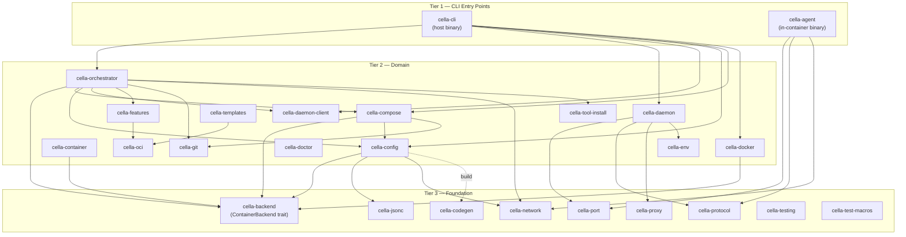
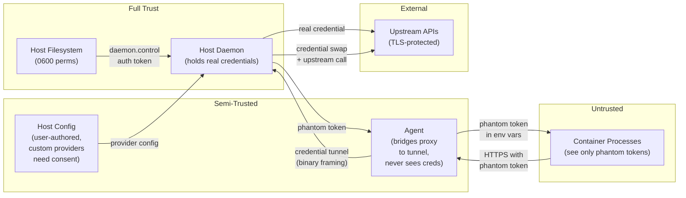

# System Architecture

The key words "MUST", "MUST NOT", "REQUIRED", "SHALL", "SHALL NOT", "SHOULD", "SHOULD NOT", "RECOMMENDED", "MAY", and "OPTIONAL" in this document are to be interpreted as described in [RFC 2119](https://www.ietf.org/rfc/rfc2119.txt).

## Summary

cella is a terminal-native devcontainer CLI built as a drop-in replacement for the official devcontainer CLI and VS Code devcontainer extension. It is a Rust workspace (edition 2024, MSRV 1.95.0) organized into 25 crates across three tiers: CLI entry points, domain logic, and foundation libraries.

The runtime architecture is a **host daemon + in-container agent** model. The `cella` binary on the host orchestrates container lifecycle, while a long-lived `cella-daemon` process manages port forwarding, credential protection, hostname routing, and SSH agent proxying across all active containers. Inside each container, a `cella-agent` binary handles port detection, MITM proxy for credential interception, clipboard bridging, and git credential forwarding.

All container backends implement the `ContainerBackend` trait, making the orchestration layer backend-agnostic. Docker (via bollard) and Apple Container are the two backends. Docker Compose integration reaches mount parity with single-container workflows. Each git worktree binds to its own container via Docker labels, enabling parallel branch development with full environment isolation.

## Architecture



### Component Interaction

```
  Host Machine                              Container
 ┌──────────────────────────────────┐      ┌──────────────────────────────┐
 │                                  │      │                              │
 │  ┌──────────┐    ┌────────────┐  │      │  ┌────────────┐             │
 │  │ cella    │───>│ cella-     │  │      │  │ cella-     │             │
 │  │ (CLI)    │    │ orchestrat │  │      │  │ agent      │             │
 │  └──────────┘    │ or         │  │      │  │            │             │
 │       │          └────────────┘  │      │  │ - port     │             │
 │       │               │         │      │  │   watcher  │             │
 │       v               v         │      │  │ - MITM     │             │
 │  ┌────────────────────────┐     │      │  │   proxy    │             │
 │  │ cella-daemon           │     │      │  │ - git cred │             │
 │  │                        │<-TCP/NDJSON->│ │   helper  │             │
 │  │ - port manager         │     │      │  │ - browser  │             │
 │  │ - credential cache     │     │      │  │   open     │             │
 │  │ - phantom registry     │     │      │  │ - clipboard│             │
 │  │ - tunnel broker        │     │      │  │ - SSH agent│             │
 │  │ - hostname proxy       │     │      │  │   bridge   │             │
 │  │ - SSH agent proxy      │     │      │  │ - cella CLI│             │
 │  │ - task manager         │     │      │  │   (symlink)│             │
 │  └────────────────────────┘     │      │  └────────────┘             │
 │       ^                         │      │                              │
 │       │ Unix socket             │      └──────────────────────────────┘
 │  ┌────────────┐                 │
 │  │ cella-     │                 │
 │  │ daemon-    │                 │
 │  │ client     │                 │
 │  └────────────┘                 │
 └──────────────────────────────────┘
```

The CLI communicates with the daemon over a Unix socket (`~/.cella/daemon.sock`) for management operations. The agent communicates with the daemon over TCP with NDJSON framing. Three connection types share the daemon's TCP control port, discriminated by a 1-byte magic prefix:

| Magic Byte | Connection Type | Purpose |
|---|---|---|
| `0x01` | Agent control | Protocol negotiation, NDJSON management messages |
| `0x02` | Reverse tunnel | Port forwarding tunnel connections |
| `0x03` | Credential proxy | Multiplexed credential proxy tunnels |

See [IPC Protocol](ipc-protocol.md) for the complete wire format specification.

## Trust Model



### Trust Boundaries

**Host daemon** (fully trusted): The daemon is the sole holder of real credential material and the sole HTTPS client for credential-bearing upstream requests. It manages the phantom token registry, credential cache (with zeroize on drop), and audit log. The daemon MUST run as the same user as the CLI and MUST restrict its socket and control files to `0600` permissions.

**Host filesystem** (trusted): Configuration files, PID files, and the daemon control file reside under `~/.cella/` with restrictive permissions. The daemon address file (`.daemon_addr`) inside the container is written by the orchestrator at container start.

**Host config** (semi-trusted): User-authored `cella.toml` and `customizations.cella` in `devcontainer.json` MAY define custom credential providers. Custom providers MUST receive explicit user consent before the daemon resolves credentials through them.

**Agent** (semi-trusted): The in-container agent bridges the MITM proxy to the credential tunnel but never holds or observes real credentials. It authenticates to the daemon using a per-container nonce. The agent binary is distributed via a shared Docker volume (`cella-agent`) that is mounted read-only into containers.

**Container processes** (untrusted): Processes inside the container only observe phantom tokens (UUID-based opaque placeholders) in environment variables. When a process makes an HTTPS request to a credential-protected domain, the agent's MITM proxy intercepts the request and tunnels it to the host daemon for credential injection. Real credentials never enter container memory, filesystem, or environment variables.

**Upstream APIs** (external): All credential-bearing requests are made by the host daemon over TLS. The daemon verifies server certificates using the system CA bundle.

See [Credential Protection](credential-protection.md) for the complete threat model and protocol specification.

## Crate Responsibilities

| Crate | Tier | Description |
|---|---|---|
| `cella-cli` | 1 | Host binary entry point. Parses CLI arguments (clap), resolves the container backend, dispatches to orchestrator or daemon management, and renders output (text with indicatif spinners or JSON). |
| `cella-agent` | 1 | In-container binary. Runs as a daemon process watching `/proc/net/tcp` for port listeners, operating the MITM proxy for credential interception, forwarding git credentials, bridging the host clipboard, handling `BROWSER` env var interception, and providing an SSH agent bridge. When invoked as `cella` (via symlink), enters CLI mode for in-container worktree management commands that delegate to the host daemon. |
| `cella-orchestrator` | 2 | Container lifecycle orchestration. Extracts the shared container management logic so both CLI and daemon call the same Rust functions (instead of the daemon shelling out to CLI subprocesses). Handles the up pipeline (image build/pull, container create/start, agent provisioning, daemon registration, lifecycle hooks), branch/worktree container creation, pruning, and shell detection. |
| `cella-daemon` | 2 | Host daemon process. Manages port forwarding, credential caching and resolution, phantom token registry, hostname HTTP proxy, tunnel brokering, SSH agent proxying, task management for background worktree operations, clipboard forwarding, browser-open handling, and audit logging. Exposes a TCP control server for agent connections and a Unix socket for CLI management. |
| `cella-daemon-client` | 2 | Thin client library for the daemon's Unix management socket. Used by the CLI and orchestrator to register/deregister containers, query ports, and manage SSH agent proxies without depending on the full daemon crate. |
| `cella-docker` | 2 | Docker backend implementation via bollard. Implements `ContainerBackend` for Docker Engine, handling container CRUD, image operations, exec (attached, detached, interactive with PTY), file upload via tar archives, network management, and agent volume provisioning. Includes Docker Compose service discovery and OrbStack detection. |
| `cella-compose` | 2 | Docker Compose integration. Discovers and parses compose files, generates override files for cella-specific mount parity, builds combined Dockerfiles with feature layers, and orchestrates `docker compose up` with the correct project name and service targeting. |
| `cella-container` | 2 | Apple Container backend implementation. Implements `ContainerBackend` for Apple's container runtime on macOS, providing an alternative to Docker for Apple Silicon. |
| `cella-config` | 2 | Configuration loading and merging. Handles devcontainer.json parsing (with JSON Schema validation via generated types), cella.toml loading, three-layer config merge, and variable substitution. Also manages settings for credentials, tools, network, shell, and CLI preferences. |
| `cella-features` | 2 | OCI devcontainer feature resolution. Fetches features from OCI registries, resolves feature dependencies and ordering, generates Dockerfile `RUN` layers, merges feature configuration, and caches OCI artifacts locally with a 24-hour TTL. |
| `cella-git` | 2 | Git operations via gix. Handles worktree create/list/remove, branch state detection (new/local/remote), content hashing for cache invalidation, lock file handling with exponential backoff retry on contention, and branch name sanitization for container and directory naming. |
| `cella-env` | 2 | Host environment detection and forwarding. Detects and prepares environment variables for injection into containers: AI tool configs (Claude Code, Codex, Gemini), git configuration, SSH agent sockets, proxy settings, CA bundles, credential provider definitions, editor configs (neovim, tmux), and platform-specific paths. |
| `cella-doctor` | 2 | Diagnostics and health checking. Runs a suite of checks (daemon reachability, Docker connectivity, container state, agent status, network configuration) and renders results as a diagnostic report. Supports automatic redaction of sensitive values. |
| `cella-templates` | 2 | Devcontainer template lifecycle. Fetches template collections from OCI registries, caches them locally, applies templates to initialize new devcontainer configurations, and manages template options and tag resolution. |
| `cella-oci` | 2 | Shared OCI registry client. Provides authentication (Docker config-based), artifact pulling, layer extraction, and local cache management used by both `cella-features` and `cella-templates`. |
| `cella-tool-install` | 2 | In-container tool installation. Generates shell commands and Dockerfile layers for installing developer tools (Claude Code, Codex, neovim, etc.) into containers as part of the build or post-create lifecycle. |
| `cella-backend` | 3 | Backend trait definitions and shared container logic. Defines `ContainerBackend`, `BackendCapabilities`, and `BoxFuture` for object-safe async trait methods. Also provides shared logic for container naming, label computation, lifecycle hook execution, mount resolution, agent environment variables, network management, and UID remapping image builds. |
| `cella-port` | 3 | Port allocation and detection. Allocates host-side ports for forwarding, tracks allocations to avoid conflicts, and detects listening ports by parsing `/proc/net/tcp` and `/proc/net/tcp6`. |
| `cella-network` | 3 | Network configuration and MITM CA management. Defines network blocking rules with glob-based domain/path matching, proxy environment variable detection, CA certificate generation (via rcgen), and rule merging across configuration layers. |
| `cella-proxy` | 3 | Hostname-based HTTP reverse proxy. Parses `Host` headers to route requests to the correct container port, manages a concurrent route table, handles WebSocket upgrades, and renders friendly HTML error pages for unmatched routes. See [Hostname-Based Port Forwarding](hostname-proxy.md). |
| `cella-protocol` | 3 | IPC protocol type definitions. Defines all message types shared between agent, daemon, and CLI: `AgentMessage`, `DaemonMessage`, `ManagementRequest`, `ManagementResponse`, handshake types, credential frame types, and worktree operation types. All messages use internally-tagged serde enums with `snake_case` naming. See [IPC Protocol](ipc-protocol.md). |
| `cella-codegen` | 3 | Schema-driven code generation. Transforms the devcontainer JSON Schema into Rust types at build time, producing validation and accessor code used by `cella-config`. Emits strongly-typed structs via syn/quote. |
| `cella-jsonc` | 3 | JSON with comments parser. Strips `//` and `/* */` comments from JSON input before parsing, enabling devcontainer.json files with comments (JSONC format) to be loaded with standard serde_json. |
| `cella-testing` | 3 | Test infrastructure. Provides runtime detection (Docker available? Compose available? Network reachable?) and re-exports the `#[runtime_test]` proc macro. Integration tests use this to compile unconditionally and skip gracefully when the required runtime is unavailable. |
| `cella-test-macros` | 3 | Proc macro crate for `#[runtime_test]`. Generates the test wrapper that checks runtime availability before executing the test body. Separate crate because proc macros require their own compilation unit. |

## Configuration

cella uses a three-layer configuration merge with increasing precedence:

```
Global (~/.cella/config.toml)  <  Workspace (customizations.cella)  <  Local (.devcontainer/cella.toml)
```

### Layer Sources

**Global** (`~/.cella/config.toml`): Machine-wide defaults. Applies to all projects on the host. Supports both TOML and JSON formats; TOML takes precedence when both exist. JSON files MAY contain comments (JSONC).

**Workspace** (`customizations.cella` inside `devcontainer.json`): Repository-level configuration embedded in the devcontainer spec's `customizations` object. Committed to version control, shared across the team. Extracted from the resolved devcontainer configuration during config loading.

**Local** (`.devcontainer/cella.toml`): Project-specific overrides. Highest precedence. MAY be gitignored for developer-specific preferences or committed for project-wide policy.

### Merge Semantics

Configuration layers are deep-merged with the following rules:

- **Objects**: Keys are recursively merged. New keys are inserted; existing keys are overridden by higher-precedence layers.
- **Arrays**: Higher-precedence arrays are prepended to lower-precedence arrays (relevant for network rules, where first-match semantics apply).
- **Scalars**: Higher-precedence values replace lower-precedence values.
- **Exception**: `shell.preferred` uses replacement semantics. The highest-precedence layer that defines it wins entirely, instead of array prepending.

### Configuration Sections

| Section | Purpose |
|---|---|
| `security` | Security mode (`disabled`, `logged`, `enforced`) for network rule enforcement |
| `credentials` | Git credential forwarding toggle, AI credential provider enable/disable |
| `tools` | Per-tool configuration (Claude Code, Codex, neovim config forwarding) |
| `network` | Network blocking rules, proxy configuration |
| `shell` | Preferred shell order for container sessions |
| `cli` | CLI defaults (build options, output format) |

Unknown fields in configuration files cause a hard deserialization error, catching typos early.

See [Configuration](configuration.md) for the full schema reference.

## Worktree-Container Binding

Each git worktree binds to its own container, enabling parallel branch development with full environment isolation. The binding is deterministic and based on Docker labels.

### Label Scheme

Every cella-managed container carries labels that identify its workspace:

| Label | Value | Purpose |
|---|---|---|
| `dev.cella.managed` | `true` | Identifies cella-managed containers |
| `dev.cella.workspace_path` | Host-side workspace path | Container discovery by workspace |
| `dev.cella.worktree` | `true` (if worktree) | Distinguishes worktree containers from main |
| `dev.cella.parent_repo` | Parent repo root path | Links worktree containers to their parent |
| `dev.cella.branch` | Branch name | Identifies which branch this container serves |

### Container Naming

Container names follow the pattern `cella-{project}-{branch}` where:

- `{project}` is derived from the `name` field in `devcontainer.json`, falling back to the repository directory name.
- `{branch}` is the sanitized branch name (slashes, underscores, dots replaced with hyphens; consecutive hyphens collapsed; leading/trailing hyphens stripped; truncated to 63 characters; lowercased). Collisions are resolved by appending a 4-character SHA-256 suffix.

### Worktree Directory Layout

Worktrees are created as siblings to the main repository by default:

```
/home/user/
  my-project/                    # main worktree (primary repo)
  my-project-worktrees/
    feature-auth-a1b2/           # linked worktree for feature/auth
    fix-bug-c3d4/                # linked worktree for fix/bug
```

The worktree root MAY be overridden in `cella.toml`. Legacy directory names (without hash suffix) are recognized for backward compatibility.

### Worktree Lifecycle

1. **Branch creation** (`cella branch <name>`): Creates a git worktree, builds or reuses a container image, creates and starts a container with worktree-specific labels and mounts, registers the container with the daemon, and runs lifecycle hooks.
2. **Branch listing** (`cella list`): Enumerates git worktrees and correlates them with running containers via labels.
3. **Branch switching** (`cella switch <name>`): Opens a shell session in the target branch's container.
4. **Branch pruning** (`cella prune`): Removes merged worktrees and their associated containers. Supports dry-run, age-based filtering, orphaned-worktree detection, and label-based filtering.
5. **Task dispatch** (`cella task run <branch> <command>`): Runs a background command in a branch container with timeout support, log streaming, and wait-for-completion semantics.

The daemon processes worktree operations for in-container agents: when `cella branch` is invoked inside a container (via the `cella` symlink to `cella-agent`), the agent forwards the request over the NDJSON protocol to the daemon, which performs the operation on the host and streams progress back.

See [Worktrees](worktrees.md) and [Container Lifecycle](container-lifecycle.md) for the complete worktree management and container lifecycle specifications.

## Communication Protocols

### Agent-Daemon (TCP, NDJSON)

The agent connects to the daemon's TCP control port on startup, authenticates with `AgentHello`, and receives `DaemonHello` in response. Subsequent communication uses typed NDJSON messages (`AgentMessage` and `DaemonMessage`). The agent implements indefinite reconnection with exponential backoff for both initial connection and daemon restarts.

Messages include port open/close events, browser-open requests, clipboard operations, git credential forwarding, health heartbeats, and worktree management operations.

### CLI-Daemon (Unix Socket, NDJSON)

CLI tools send `ManagementRequest` messages and receive `ManagementResponse` messages over `~/.cella/daemon.sock`. Operations include container registration/deregistration, port queries, daemon status, SSH agent proxy management, phantom token registration, and graceful shutdown.

### Credential Tunnel (TCP, Binary Framing)

Credential proxy connections use a separate magic byte (`0x03`) and binary framing for HTTP request/response relay. The agent tunnels intercepted HTTPS requests to the daemon, which performs credential injection and upstream forwarding.

See [IPC Protocol](ipc-protocol.md) for the complete wire format, and [Credential Protection](credential-protection.md) for the credential tunnel specification.

## Port Forwarding

Port forwarding operates through three layers:

1. **Detection**: The agent polls `/proc/net/tcp{,6}` to discover new listeners inside the container and reports `PortOpen`/`PortClosed` events to the daemon.
2. **Allocation**: The daemon's `PortManager` allocates host-side ports (preferring the same port number when available) and starts TCP proxy listeners on the host loopback.
3. **Routing**: For localhost-bound listeners, the agent starts a proxy inside the container that re-exposes the port on `0.0.0.0`, making it reachable from the host. The daemon supports reverse tunnels for cases where direct TCP connection is not possible.

The hostname proxy (`cella-proxy`) provides stable, human-readable URLs (`{port}.{branch}.{project}.localhost`) that route HTTP traffic to the correct container port via `Host` header matching. See [Hostname-Based Port Forwarding](hostname-proxy.md).

Port behavior is configurable via `portsAttributes` and `otherPortsAttributes` in `devcontainer.json`, supporting per-port labels, protocol hints, auto-forward actions (notify, openBrowser, silent, ignore), and required local port constraints.

See [Port Forwarding](port-forwarding.md) for the complete specification.

## Network Proxy

cella provides a MITM network proxy for two purposes: credential protection and network rule enforcement.

**Credential MITM**: When credential protection is enabled, the agent runs a MITM HTTPS proxy that intercepts requests to credential-protected domains. The proxy terminates TLS using a per-container CA certificate (generated by `cella-network`), inspects the request, and tunnels it to the daemon for credential injection. The container's CA bundle is configured to trust the per-container CA.

**Forward proxy**: The agent MAY run a forward proxy that enforces network blocking rules. Rules are glob-based domain/path matchers defined in `cella.toml` and merged across configuration layers with prepend semantics (higher-precedence rules match first). The proxy intercepts HTTP/HTTPS traffic and blocks requests matching deny rules.

See [Network Proxy](network-proxy.md) for the proxy architecture and rule engine specification.

## Environment Forwarding

`cella-env` detects host environment state and prepares variables for container injection:

| Category | Examples |
|---|---|
| AI tool configuration | `ANTHROPIC_API_KEY`, `OPENAI_API_KEY`, Claude Code config, Codex config, Gemini config |
| Git configuration | `.gitconfig`, credential helper setup |
| SSH agent | `SSH_AUTH_SOCK` forwarding or SSH agent bridge setup |
| Proxy settings | `HTTP_PROXY`, `HTTPS_PROXY`, `NO_PROXY` |
| CA certificates | Host CA bundle injection |
| Editor configuration | Neovim config, tmux config |
| Platform detection | OS, architecture, shell |

Environment variables from AI credential providers are replaced with phantom tokens when credential protection is enabled.

See [Environment Forwarding](environment-forwarding.md) for the complete variable list and forwarding semantics, and [AI Tool Integration](ai-tool-integration.md) for per-tool configuration details.

## Container Backends

The `ContainerBackend` trait in `cella-backend` defines the interface that all container runtimes MUST implement:

```rust
pub trait ContainerBackend: Send + Sync {
    fn kind(&self) -> BackendKind;
    fn capabilities(&self) -> BackendCapabilities;
    // Container CRUD, exec, image ops, file upload,
    // connectivity, platform detection, network ops,
    // agent provisioning...
}
```

`BackendCapabilities` declares optional features:

| Capability | Docker | Apple Container |
|---|---|---|
| `compose` | Yes | No |
| `managed_agent` | Yes | No |

All async trait methods return `BoxFuture<'a, T>` (`Pin<Box<dyn Future<Output = T> + Send + 'a>>`) for object safety, allowing callers to work with `dyn ContainerBackend` trait objects.

The hooks pattern (`PruneHooks`, `ComposeUpHooks`, `UpHooks`) bridges CLI-owned presentation operations (progress display, user prompts, output formatting) into the orchestrator without circular dependencies. Hooks are defined in the orchestrator/backend crates and implemented by the CLI.

See [Container Backends](container-backends.md) for backend-specific behavior and capability negotiation.

## Extensions

cella is designed for extension at several well-defined boundaries:

**Container backends**: New container runtimes (Podman, Finch, etc.) are added by implementing `ContainerBackend` and `BackendCapabilities` in a new crate, then registering the backend in the CLI's backend resolution. The trait covers the complete container lifecycle: CRUD, exec, image operations, network management, and agent provisioning.

**Credential providers**: The daemon's credential resolver supports provider plugins defined in `cella.toml`. Each provider specifies its environment variable, target domains, HTTP header, and value prefix. New providers are added declaratively without code changes. Custom providers REQUIRE explicit user consent at first use.

**AI tool integrations**: `cella-env` contains per-tool modules (Claude Code, Codex, Gemini) that detect host configuration and prepare container environment variables. New tool integrations are added as modules in `cella-env` with corresponding `cella.toml` configuration sections.

**Devcontainer features**: `cella-features` resolves features from any OCI-compliant registry. Custom feature registries are supported through standard OCI authentication (Docker config-based credentials via `cella-oci`).

**Template sources**: `cella-templates` fetches templates from OCI registries. Custom template collections are added by publishing OCI artifacts following the devcontainer template specification.

**Network rules**: Rule definitions are extensible via the glob-based matching engine in `cella-network`. New rule types can be added by extending the `NetworkRule` enum and `RuleAction` without changing the merge or evaluation logic.

## Limitations

1. The hostname HTTP proxy handles HTTP traffic only. No CA installation or HTTPS termination is performed for hostname-based routing. Non-HTTP traffic (databases, raw TCP, UDP) uses port-based allocation exclusively.
2. The hostname proxy binds to loopback only. No LAN exposure or arbitrary TLD support.
3. Daemon state (port allocations, container registrations, SSH agent proxy refcounts) is held in memory only and is lost on daemon restart. Containers re-register on agent reconnection.
4. Docker container labels and environment variables are immutable after creation. Configuration changes that affect labels or environment require container recreation.
5. The `cella-agent` Docker volume is shared across ALL containers. Agent binary updates affect every running container. The agent entrypoint runs in a restart loop; `restart_agent_in_container()` uses `pkill`-then-verify for graceful upgrade with a backward-compatible fallback for containers created before the restart loop.
6. Cookie leakage can occur across branches when services set `Domain=myapp.localhost` cookies, as the hostname scheme uses the same parent domain for all branches of a project.
7. Safari `.localhost` hostname resolution may be inconsistent across macOS versions.
8. Dev servers with strict host validation (Vite, Next.js, Django, Rails) MAY reject requests with hostname-based `Host` headers and require per-server configuration.
9. The Apple Container backend does not support Docker Compose workflows or managed agent provisioning (`compose` and `managed_agent` capabilities are both `false`).
