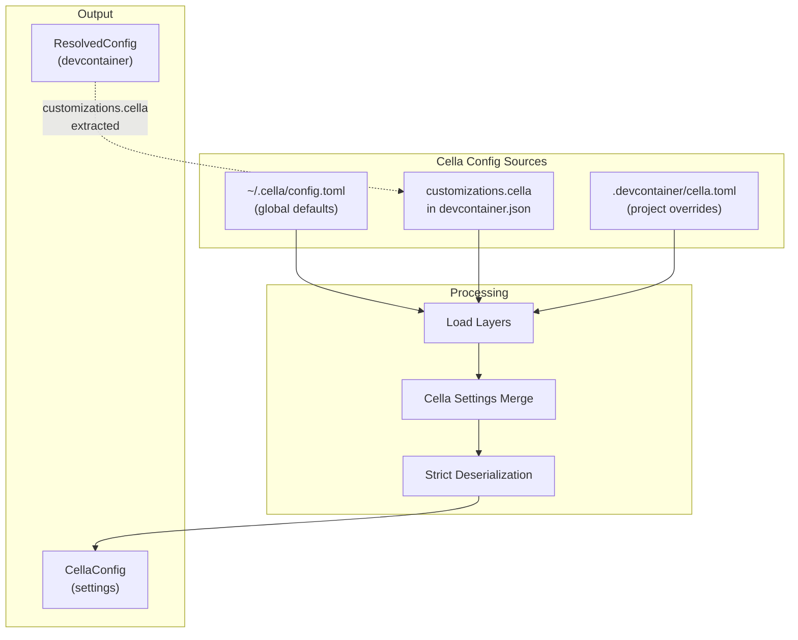

# Configuration

The key words "MUST", "MUST NOT", "REQUIRED", "SHALL", "SHALL NOT", "SHOULD", "SHOULD NOT", "RECOMMENDED", "MAY", and "OPTIONAL" in this document are to be interpreted as described in [RFC 2119](https://www.ietf.org/rfc/rfc2119.txt).

This document covers cella-specific configuration: the layered settings system, cella config files, and cella settings. For devcontainer.json semantics (config discovery, merge semantics, variable substitution, orchestration types), see [devcontainer-reference.md](devcontainer-reference.md).

## Summary

cella uses a layered configuration system that merges settings from three sources in priority order: global defaults, workspace-embedded customizations, and project-level overrides. Configuration files use TOML (preferred) or JSON with JSONC comments. The devcontainer.json file is parsed as JSONC with schema validation via build-time code generation from the devcontainer JSON schema.

## Architecture



For the full devcontainer.json processing pipeline (discovery, parsing, merge, variable substitution), see [devcontainer-reference.md](devcontainer-reference.md).

| Crate | Role |
|---|---|
| `cella-config` | Schema types, TOML/JSON loading, settings merge, devcontainer discovery/parsing/resolution, variable substitution |
| `cella-codegen` | JSON schema to Rust type generation (build-time) |
| `cella-jsonc` | JSONC preprocessing (comment and trailing comma removal) |

### devcontainer.json Layer Merging

After discovering the primary devcontainer.json, two additional devcontainer.json override layers are merged:

1. **devcontainer.json global override** (`~/.config/cella/global.jsonc`) -- merged as a base layer beneath the primary config. This is distinct from the cella settings global config (`~/.cella/config.toml`); they use different paths, different formats, and different merge algorithms.
2. **devcontainer.json local override** (`.devcontainer/devcontainer.local.jsonc`) -- merged on top of the primary config

These layers use devcontainer merge semantics (see [devcontainer-reference.md § Property Merge Semantics](devcontainer-reference.md#property-merge-semantics)).

## Configuration Layers

cella settings are loaded from three sources and merged in order from lowest to highest priority:

| Priority | Location | Format | Scope |
|---|---|---|---|
| 1 (lowest) | `~/.cella/config.toml` | TOML or JSON | Global defaults for all projects |
| 2 | `customizations.cella` in `devcontainer.json` | JSON (embedded) | Shared via version control |
| 3 (highest) | `.devcontainer/cella.toml` | TOML or JSON | Project-level overrides |

Each location is OPTIONAL. When no config files exist, all settings use their defaults.

### Format Precedence

The global and project-level config locations accept either TOML (`.toml`) or JSON (`.json`) files. When both exist in the same directory, the TOML file MUST take precedence and the JSON file MUST be ignored. JSON config files support JSONC comments (`//` and `/* */`).

### Workspace Customizations

Settings in `devcontainer.json` go under `customizations.cella`:

```jsonc
{
  "image": "mcr.microsoft.com/devcontainers/base:ubuntu",
  "customizations": {
    "cella": {
      "credentials": { "gh": true },
      "tools": { "claude-code": { "version": "stable" } }
    }
  }
}
```

The `customizations.cella` object is extracted from the resolved devcontainer.json and treated as a settings layer. It uses the same schema as TOML config files.

## Merge Semantics

### Cella Settings Merge

Cella settings layers (global, workspace customizations, project) are merged using `deep_merge`. The algorithm handles value types as follows:

| Value Type | Behavior | Example |
|---|---|---|
| Scalar (string, number) | Higher-priority layer wins | `mode = "enforced"` overrides `mode = "logged"` |
| Object | Recursive merge -- sibling fields are preserved | Setting `[credentials.ai] enabled = false` in project config does not remove `gh = true` from global |
| Array | Higher-priority items prepended, then lower-priority items appended | Network rules from project appear before global rules (first-match-wins) |
| Null | Higher-priority layer wins | `null` overrides any prior value |

Array prepend ordering is intentional: in first-match rule engines like network rules, higher-priority layers' entries are evaluated first.

**Exception: `shell.preferred`** uses replacement semantics instead of the default array merge. When any layer sets `shell.preferred`, the highest-priority layer's value wins entirely -- no concatenation or prepend. This is because shell preference order is a complete ranked list, not an additive collection.

#### Merge Example

Global config (`~/.cella/config.toml`):

```toml
[credentials]
gh = true

[credentials.ai]
enabled = true
openai = false
```

Project config (`.devcontainer/cella.toml`):

```toml
[credentials.ai]
anthropic = false
```

Result after merge:

```toml
[credentials]
gh = true                # preserved from global

[credentials.ai]
enabled = true           # preserved from global
openai = false           # preserved from global
anthropic = false        # added by project
```

For devcontainer.json merge semantics (property-specific rules, merge strategies, memory string parsing), see [devcontainer-reference.md § Property Merge Semantics](devcontainer-reference.md#property-merge-semantics).

## devcontainer.json Parsing

### JSONC Preprocessing

devcontainer.json files use JSONC (JSON with Comments). The `cella-jsonc` crate preprocesses the input in a single pass:

- Line comments (`//`) are replaced with spaces until the next newline
- Block comments (`/* */`) are replaced with spaces (newlines preserved)
- Trailing commas before `]` or `}` are replaced with a space
- String contents are passed through verbatim (comment-like syntax inside strings is not modified)
- Escaped quotes within strings are handled correctly

The preprocessing preserves byte offsets exactly (`output.len() == input.len()`), enabling source-positioned error diagnostics.

An unterminated block comment MUST produce an error. Nested block comments are not supported -- the first `*/` ends the comment.

### Schema Code Generation

The `cella-codegen` crate generates Rust types and validators from the devcontainer JSON schema at build time. The process:

1. Read `schemas/devContainer.base.schema.json` during `build.rs`
2. Parse the JSON schema into an intermediate representation (IR)
3. Lower `$ref` references, `allOf` compositions, enum types, and nested objects into Rust type definitions
4. Emit Rust source with struct definitions, validation functions, and typed accessors
5. Output is included via `include!(concat!(env!("OUT_DIR"), "/generated.rs"))`

The generated `DevContainer` type provides typed accessor methods (`name()`, `remote_user()`, `container_user()`, `features()`, `remote_env()`, `mounts()`, `initialize_command()`, `host_requirements()`) that return `Option<&T>` for nullable fields.

### Validation Modes

| Mode | Unknown Fields | Effect |
|---|---|---|
| Non-strict (default) | Warning | Config parsed successfully; unknown fields produce diagnostics with `Severity::Warning` |
| Strict | Error | Unknown fields produce diagnostics with `Severity::Error`; parsing fails |

Diagnostics include:

| Field | Description |
|---|---|
| `severity` | `Error` or `Warning` |
| `message` | Human-readable description |
| `path` | JSON pointer path to the problematic field |
| `span` | Byte offset range in the original source (when determinable) |
| `help` | Suggested fix |

Deprecation warnings are emitted for legacy properties. For example, `appPort` produces a warning recommending `forwardPorts`.

For variable substitution (supported patterns, resolution rules, `workspaceFolder` two-pass resolution, `devcontainerId` computation), see [devcontainer-reference.md § Variable Substitution](devcontainer-reference.md#variable-substitution).

## Settings Reference

All config sections use `deny_unknown_fields` -- unknown fields MUST be rejected at deserialization time. All enum values are lowercase strings.

### `[security]`

Network security mode for the in-container proxy.

| Field | Type | Default | Description |
|---|---|---|---|
| `mode` | `string` | `"disabled"` | Security mode: `"disabled"`, `"logged"`, `"enforced"` |

```toml
[security]
mode = "enforced"
```

### `[credentials]`

Controls credential forwarding into containers. See [credential-protection.md](credential-protection.md) for the full phantom token system.

| Field | Type | Default | Description |
|---|---|---|---|
| `gh` | `bool` | `true` | Forward GitHub CLI credentials |
| `protect` | `bool` | `false` | Enable phantom token credential protection |
| `cache_ttl_seconds` | `u32` | `60` | Credential resolution cache TTL in seconds. `0` disables caching. |
| `profile` | `string?` | `null` | Credential profile name for multi-account scoping |

```toml
[credentials]
gh = true
protect = true
cache_ttl_seconds = 120
```

#### `[credentials.ai]`

Controls which AI provider API keys are forwarded from the host environment into containers.

| Field | Type | Default | Description |
|---|---|---|---|
| `enabled` | `bool` | `true` | Global toggle -- when `false`, no AI keys are forwarded regardless of per-provider settings |
| *`<provider_id>`* | `bool` | `true` | Per-provider override. Known providers: `anthropic`, `openai`, `gemini`, `groq`, `mistral`, `deepseek`, `xai`, `fireworks`, `together`, `perplexity`, `cohere` |

Unknown provider names default to enabled. The `providers` map uses `#[serde(flatten)]` so any string key is accepted without struct changes.

```toml
[credentials.ai]
enabled = true
openai = false
anthropic = true
```

#### `[[credentials.providers]]`

Custom credential providers for use with phantom token protection. See [credential-protection.md](credential-protection.md) for the user consent flow and security model.

| Field | Type | Required | Default | Description |
|---|---|---|---|---|
| `name` | `string` | yes | -- | Short identifier. If it matches a built-in provider ID, overrides that provider entirely. |
| `env` | `string` | yes | -- | Host environment variable holding the real credential |
| `domains` | `string[]` | yes | -- | Target domains this provider protects |
| `header` | `string` | yes | -- | HTTP header name for credential injection |
| `prefix` | `string` | no | `""` | Header value prefix prepended to the credential (e.g., `"Bearer "`) |

```toml
[[credentials.providers]]
name = "internal-api"
env = "INTERNAL_API_KEY"
domains = ["api.internal.corp"]
header = "Authorization"
prefix = "Bearer "
```

### `[tools]`

Controls tool installation and host config forwarding. Tools are not installed by default -- use `cella install` for on-demand installation, or list them in `install` for eager installation during `cella up`.

| Field | Type | Default | Description |
|---|---|---|---|
| `install` | `string[]` | `[]` | Tools to install during `cella up`. Valid: `"claude-code"`, `"codex"`, `"gemini"`, `"nvim"`, `"tmux"` |

```toml
[tools]
install = ["claude-code", "nvim"]
```

#### `[tools.claude-code]`

| Field | Type | Default | Description |
|---|---|---|---|
| `forward_config` | `bool` | `true` | Bind-mount host config (`~/.claude/`, `~/.claude.json`) into the container |
| `version` | `string` | `"latest"` | `"latest"`, `"stable"`, or a pinned version |

#### `[tools.codex]`

| Field | Type | Default | Description |
|---|---|---|---|
| `forward_config` | `bool` | `true` | Bind-mount host config (`~/.codex/`) into the container |
| `version` | `string` | `"latest"` | `"latest"` or a pinned version |

#### `[tools.gemini]`

| Field | Type | Default | Description |
|---|---|---|---|
| `forward_config` | `bool` | `true` | Bind-mount host config (`~/.gemini/`) into the container |
| `version` | `string` | `"latest"` | `"latest"` or a pinned version |

#### `[tools.nvim]`

| Field | Type | Default | Description |
|---|---|---|---|
| `forward_config` | `bool` | `true` | Bind-mount host nvim config (`~/.config/nvim/` or custom `config_path`) into the container |
| `version` | `string` | `"stable"` | `"stable"`, `"nightly"`, or a pinned version |
| `config_path` | `string?` | *unset* | Override host config source directory. Container destination is always `$HOME/.config/nvim/`. |

#### `[tools.tmux]`

Tmux has no `version` field -- it is installed via the container's system package manager.

| Field | Type | Default | Description |
|---|---|---|---|
| `forward_config` | `bool` | `true` | Bind-mount host tmux config (`~/.tmux.conf`, `~/.config/tmux/`) into the container |
| `config_path` | `string?` | *unset* | Override host config source path. Container destinations are always `$HOME/.tmux.conf` and `$HOME/.config/tmux/`. |

### `[network]`

Network proxy and blocking settings. See [network-proxy.md](../guides/network-proxy.md) for full details on modes, rules, path patterns, CA certificates, and CLI commands.

| Field | Type | Default | Description |
|---|---|---|---|
| `mode` | `string?` | *unset* | `"denylist"` or `"allowlist"`. When unset, does not override devcontainer.json settings. |
| `proxy` | `object` | *(see below)* | Proxy configuration |
| `rules` | `array` | `[]` | Network blocking rules |

When `mode` is unset (`None`), the cella settings layer does not inject a mode override. The effective mode defaults to `denylist` when converting to the network config used by the rule engine.

#### `[network.proxy]`

| Field | Type | Default | Description |
|---|---|---|---|
| `enabled` | `bool` | `true` | Enable proxy forwarding |
| `http` | `string?` | *unset* | HTTP proxy URL override |
| `https` | `string?` | *unset* | HTTPS proxy URL override |
| `no_proxy` | `string?` | *unset* | `NO_PROXY` override |
| `ca_cert` | `string?` | *unset* | Path to additional CA certificate |
| `proxy_port` | `u16` | `18080` | In-container proxy listen port |

#### `[[network.rules]]`

| Field | Type | Default | Description |
|---|---|---|---|
| `domain` | `string` | *(required)* | Domain glob pattern |
| `paths` | `string[]` | `[]` | Path glob patterns |
| `action` | `string` | *(required)* | `"block"` or `"allow"` |

### `[shell]`

Shell preference for container sessions.

| Field | Type | Default | Merge Behavior | Description |
|---|---|---|---|---|
| `preferred` | `string[]` | `[]` | **Replacement** (highest-priority layer wins entirely) | Ordered list of shell preferences. Entries MAY be bare names (`"zsh"`) or absolute paths (`"/usr/local/bin/fish"`). |

```toml
[shell]
preferred = ["zsh", "bash", "sh"]
```

### `[cli]`

Persisted defaults for CLI flags.

| Field | Type | Default | Description |
|---|---|---|---|
| `verbose` | `bool` | `false` | Enable verbose output |
| `output` | `string` | `"text"` | Output format: `"text"` or `"json"` |
| `pull` | `string` | `"missing"` | Image pull policy: `"always"`, `"missing"`, `"never"`, `"build"` |
| `skip_checksum` | `bool` | `false` | Skip agent binary checksum verification |
| `no_network_rules` | `bool` | `false` | Disable all network blocking rules |

```toml
[cli]
skip_checksum = false
no_network_rules = false
```

#### `[cli.build]`

Build-specific CLI defaults.

| Field | Type | Default | Description |
|---|---|---|---|
| `no_cache` | `bool` | `false` | Disable Docker build cache |
| `profiles` | `string[]` | `[]` | Compose profiles to activate |
| `env_files` | `string[]` | `[]` | Additional env files for build |
| `pull_policy` | `string` | `"missing"` | Build image pull policy: `"always"`, `"missing"`, `"never"`, `"build"` |

```toml
[cli.build]
no_cache = false
profiles = ["dev"]
```

## Validation

### Cella Settings

All cella config sections use `#[serde(deny_unknown_fields)]` -- unknown fields MUST be rejected at deserialization time. A typo like `[securityy]` or `enbled = true` produces an error at load time rather than being silently ignored.

Validation errors include the serde error message pointing to the unknown field or type mismatch.

### devcontainer.json

devcontainer.json validation is performed by the generated schema validator. Errors include JSON pointer paths and source-positioned spans when available:

```
error[cella::config::parse]: validation error at /features/unknownFeature
  --> devcontainer.json:5:5
  |
5 |     "unknownFeature": {}
  |     ^^^^^^^^^^^^^^^^
  help: remove this field or check the spelling
```

## Configuration Reference

Summary of the complete `CellaConfig` structure:

| Section | Key Fields | Default | Notes |
|---|---|---|---|
| `security` | `mode` | `disabled` | `disabled` / `logged` / `enforced` |
| `credentials` | `gh`, `protect`, `cache_ttl_seconds`, `profile` | `gh=true`, `protect=false`, `cache_ttl=60` | See [credential-protection.md](credential-protection.md) |
| `credentials.ai` | `enabled`, `<provider_id>` | `enabled=true`, all providers `true` | Flat map via `#[serde(flatten)]` |
| `credentials.providers` | `name`, `env`, `domains`, `header`, `prefix` | `[]` | Custom provider array |
| `tools` | `install` | `[]` | Eager install list |
| `tools.<name>` | `forward_config`, `version`, `config_path` | Varies per tool | claude-code, codex, gemini, nvim, tmux |
| `network` | `mode`, `proxy`, `rules` | `mode=None`, `proxy.enabled=true`, `rules=[]` | See [network-proxy.md](../guides/network-proxy.md) |
| `shell` | `preferred` | `[]` | Replacement merge semantics |
| `cli` | `verbose`, `output`, `pull`, `skip_checksum`, `no_network_rules` | All `false`/defaults | Persisted CLI flag defaults |
| `cli.build` | `no_cache`, `profiles`, `env_files`, `pull_policy` | All `false`/empty | Build-specific defaults |

## Error Handling

Configuration errors are reported via `miette` diagnostics with structured context:

| Error | Cause | Diagnostic Help |
|---|---|---|
| `ReadFile` | Config file unreadable (permissions, absent) | "check that the file exists and is readable" |
| `ParseToml` | Invalid TOML syntax | "check TOML syntax at the indicated location" |
| `ParseJson` | Invalid JSON syntax | "check JSON syntax -- JSONC comments (// and /* */) are supported" |
| `JsoncStrip` | JSONC preprocessing failure (unterminated block comment) | "check for unterminated block comments" |
| `Deserialization` | Schema validation failure (unknown fields, type mismatches) | "check field names and value types against the cella config schema" |

For devcontainer.json discovery errors (`NotFound`, `Ambiguous`, `ReadDir`), see [devcontainer-reference.md § Config Discovery](devcontainer-reference.md#config-discovery).

All configuration errors are fatal -- cella does not proceed with partial configuration.

## Dual Config File Warning

When both `cella.toml` and `cella.json` exist in the same directory, cella emits a warning diagnostic identifying both files and indicating which one is used (TOML takes precedence). The JSON file is not silently ignored.

## Config Profiles

Named configuration profiles enable quick switching between settings sets:

- `cella config use <profile>` activates a profile from `~/.cella/profiles/<name>.toml`
- The active profile is loaded as an additional layer between global and workspace customizations
- `cella config list` shows available profiles

## Remote Config

Organization-wide configuration distribution:

- `[config.remote]` section with a URL pointing to a shared config endpoint
- Fetched and cached locally with a configurable TTL
- Merged as the lowest-priority layer (below global config)
- Supports authentication via the credential system

## Limitations

1. The `customizations.cella` section in devcontainer.json is extracted as raw JSON and re-deserialized through the same TOML-compatible schema. TOML-specific syntax (inline tables, multi-line strings) is not available in the JSON embedding.
2. The `shell.preferred` replacement semantics are an exception to the general array merge behavior. This is intentional but may surprise users expecting concatenation.
