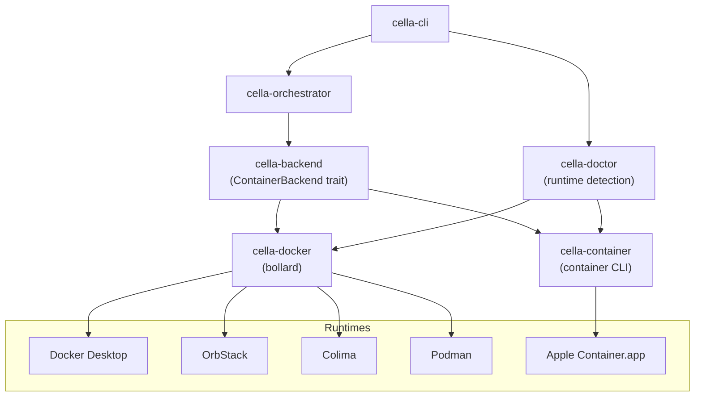

# Container Backends

The key words "MUST", "MUST NOT", "REQUIRED", "SHALL", "SHALL NOT", "SHOULD", "SHOULD NOT", "RECOMMENDED", "MAY", and "OPTIONAL" in this document are to be interpreted as described in [RFC 2119](https://www.ietf.org/rfc/rfc2119.txt).

## Summary

cella supports multiple container runtimes through a backend abstraction layer. The `cella-backend` crate defines the `ContainerBackend` trait -- a single async interface that all container runtimes implement. The Docker backend (`cella-docker`) drives the Docker Engine via the bollard async API client. The Apple Container backend (`cella-container`) drives the native macOS container runtime via CLI subprocess invocations. The `cella-doctor` crate probes the host environment to detect which runtimes are available and validates their configuration.

This design allows cella to operate identically regardless of the underlying runtime. Callers work exclusively with `dyn ContainerBackend` trait objects and never depend on a specific implementation crate.

## Architecture



### Crate Responsibilities

| Crate | Tier | Role |
|---|---|---|
| `cella-backend` | Foundation | Trait definitions, shared types, error types, naming/label utilities, mount abstractions, container target resolution |
| `cella-docker` | Domain | Docker Engine implementation via bollard, socket discovery, config mapping to Docker API, network/volume management |
| `cella-container` | Domain | Apple Container implementation via CLI subprocess, staging directory file injection, best-effort OCI image parsing |
| `cella-doctor` | Domain | Runtime availability checks, engine version validation, security advisory detection |

## Backend Trait

### Interface Definition

The `ContainerBackend` trait is the central abstraction. All methods return `BoxFuture` -- a pinned, boxed, `Send` future -- to preserve object safety. Callers interact with backends through `dyn ContainerBackend` trait objects.

```rust
pub type BoxFuture<'a, T> = Pin<Box<dyn Future<Output = T> + Send + 'a>>;

pub trait ContainerBackend: Send + Sync {
    fn kind(&self) -> BackendKind;
    fn capabilities(&self) -> BackendCapabilities;

    // Container lifecycle
    fn find_container(&self, workspace_root: &Path) -> BoxFuture<...>;
    fn create_container(&self, opts: &CreateContainerOptions) -> BoxFuture<...>;
    fn start_container(&self, id: &str) -> BoxFuture<...>;
    fn stop_container(&self, id: &str) -> BoxFuture<...>;
    fn remove_container(&self, id: &str, remove_volumes: bool) -> BoxFuture<...>;
    fn inspect_container(&self, id: &str) -> BoxFuture<...>;
    fn list_cella_containers(&self, running_only: bool) -> BoxFuture<...>;

    // Exec operations
    fn exec_command(&self, id: &str, opts: &ExecOptions) -> BoxFuture<...>;
    fn exec_stream(&self, id: &str, opts: &ExecOptions, stdout: ..., stderr: ...) -> BoxFuture<...>;
    fn exec_interactive(&self, id: &str, opts: &InteractiveExecOptions) -> BoxFuture<...>;
    fn exec_detached(&self, id: &str, opts: &ExecOptions) -> BoxFuture<...>;

    // Image operations
    fn pull_image(&self, image: &str) -> BoxFuture<...>;
    fn build_image(&self, opts: &BuildOptions) -> BoxFuture<...>;
    fn image_exists(&self, image: &str) -> BoxFuture<...>;
    fn inspect_image_details(&self, image: &str) -> BoxFuture<...>;

    // File injection, connectivity, platform detection, networking, agent provisioning
    // ... (see full trait for all methods)
}
```

Every backend implementation MUST provide all required methods. Methods with default implementations (network management operations) return `BackendError::NotSupported` for backends that lack the concept -- this is the correct behavior, not an error condition.

### Backend Kind

The `BackendKind` enum identifies which backend is in use. It serializes as kebab-case strings for wire transport and label storage.

| Variant | String | Description |
|---|---|---|
| `Docker` | `"docker"` | Docker Engine (via bollard) |
| `Podman` | `"podman"` | Podman (Docker-compatible socket) |
| `AppleContainer` | `"apple-container"` | Apple Container native runtime |

The `backend_kind` field is sent during daemon registration so the daemon can adapt its behavior per-backend (e.g., skipping agent volume management for backends that do not support Docker volumes).

### Capability Model

Each backend reports its supported capabilities through `BackendCapabilities`:

```rust
pub struct BackendCapabilities {
    pub compose: bool,
    pub managed_agent: bool,
}
```

Callers MUST check capabilities before invoking capability-gated operations:

| Capability | Docker | Apple Container | Governs |
|---|---|---|---|
| `compose` | true | false | Docker Compose integration (compose project creation, service discovery, override YAML generation) |
| `managed_agent` | true | false | In-container agent provisioning via shared Docker volume, agent restart, daemon address injection |

Beyond the `BackendCapabilities` struct, backends express their feature surface through several other mechanisms:

- **`NotSupported` errors.** Network management operations (`list_managed_networks`, `remove_network_if_orphan`, `connect_to_network`, `network_exists`) return `BackendError::NotSupported` on backends without Docker-style networking. Callers SHOULD handle this variant gracefully.
- **Unsupported option warnings.** Backends that do not support Docker-specific container creation flags (privileged mode, capabilities, GPU passthrough, security options, device mappings) MUST emit `tracing::warn` diagnostics and proceed without the flag rather than failing.
- **Mount type support.** All backends MUST support `bind` and `tmpfs` mounts. Backends SHOULD support `volume` mounts. Backends MAY support `npipe` (Windows named pipes). Unsupported mount types MUST be logged and skipped, never silently demoted to a different type.
- **GPU passthrough.** Supported by the Docker backend via NVIDIA device requests (`DeviceRequest` with `gpu` capability). Not supported by Apple Container. The `GpuRequest` enum supports three modes: `All` (all GPUs), `Count(n)` (specific count), and `DeviceIds(vec)` (specific device IDs).
- **Ulimit configuration.** Supported by the Docker backend through `RunArgsOverrides`. Each ulimit specifies a name, soft limit, and hard limit.

### Container Info

All backends return a unified `ContainerInfo` struct from inspect and list operations:

```rust
pub struct ContainerInfo {
    pub id: String,
    pub name: String,
    pub state: ContainerState,
    pub exit_code: Option<i64>,
    pub labels: HashMap<String, String>,
    pub config_hash: Option<String>,
    pub ports: Vec<PortBinding>,
    pub created_at: Option<String>,
    pub container_user: Option<String>,
    pub image: Option<String>,
    pub mounts: Vec<MountInfo>,
    pub backend: BackendKind,
}
```

The `backend` field MUST be set to the correct `BackendKind` variant so callers can distinguish which runtime manages a given container.

### Container Target Resolution

`ContainerTarget` resolves a user's intent (container ID, name, label, or workspace folder) to a concrete `ContainerInfo`. Resolution follows a strict priority order:

1. **`container_id`** -- direct inspect by ID
2. **`container_name`** -- inspect by name
3. **`id_label`** -- search all runtime containers by label (`key=value` or `key`)
4. **`workspace_folder`** -- search by `dev.cella.workspace_path` label
5. **CWD fallback** -- `std::env::current_dir()` as workspace folder

The resolver MUST return `BackendError::ContainerNotFound` if no match is found, and `BackendError::ContainerNotRunning` if the container exists but is stopped and `require_running` is true.

## Docker Backend

### Connection Management

`DockerClient` wraps the bollard `Docker` client and implements `ContainerBackend`. Connection follows a tiered strategy:

1. **Bollard defaults.** Reads `DOCKER_HOST` env var or probes `/var/run/docker.sock`.
2. **`docker context inspect`.** Queries the active Docker context for its unix socket endpoint.
3. **Known socket paths.** Probes filesystem locations for alternative runtimes (see [Runtime Detection](#runtime-detection)).
4. **Explicit override.** `DockerClient::connect_with_host(host)` accepts `unix:///path`, bare `/path`, or `http(s)://host:port` URLs. Exposed via `--docker-host` CLI flag and `DOCKER_HOST` env var.

If all methods fail, the client returns a detailed error message listing every path that was tried and suggesting runtimes to install.

### Container Creation

Container creation converts `CreateContainerOptions` to a bollard `ContainerCreateBody`. The mapping covers thirty-plus Docker API flags organized into the following categories:

**Core options:**

| Flag | Source |
|---|---|
| `image`, `name`, `labels`, `env`, `user`, `working_dir`, `entrypoint`, `cmd` | Direct `CreateContainerOptions` fields |
| `exposed_ports`, `port_bindings` | `port_bindings` map (protocol defaults to `tcp` when not specified) |
| `mounts` | Workspace mount + additional mounts, deduplicated by target path (last occurrence wins) |

**Networking (`RunArgsOverrides`):**

`network_mode`, `hostname`, `dns`, `dns_search`, `extra_hosts`, `mac_address`

The Docker backend automatically injects `host.docker.internal:host-gateway` into `extra_hosts` on every container.

**Resources (`RunArgsOverrides`):**

`memory`, `memory_swap`, `memory_reservation`, `nano_cpus`, `cpu_shares`, `cpu_period`, `cpu_quota`, `cpuset_cpus`, `cpuset_mems`, `shm_size`, `pids_limit`

**Security (`RunArgsOverrides`):**

`cap_add`, `security_opt`, `privileged`, `userns_mode`, `cgroup_parent`, `cgroupns_mode`

Security options from `CreateContainerOptions.security_opt` and `RunArgsOverrides.security_opt` are merged. The `privileged` flag is OR'd: if either the base options or the overrides request privileged mode, the container runs privileged.

**Devices and GPU:**

`devices` (host path, container path, cgroup permissions), `device_cgroup_rules`, `gpus` (converted to `DeviceRequest` with `gpu` capability)

GPU requests from `RunArgsOverrides.gpus` take precedence over `CreateContainerOptions.gpu_request`. Only one GPU device request is emitted.

**Other:**

`ulimits`, `sysctls`, `tmpfs`, `pid_mode`, `ipc_mode`, `uts_mode`, `runtime`, `storage_opt`, `log_driver`, `log_opt`, `restart_policy`, `init`

Unrecognized `runArgs` flags are collected in `RunArgsOverrides.unrecognized` and emitted as warnings.

### Image Build

When a `build` object is present in devcontainer.json, cella builds a Docker image from the specified Dockerfile. The `parse_build_options` function in `cella-orchestrator` extracts build parameters from the config and produces a `BuildOptions` struct.

**Forwarded build properties:**

| Property | `BuildOptions` Field | Default | Notes |
|---|---|---|---|
| `build.dockerfile` | `dockerfile` | `"Dockerfile"` | Relative to context path |
| `build.context` | `context_path` | `"."` | Resolved relative to `.devcontainer/` directory; absolute paths used as-is |
| `build.args` | `args` | `{}` | Key-value map forwarded as `--build-arg` flags |
| `build.target` | `target` | none | Multi-stage build target, forwarded as `--target` |
| `build.cacheFrom` | `cache_from` | `[]` | Array of image references forwarded as `--cache-from` |
| `build.options` | `options` | `[]` | Additional Docker build CLI flags passed through verbatim |

All six properties MUST be forwarded to the Docker build command. `context`, `args`, `target`, and `cacheFrom` MUST NOT be silently dropped.

The build context path MUST be resolved relative to the directory containing `devcontainer.json` (the `.devcontainer/` directory), not the workspace root. When `context` is an absolute path, it MUST be used as-is without further resolution.

**Build secrets:**

`BuildOptions` also carries a `secrets` list (`Vec<BuildSecret>`), where each secret has an `id` and either a `src` (file path) or `env` (environment variable name). These are forwarded as `--secret` flags to the Docker build.

**Build metadata label:**

When the image build is the final layer (no features will be applied on top), cella MUST embed a `devcontainer.metadata` label in the built image via `--label=devcontainer.metadata=...`. This label carries lifecycle commands (e.g., `postCreateCommand`, `onCreateCommand`) so that prebuilt images remain self-describing. When features will be layered on top, the metadata label is omitted from the base build to avoid duplication -- the features build produces its own metadata label.

**No-cache and pull policy:**

When `--no-cache` is requested, `--no-cache` and `--pull` flags are appended to `options`. When pull policy is `"always"`, only `--pull` is appended. When pull policy is `"never"`, neither flag is added (Docker's default behavior is to not pull base images unless `--pull` is passed).

Reference: [build property](https://containers.dev/implementors/json_reference/) in the devcontainer specification.

### Mount Handling

The `MountSpec` type provides a backend-neutral mount representation with adapters for both the Docker API (`to_mount_config`) and Docker Compose YAML (`to_compose_yaml_entry`).

Supported mount kinds:

| Kind | Docker API Type | Notes |
|---|---|---|
| `Bind` | `MountType::BIND` | Host directory to container path. Compose adapter emits `bind.create_host_path: false` to prevent silent directory creation. |
| `Tmpfs` | `MountType::TMPFS` | In-memory filesystem. Source is empty. |
| `Volume` | `MountType::VOLUME` | Docker-managed named volume. |
| `NamedPipe` | `MountType::NPIPE` | Windows named pipes (`//./pipe/docker_engine`). |

All backends MUST honor the `read_only` flag on mounts. The `consistency` hint (`cached`, `delegated`, `consistent`) is forwarded when present.

When multiple mounts target the same container path, the last occurrence wins. The deduplication operates across workspace mounts and additional mounts uniformly. The dedup algorithm reverses the mount list, retains the first occurrence per target path, then reverses back -- ensuring the last-specified mount for a given target path is the one that takes effect.

#### Mount Validation

Mount entries in the `mounts` array accept two formats: an object or a comma-delimited string.

**Object format:**

The `target` field MUST be present and non-empty; entries with an empty or missing target are silently dropped. The `source` field is OPTIONAL -- volume mounts may omit it. The `type` field SHOULD be present; when absent, cella defaults to `"bind"`.

> **Note:** The [upstream spec](https://containers.dev/implementors/json_reference/) defines mount `type` as required with an enum of exactly `bind` or `volume`. cella is more permissive: it defaults missing `type` to `"bind"` and accepts `tmpfs` and `npipe` as extensions beyond the spec's enum. This matches Docker's mount type vocabulary and avoids rejecting valid Docker mount configurations.

The `readOnly` boolean field defaults to `false` when absent.

**String format:**

String-format mounts use comma-separated `key=value` pairs. Recognized keys:

| Key | Aliases | Default | Notes |
|---|---|---|---|
| `type` | -- | `"bind"` | Mount type |
| `source` | `src` | `""` | Host path or volume name |
| `target` | `dst`, `destination` | -- | Container path (REQUIRED) |
| `consistency` | -- | none | `cached`, `delegated`, or `consistent` |
| `external` | -- | `false` | Whether the volume is externally managed |

Bare tokens `ro` and `readonly` (without `=`) set `read_only` to `true`. Whitespace around `=` is trimmed.

A string-format mount MUST have a non-empty `target` after parsing; entries without one return `None` and are skipped.

**Mount type support by backend:**

| Type | Spec | Docker | Apple Container |
|---|---|---|---|
| `bind` | Yes | Yes | Yes (via `--volume`) |
| `volume` | Yes | Yes | No |
| `tmpfs` | **cella extension** | Yes | No |
| `npipe` | **cella extension** | Yes (Windows) | No |

Unsupported mount types MUST be logged and skipped, not silently demoted to a different type. The `MountSpec::from_mount_config` adapter returns `None` for unrecognized type strings, and callers SHOULD log a warning.

Reference: [mounts property](https://containers.dev/implementors/json_reference/) in the devcontainer specification.

### Networking

The Docker backend manages two categories of networks, both labeled `dev.cella.managed=true`:

- **Shared `cella` network.** A bridge network that provides cross-container DNS resolution. All cella containers are connected to this network.
- **Per-workspace `cella-net-{hash}` networks.** Scoped to a workspace path, providing container isolation between projects. Carry the `dev.cella.repo` label.

Network operations:

| Operation | Behavior |
|---|---|
| `ensure_network` | Create the shared `cella` bridge network if it does not exist |
| `ensure_container_network` | Connect a container to both the shared network and its workspace-scoped network |
| `list_managed_networks` | Return all networks with `dev.cella.managed=true`, including endpoint counts |
| `remove_network_if_orphan` | Remove a network only if it has zero attached containers |
| `connect_to_network` | Connect a container to a named network |
| `network_exists` | Check whether a named network exists |

### Agent Provisioning

The Docker backend provisions the cella-agent binary through a shared Docker volume:

1. **Volume mount.** The `cella-agent` volume is mounted at `/cella` (read-only) in every container. The mount tuple is `("cella-agent", "/cella", true)`.
2. **Binary population.** `ensure_agent_provisioned` copies the agent binary for the target architecture into the volume, verified by SHA-256 checksum.
3. **Address injection.** `write_agent_addr` writes the daemon address and authentication token to the shared volume so the in-container agent can connect back to the host daemon.
4. **Version pruning.** `prune_old_agent_versions` removes agent binaries for versions other than the current one.

The agent volume is shared across ALL containers. Changes to the volume affect every running container.

### Labels

cella applies two sets of labels to every container:

**cella-specific labels:**

| Label | Content |
|---|---|
| `dev.cella.tool` | `"cella"` |
| `dev.cella.workspace_path` | Canonicalized workspace root |
| `dev.cella.config_path` | Canonicalized devcontainer.json path |
| `dev.cella.config_hash` | SHA-256 of the resolved configuration |
| `dev.cella.docker_runtime` | Runtime identifier (e.g., `"orbstack"`, `"linux-native"`) |
| `dev.cella.created_at` | RFC 3339 creation timestamp |
| `dev.cella.backend` | Backend kind string |

**Spec-standard labels** (for VS Code / tooling interop):

| Label | Content |
|---|---|
| `devcontainer.local_folder` | Same as `dev.cella.workspace_path` |
| `devcontainer.config_file` | Same as `dev.cella.config_path` |

Compose-managed containers additionally carry `dev.cella.compose_project` and `dev.cella.primary_service`. Worktree containers carry `dev.cella.worktree`, `dev.cella.branch`, and `dev.cella.parent_repo`.

## Apple Container Backend

### Runtime Interface

The Apple Container backend drives the macOS-native container runtime through the `container` CLI binary. The runtime uses Apple's Virtualization.framework (vz) to run Linux containers as lightweight VMs on Apple Silicon, providing near-native performance without a third-party hypervisor. The backend implements `ContainerBackend` by translating trait method calls into CLI subprocess invocations via `ContainerCli`.

Key differences from the Docker backend:

| Aspect | Docker | Apple Container |
|---|---|---|
| API client | bollard (async Rust, Docker Engine API) | CLI subprocess (`container` binary) |
| Compose | Supported | Not supported |
| Agent provisioning | Shared Docker volume | Not supported |
| Network management | Docker bridge networks | Not supported (returns `NotSupported`) |
| Host gateway | `host.docker.internal` | `host.local` |
| Mount types | bind, volume, tmpfs, npipe | bind (via `--volume` flag) |
| State mapping | Docker's `exited`/`dead` -> `Stopped` | Apple's `stopped` -> `Stopped` |

### File Injection

Without Docker's tar-upload API, the Apple Container backend uses a staging directory pattern for file injection:

1. Create a host-side staging directory at `~/.cache/cella/containers/{container-name}/`.
2. Mount the staging directory into the container at `/tmp/.cella-staging`.
3. Write files to the host staging directory.
4. Execute `cp` inside the container to move files from the staging mount to their final paths.
5. Execute `chmod` to set correct permissions.

The staging directory is cleaned up when the container is removed with `remove_volumes: true`.

### Image Inspection

Image metadata parsing uses best-effort extraction from the raw `container image inspect` JSON output. The parser checks multiple key paths for Docker/OCI compatibility:

- `Config.User` / `config.user` / `container_config.User` -- user field (colon-delimited, only the user portion is extracted; defaults to `"root"` if empty)
- `Config.Env` / `config.env` -- environment variable array
- `Config.Labels` / `config.labels` -> `devcontainer.metadata` -- raw metadata JSON string

### Unsupported Docker Options

When Docker-specific creation flags are present, the Apple Container backend MUST emit warnings and proceed:

| Flag | Behavior |
|---|---|
| `--privileged` | Warning emitted, ignored |
| `--cap-add` | Warning emitted, ignored |
| `--security-opt` | Warning emitted, ignored |
| `--gpus` / `gpu_request` | Warning emitted, ignored |
| `--device` | Warning emitted, ignored |
| Unrecognized `runArgs` | Warning emitted, ignored |

## Docker Compose Configuration

Docker Compose mode is activated when `dockerComposeFile` is present in devcontainer.json. The `cella-compose` crate handles project extraction, override YAML generation, and service orchestration. The Docker backend reports `compose: true` in its capabilities; Apple Container reports `compose: false`.

### Container Type Selection

Exactly one of `image`, `build` (containing `dockerfile`), or `dockerComposeFile` MUST determine the container type. These three properties are mutually exclusive -- specifying more than one is a configuration error.

| Container Type | Determining Property | Required Companion Properties |
|---|---|---|
| Image | `image` | -- |
| Dockerfile | `build.dockerfile` | -- |
| Compose | `dockerComposeFile` | `service`, `workspaceFolder` |

This mutual exclusivity is enforced at the configuration layer. See [configuration.md](./configuration.md) for the full config resolution pipeline.

### Required Compose Properties

A Compose-mode configuration MUST include all three of `dockerComposeFile`, `service`, and `workspaceFolder`. `ComposeProject::from_resolved` returns `CellaComposeError::MissingField` if `service` or `workspaceFolder` is absent. The `dockerComposeFile` extraction returns an error if the field is missing or is neither a string nor an array of strings.

`dockerComposeFile` accepts a single string or an array of strings. Paths are resolved relative to the directory containing `devcontainer.json`. Each resolved path MUST exist on disk; a missing compose file produces `CellaComposeError::FileNotFound`.

### Property Scoping

The devcontainer specification divides properties into `composeContainer` and `nonComposeBase` groups. Properties in `nonComposeBase` (e.g., `runArgs`, `build`, `appPort`, `workspaceMount`, `containerEnv`) apply only to image and Dockerfile container types and MUST NOT be used with Compose containers. Properties in `composeContainer` (e.g., `dockerComposeFile`, `service`, `runServices`, `workspaceFolder`) apply only to Compose mode. The two groups are mutually exclusive.

General properties (lifecycle commands, `customizations`, `features`, `forwardPorts`, `remoteUser`, etc.) apply to all container types.

Reference: [JSON reference](https://containers.dev/implementors/json_reference/) -- see the "Type" column for per-property applicability.

### Default Differences by Container Type

Several properties have different default values depending on the container type:

| Property | Image / Dockerfile Default | Compose Default |
|---|---|---|
| `overrideCommand` | `true` | `false` |
| `shutdownAction` | `"stopContainer"` | `"stopCompose"` |

`overrideCommand` controls whether cella overrides the container's entrypoint/CMD with a sleep command to keep it alive. For Compose containers, the service's own command is preserved by default.

`shutdownAction` controls what happens when the user disconnects:

| Container Type | Allowed Values | Default |
|---|---|---|
| Image / Dockerfile | `"none"`, `"stopContainer"` | `"stopContainer"` |
| Compose | `"none"`, `"stopCompose"` | `"stopCompose"` |

> **Note:** cella's Compose `ShutdownAction` parser treats any string other than `"none"` as `StopCompose`. Invalid values are not rejected -- they silently fall through to the default. This is more permissive than the spec's strict enum.

### runServices

`runServices` specifies which Compose services to start. When not specified (or `null`), ALL services defined in the compose file(s) are started. When specified as an array of strings, only those services are started with `docker compose up`.

Service names in `runServices` MUST match services defined in the compose file(s). `validate_run_services` checks each name against the parsed service list and returns an error for unknown services.

## Runtime Detection

### Docker Socket Discovery

When the default Docker socket (`/var/run/docker.sock` or `DOCKER_HOST`) is unreachable, cella probes for alternative runtimes in the following order:

1. **`docker context inspect`** -- queries the active Docker context for its unix socket endpoint. Accepts `unix://` paths and bare absolute paths. Rejects non-unix endpoints (TCP, SSH).

2. **Known filesystem paths** (in order):

    | Path | Runtime |
    |---|---|
    | `~/.colima/default/docker.sock` | Colima |
    | `~/.rd/docker.sock` | Rancher Desktop |
    | `~/.local/share/containers/podman/machine/*/podman.sock` | Podman machine (macOS, glob) |
    | `$XDG_RUNTIME_DIR/podman/podman.sock` | Podman rootless (Linux only) |

Each discovered socket is recorded with its discovery method (`DockerContext` or `FilesystemProbe`) for diagnostic reporting.

### Apple Container Discovery

The Apple Container CLI is discovered through a separate process:

1. **`CELLA_CONTAINER_PATH` env var** -- explicit override pointing to the `container` binary.
2. **PATH search** -- locate `container` in the system `PATH`.
3. **Validation** -- confirm the binary is Apple's Container CLI (not a coincidental name collision):
   - Primary: `container version --format json` -- parse JSON output for version info. An entry with `appName` containing "container" (case-insensitive) or any entry with a version field is accepted.
   - Fallback: `container system status` -- confirms the binary is a working Apple Container CLI when the version plugin is not installed (common with `.pkg` installs).

### Runtime Health Checks

`cella doctor` validates the runtime environment through a series of checks:

**Docker checks:**

| Check | Pass Condition |
|---|---|
| Daemon reachable | `ping()` succeeds |
| Socket accessible | Socket file exists and is readable |
| Docker CLI | `docker --version` succeeds |
| Engine version | `docker version --format {{.Server.Version}}` succeeds |
| Engine security | Engine version >= 29.3.1 (see [Security Thresholds](#security-thresholds)) |
| Buildx | `docker buildx version` succeeds |
| Compose | `docker compose version` succeeds |

**Container checks** (per running container):

| Check | Pass Condition |
|---|---|
| Running | Container state is `Running` |
| Version | Agent version matches CLI version |
| Agent | Agent connected to daemon (managed backends only) |
| Credentials | gh CLI config present in container (managed backends only) |
| Forwarded ports | Port count reported (informational) |

Container checks for unmanaged backends (Apple Container) skip agent connectivity and port forwarding checks but still verify running state and version skew.

### Security Thresholds

The engine security check evaluates Docker Engine version against known advisories:

| Version Range | Severity | Finding |
|---|---|---|
| < 29.0 | Warning | Default seccomp profile does not block `AF_ALG` socket creation. Credential protection benefits from 29+ hardening. |
| 29.0 -- 29.3.0 | Warning | AuthZ bypass via oversized requests. Upgrade recommended. |
| >= 29.3.1 | Pass | All known security-relevant patches applied. |

## Runtime-Specific Behavior

### OrbStack

OrbStack provides native `.local` domain routing for containers, eliminating the need for explicit port forwarding in many cases.

cella sets two OrbStack-specific container labels:

| Label | Value | Purpose |
|---|---|---|
| `dev.orbstack.domains` | `{branch}.{project}.local` | Hostname-based routing to the container's default web port |
| `dev.orbstack.http-port` | First entry from `forwardPorts` | Tells OrbStack which container port to route HTTP traffic to |

Branch names are sanitized for DNS compatibility (slashes replaced with dashes, lowercased).

### Colima

Colima runs the Docker Engine inside a Lima VM on macOS. The Docker socket is located at `~/.colima/default/docker.sock`.

Containers run inside the VM and do not have routable IP addresses from the host. Port forwarding from the container to the host requires a reverse tunnel through the daemon's port-forwarding infrastructure. See [port-forwarding.md](./port-forwarding.md) for the tunnel architecture.

### Lima

Lima provides Linux virtual machines on macOS with automatic Docker socket forwarding. When used standalone (without Colima), Lima exposes its Docker socket at a user-configured path. cella discovers Lima-managed Docker sockets through the same `docker context inspect` mechanism used for other runtimes -- Lima's `limactl` configures a Docker context that points to its VM's socket. Lima's networking model is identical to Colima's: container IPs are not routable from the host, requiring reverse tunnel port forwarding.

### Docker Desktop

Docker Desktop for Mac runs the Docker Engine inside a lightweight VM. The socket is at the standard `/var/run/docker.sock` path (symlinked from the VM).

Like Colima, container IPs are not directly routable from the host on macOS. Port forwarding relies on the daemon's reverse tunnel mechanism.

On Linux, Docker Desktop uses a similar VM architecture but native Docker Engine installations (`linux-native` runtime label) provide direct container-IP routing.

### Podman

Podman provides a Docker-compatible API socket. cella connects to Podman through the standard Docker backend -- there is no separate Podman backend implementation. The `BackendKind::Podman` variant exists for identification and label purposes.

Podman socket discovery checks:

- `~/.local/share/containers/podman/machine/*/podman.sock` (macOS, via Podman machine)
- `$XDG_RUNTIME_DIR/podman/podman.sock` (Linux, rootless)

The Docker backend's `host_gateway()` returns `host.docker.internal` for both Docker and Podman. Podman's own `host.containers.internal` is an alternative that containers MAY use, but cella standardizes on the Docker name for consistency.

## GPU and Resource Support

### GPU Passthrough

GPU access is specified through `hostRequirements.gpu` in `devcontainer.json` or `--gpus` in `runArgs`. The `GpuRequest` enum represents three modes:

| Mode | `docker create` Equivalent | DeviceRequest |
|---|---|---|
| `All` | `--gpus all` | `count: -1, capabilities: [["gpu"]]` |
| `Count(n)` | `--gpus "count=n"` | `count: n, capabilities: [["gpu"]]` |
| `DeviceIds(ids)` | `--gpus "device=0,1"` | `device_ids: ids, capabilities: [["gpu"]]` |

When both `runArgs --gpus` and `hostRequirements.gpu` are present, `runArgs` takes precedence. The Docker backend converts `GpuRequest` to a bollard `DeviceRequest`. Apple Container does not support GPU passthrough and emits a warning.

### Resource Constraints

Resource limits from `runArgs` are forwarded to the Docker Engine's host config:

| Category | Flags |
|---|---|
| Memory | `--memory`, `--memory-swap`, `--memory-reservation` |
| CPU | `--cpus` (nano_cpus), `--cpu-shares`, `--cpu-period`, `--cpu-quota`, `--cpuset-cpus`, `--cpuset-mems` |
| Process | `--pids-limit` |
| Shared memory | `--shm-size` |
| Ulimits | `--ulimit name=soft:hard` |

## Host Requirements Validation

The `hostRequirements` object in devcontainer.json declares minimum host capabilities. cella validates these during `cella up` and reports which requirements are met. Validation is informational -- unmet requirements produce warnings but do not block container creation (except when all checks fail, which triggers a user-facing diagnostic).

When `hostRequirements` is absent or `null`, validation is skipped and all requirements are considered met.

### Accepted Properties

| Property | Type | Description |
|---|---|---|
| `cpus` | integer | Minimum CPU core count (checked against `available_parallelism`) |
| `memory` | string | Minimum system memory (e.g., `"8gb"`, `"512mb"`) |
| `storage` | string | Minimum available disk space at workspace root |
| `gpu` | boolean, `"optional"`, or object | GPU availability requirement |

No other properties are accepted. The spec defines `hostRequirements` with `unevaluatedProperties: false`.

### GPU Requirement

`hostRequirements.gpu` MUST accept the following value shapes:

| Value | `required` | `optional` | Behavior |
|---|---|---|---|
| `undefined` / absent | -- | -- | No GPU check performed |
| `false` | false | false | No GPU check performed |
| `true` | true | false | GPU MUST be available; unmet requirement is a failure |
| `"optional"` | true | true | GPU is checked but absence is not a failure |
| `{ cores?, memory? }` | true | false | GPU MUST be available; object fields are informational |

When `gpu` is `true`, `"optional"`, or an object, cella checks for GPU presence by probing `/dev/nvidia0` and running `nvidia-smi`. A boolean `true` value maps to `required=true, optional=false`. A boolean `false` value skips the check entirely (no `RequirementCheck` is produced).

> **Note:** The object form (e.g., `{"cores": 4, "memory": "8gb"}`) currently sets `required=true` but does not validate the specific `cores` or `memory` constraints against the actual GPU hardware -- only GPU presence is checked. This is a known limitation.

Object form constraints:

| Field | Type | Constraint |
|---|---|---|
| `cores` | integer | Minimum 1 |
| `memory` | string | Pattern: `[0-9]+(tb|gb|mb|kb)?` |

### Memory and Storage Parsing

Memory and storage strings are parsed by `parse_byte_size`, which accepts numeric values with optional suffixes. Parsing is case-insensitive.

| Suffix | Multiplier | Example |
|---|---|---|
| `tb` or `t` | 1024^4 | `"1tb"` = 1 TiB |
| `gb` or `g` | 1024^3 | `"8gb"` = 8 GiB |
| `mb` or `m` | 1024^2 | `"512mb"` = 512 MiB |
| `kb` or `k` | 1024 | `"1024kb"` = 1 MiB |
| none | 1 (bytes) | `"1048576"` = 1 MiB |

> **cella extension:** The spec defines suffixes as exactly `tb`, `gb`, `mb`, `kb`. cella also accepts single-character shorthand (`t`, `g`, `m`, `k`), providing more lenient parsing than the spec requires.

Invalid memory strings (e.g., `"not-a-size"`) are silently skipped -- no `RequirementCheck` is produced and no error is raised.

Numeric overflow during parsing MUST NOT cause a panic. Values that exceed `u64` range are rejected by `u64::try_from` and treated as a parse failure.

### Merge Semantics

When host requirements come from multiple sources (e.g., devcontainer.json and feature metadata), the merged result MUST take the maximum value per dimension. For numeric dimensions (`cpus`, `memory`, `storage`), the higher value wins. For `gpu`, any source requesting GPU access elevates the merged requirement to required.

Reference: [hostRequirements](https://containers.dev/implementors/json_reference/) in the devcontainer specification.

## Configuration Reference

### Environment Variables

| Variable | Effect |
|---|---|
| `DOCKER_HOST` | Docker socket URL (`unix:///path`, `tcp://host:port`). Bypasses all discovery. |
| `CELLA_CONTAINER_PATH` | Explicit path to the Apple Container CLI binary. |
| `XDG_RUNTIME_DIR` | Used on Linux to locate Podman rootless socket. |

### CLI Flags

| Flag | Effect |
|---|---|
| `--docker-host <url>` | Override Docker socket URL for this invocation. Accepts `unix://`, bare paths, and `http(s)://` URLs. |

### Container Naming

Container and image names follow deterministic patterns based on workspace path and optional config name:

| Pattern | Example |
|---|---|
| Container | `cella-{name\|folder}-{hash8}` |
| Image | `cella-img-{name\|folder}-{hash8}` |
| Features image | `cella-img-{name\|folder}-{path-hash8}-{features-hash8}` |
| Worktree image | `cella-img-{name\|folder}-{path-hash8}-{config-hash8}` |
| Compose project | `cella-{name\|folder}-{hash8}` |

The `{hash8}` is the first 8 characters of the SHA-256 of the canonicalized workspace path. Names are lowercased and sanitized: non-alphanumeric characters (except `_`, `.`, `-`) are replaced with dashes, consecutive separators are collapsed, and leading/trailing dashes are trimmed.

## Error Handling

All backends map their internal errors to `BackendError`, a unified error type with `thiserror` derivation and `miette` diagnostics:

| Variant | Diagnostic Code | When |
|---|---|---|
| `ContainerNotFound` | `cella::container_not_found` | No container matches the identifier |
| `ContainerNotRunning` | `cella::backend::container_not_running` | Container exists but is stopped |
| `ImageNotFound` | `cella::backend::image_not_found` | Image not available locally |
| `ImageBuildFailed` | `cella::build_failed` | Dockerfile build error |
| `ExecFailed` | `cella::backend::exec_failed` | Non-zero exit from exec |
| `LifecycleFailed` | `cella::lifecycle_failed` | Lifecycle hook failure |
| `ConnectionFailed` | `cella::connection_failed` | Runtime unreachable |
| `NotSupported` | `cella::backend::not_supported` | Operation unavailable on this backend |
| `CliNotFound` | `cella::cli_not_found` | Backend binary not in PATH |
| `ContainerExitedImmediately` | `cella::container_exited` | Container died after start (includes log tail) |
| `AgentVolume` | `cella::backend::agent_volume` | Volume population error |
| `AgentChecksumMismatch` | `cella::backend::agent_checksum_mismatch` | Binary integrity failure |
| `HostCommandFailed` | `cella::backend::host_command_failed` | Host-side subprocess error |
| `Io` | `cella::backend::io` | Generic I/O error |
| `Runtime` | `cella::backend::runtime` | Wrapped SDK-specific error |

Each variant carries user-facing `help` text where appropriate (e.g., `ContainerNotFound` suggests `cella up` or `cella list`). Backends MUST map their SDK-specific errors (bollard errors, subprocess failures) into these variants rather than exposing implementation details.

## Podman Backend

The Podman backend implements `ContainerBackend` via Podman's Docker-compatible API. cella detects Podman by checking the API's `/info` endpoint for the `Podman` server field.

Podman-specific handling includes:

| Aspect | Behavior |
|---|---|
| Rootless networking | slirp4netns/pasta support |
| Volume semantics | `:Z`/`:z` SELinux label support |
| Build cache | Podman-specific cache behavior |

The backend capability flags match Docker except where Podman's API diverges.

## Colima SSH Agent Auto-detection

When running under Colima, cella detects the Colima VM and checks `colima.yaml` for SSH agent forwarding configuration. If `forwardAgent` is not enabled, cella emits a diagnostic with the exact configuration change needed (`forwardAgent: true` in `~/.colima/default/colima.yaml` or `colima start --ssh-agent`). On Linux, cella detects native Docker and uses Unix domain socket forwarding directly.

## Extensions

### Kubernetes Backend

A Kubernetes backend would implement `ContainerBackend` by translating container operations to Pod and Deployment operations against a Kubernetes API server. The capability model already supports this -- `compose: false`, `managed_agent: false` -- and the `NotSupported` error variant handles operations that have no Kubernetes equivalent (Docker networks, volume management).

### Remote Docker Hosts

The Docker backend's `connect_with_host` method accepts TCP URLs, enabling connections to remote Docker daemons over the network. A remote host backend would extend this with SSH tunnel management and TLS certificate handling for secure remote container management.

## Limitations

- **Apple Container CLI stability.** The `container` CLI output format is pre-1.0 and may change between macOS releases. The backend uses best-effort JSON parsing with multiple key-path fallbacks to tolerate format changes.
- **Container label immutability.** Docker container labels and environment variables are immutable after creation. Configuration changes that affect labels require container recreation.
- **macOS container-IP routing.** Colima and Docker Desktop for Mac run containers inside a VM. Container IPs are not routable from the host. Port access requires explicit forwarding through the daemon's tunnel infrastructure. OrbStack is the exception -- its native `.local` domain routing provides direct container access.

---

**Cross-references:** [architecture.md](./architecture.md) (tier structure, crate dependencies), [container-lifecycle.md](./container-lifecycle.md) (orchestration flow from `cella up` through lifecycle hooks), [port-forwarding.md](./port-forwarding.md) (runtime-specific port handling, reverse tunnels, OrbStack native domains).
