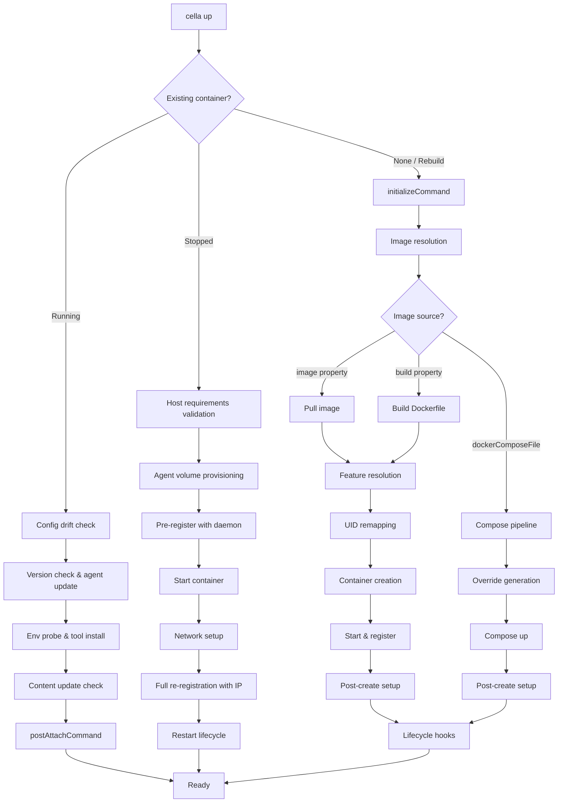

# Container Lifecycle

The key words "MUST", "MUST NOT", "REQUIRED", "SHALL", "SHALL NOT", "SHOULD", "SHOULD NOT", "RECOMMENDED", "MAY", and "OPTIONAL" in this document are to be interpreted as described in [RFC 2119](https://www.ietf.org/rfc/rfc2119.txt).

## Summary

cella manages the full container lifecycle for devcontainer workspaces: config resolution, image building, feature installation, container creation, environment setup, lifecycle hooks, agent provisioning, daemon registration, and port forwarding. The orchestration pipeline is driven by `cella up` and implemented primarily in `cella-orchestrator`, with backend-agnostic container operations delegated through the `ContainerBackend` trait.

## Architecture

## Orchestration Pipeline

The `ensure_up` function in `cella-orchestrator` is the entry point for the container-up pipeline. It evaluates the current container state and takes one of three paths: reconnect to a running container, restart a stopped container, or create a new one.

### State Evaluation

When invoked, the pipeline MUST:

1. Validate host requirements (if `hostRequirements` is present in config).
2. Search for an existing container matching the workspace root.
3. Determine the container's state: `Running`, `Stopped`, or absent.

The `ImageStrategy` controls forced rebuilds:

| Strategy | Behavior |
|---|---|
| `Cached` | Use existing container/image if available |
| `Rebuild` | Remove existing container, rebuild image with Docker cache |
| `RebuildNoCache` | Remove existing container, rebuild image without cache |

### Running Container Path

When an existing container is already running:

1. Run `initializeCommand` on the host (runs on every attach, per spec).
2. Check for previous lifecycle failures via `/tmp/.cella/lifecycle_status.json`.
3. Sync agent runtime if backend supports managed agent.
4. Detect version drift and update agent binary if needed.
5. Ensure agent is registered with daemon (restart agent, update IP or full re-register).
6. Probe user environment and install tools.
7. Run `onCreateCommand` for prebuilt images if still pending.
8. Check content hash and run `updateContentCommand` if workspace changed.
9. Run `postAttachCommand`.

Config drift (changed `config_hash`) and runtime drift (changed Docker runtime) emit warnings with a hint to use `cella up --rebuild`.

### Stopped Container Path

When a stopped container exists:

1. Emit config/runtime drift warnings.
2. Provision agent volume.
3. Pre-register with daemon (so the agent can report ports immediately after start).
4. Start the container.
5. Verify the container is still running (not exited immediately).
6. Connect to networks.
7. Full re-registration with daemon including actual container IP.
8. Restart agent in container.
9. Run restart lifecycle: env probe, tool install, content update check, `postStartCommand`, `postAttachCommand`.

If the container fails to start, the pipeline removes it and falls through to creation.

### Creation Path

When no container exists (or rebuild was requested):

1. Run `initializeCommand` on the host.
2. Resolve and build the container image (see [Image Resolution](#image-resolution)).
3. Resolve devcontainer features (see [Feature Resolution](#feature-resolution)).
4. Build UID-remapped image layer (see [UID Remapping](#uid-remapping)).
5. Assemble environment forwarding (SSH agent, proxy, env vars).
6. Resolve SSH agent proxy through daemon if needed.
7. Provision agent volume and sync runtime.
8. Configure mounts (workspace, tool configs, agent IPC, agent volume, CLI mounts).
9. Create container with SSH fallback retry logic.
10. Start container, verify running, connect networks.
11. Register with daemon (container ID, name, IP).
12. Post-create setup: env injection, credential seeding, shell detection, env probe, tool install.
13. Run lifecycle hooks (see [Lifecycle Hooks](#lifecycle-hooks)).
14. Write content hash for future change detection.

If lifecycle hooks fail during creation, the pipeline MUST stop the container, remove it, and propagate the error.

## Image Resolution

The image resolution strategy is determined by which property is present in `devcontainer.json`. Exactly one of `image`, `build`, or `dockerComposeFile` MUST be specified.

### `image` Property

When `image` is specified, the pipeline pulls the image from the registry. Pull behavior is controlled by `--pull`:

| Policy | Image exists locally | Behavior |
|---|---|---|
| `missing` (default) | Yes | Use cached |
| `missing` | No | Pull |
| `always` | Any | Pull |
| `never` | Yes | Use cached |
| `never` | No | Error |

The `--build-no-cache` flag forces a re-pull regardless of policy.

### `build` Property

When `build` is specified, the pipeline builds a Docker image from a Dockerfile. The build configuration supports:

- `dockerfile` -- Dockerfile path relative to context (default: `Dockerfile`)
- `context` -- Build context path, absolute or relative to `.devcontainer/`
- `args` -- Build arguments passed as `--build-arg`
- `target` -- Multi-stage build target
- `cacheFrom` -- Cache source images
- `options` -- Additional Docker build flags

Host proxy environment variables (`HTTP_PROXY`, `HTTPS_PROXY`, `NO_PROXY`) are injected as build args when detected.

The image name is computed as `cella-img-<identifier>-<hash8>` where `<identifier>` is derived from the config name or workspace folder, and `<hash8>` is the first 8 characters of the SHA-256 of the canonical workspace path. When features are layered on top, an additional 8-character features digest suffix is appended: `cella-img-<identifier>-<hash8>-<feat8>`. For worktree-backed containers, the parent repo path is used so all worktrees with identical configs share the same image cache; a config content hash suffix differentiates worktrees with different build configurations.

When features are not present, a `devcontainer.metadata` label is embedded in the built image so prebuilt images carry their lifecycle commands.

### `dockerComposeFile` Property

When `dockerComposeFile` is specified, the pipeline delegates to the compose orchestrator (see [Docker Compose Integration](#docker-compose-integration)).

## Feature Resolution

Devcontainer features extend the base image with additional tools and configuration. The orchestrator invokes `cella-features` during the creation path to resolve, order, and install features as an image layer on top of the base image.

At a high level, the pipeline: parses feature references from config, fetches artifacts (OCI, HTTPS, or local), resolves dependencies and computes install order, generates a `Dockerfile.features`, builds the feature layer, and merges metadata into the `devcontainer.metadata` label.

See [features.md](features.md) for the full feature specification, including metadata schema, option types, reference formats, dependency resolution algorithm, installation execution, metadata merge rules, caching, and lockfile integrity.

## Template Lifecycle

Templates provide scaffolding for new devcontainer configurations. The template lifecycle is handled by `cella-templates`.

### Discovery

Template collections are fetched from OCI registries. The default collection is `ghcr.io/devcontainers/templates`. Collection indexes are cached on disk with a 24-hour TTL.

See [templates.md](templates.md) for the full template specification, including metadata schema, option types, OCI distribution, application pipeline, option substitution, and output format.

## Lifecycle Hooks

See [lifecycle-hooks.md](lifecycle-hooks.md) for the full lifecycle hooks specification, including phase ordering, command formats, parallel execution, `waitFor` semantics, failure handling, feature lifecycle commands, and variable substitution.

## Container Identity

See [lifecycle-hooks.md](lifecycle-hooks.md#container-labels) for container labels (spec-standard and cella-specific) and the `devcontainerId` computation algorithm.

## UID Remapping

To ensure bind-mounted files are accessible without permission issues, cella builds a thin image layer that remaps the container user's UID/GID to match the host user.

### Conditions

UID remapping is performed when ALL of the following are true:

- `updateRemoteUserUID` is `true` (default) in the devcontainer config.
- The resolved `remoteUser` is not `root`.
- The host UID is not 0 (not running as root on the host).

### Process

1. Build a new image layer on top of the resolved image using an inline Dockerfile.
2. The Dockerfile modifies `/etc/passwd` and `/etc/group` to update the remote user's UID/GID.
3. The home directory is recursively chowned to the new UID/GID.
4. If a different user already occupies the target UID, remapping is skipped with a log message.
5. If a different group already occupies the target GID, the user's GID is left unchanged.

The resulting image is tagged as `<base-image>-uid` and used for container creation.

## Host Requirements Validation

The `hostRequirements` object in `devcontainer.json` declares minimum host resources. cella validates these before container creation.

### Supported Requirements

| Requirement | Type | Detection method |
|---|---|---|
| `cpus` | Integer | `available_parallelism()` |
| `memory` | Size string (e.g., `"8gb"`) | `/proc/meminfo` (Linux), `sysctl hw.memsize` (macOS) |
| `storage` | Size string (e.g., `"32gb"`) | `df` on workspace filesystem |
| `gpu` | Boolean, `"optional"`, or object | `/dev/nvidia0` existence, `nvidia-smi` query |

Size strings support units: `b`, `kb`/`k`, `mb`/`m`, `gb`/`g`, `tb`/`t` (case-insensitive). Raw numeric values are treated as bytes.

### Policy

The `HostRequirementPolicy` controls behavior on unmet requirements:

- **`Warn`** -- Log warnings for each unmet requirement; continue with container creation.
- **`Error`** -- Abort the pipeline with a diagnostic error.

GPU requirements with value `"optional"` are always considered met, regardless of GPU availability.

## Docker Compose Integration

When `dockerComposeFile` is present, cella delegates container management to Docker Compose V2 while maintaining feature parity with the single-container pipeline. See [container-backends.md](container-backends.md) for backend-level compose capabilities and mount handling.

### Override File Generation

cella generates an override compose file passed as the final `-f` flag to `docker compose`. This override injects cella-specific configuration into the primary service:

- **Image override** -- Swaps the service image to the features-built image when features are present.
- **Agent volume** -- Mounts the shared `cella-agent` volume.
- **Environment** -- Injects daemon connection, proxy, and env forwarding variables.
- **Labels** -- Adds `dev.cella.*` and `devcontainer.*` labels.
- **Build overrides** -- Rewrites `build.dockerfile` and `build.target` for combined Dockerfile builds (service Dockerfile + features).
- **Additional contexts** -- Adds BuildKit named contexts for feature content sources.
- **Build secrets** -- Forwards BuildKit secrets to compose builds.
- **Extra volumes** -- Appends SSH agent, tool config, and parent git directory mounts.

### Mount Parity

The override file ensures mount parity between compose and single-container pipelines:

- Workspace bind mount
- SSH agent socket forwarding
- Agent volume mount
- Tool configuration mounts
- Parent git directory mounts (for worktree support)
- Agent IPC directory mounts (Claude Code teams/tasks, Codex queues)

Mounts whose target falls inside the reserved agent volume subtree (`/cella`) are rejected. Volume mounts whose source name matches the agent volume name are also rejected to prevent alias-based integrity bypass.

### Mount Deduplication

When the resolved compose config already declares a mount at a given target path, cella's override MUST NOT add a duplicate. Mount targets are deduplicated against the service's existing volume declarations.

### Shutdown Actions

The `shutdownAction` property controls what happens when the last client disconnects:

| Value | Behavior |
|---|---|
| `none` | Container keeps running |
| `stopContainer` | Stop the primary container |
| `stopCompose` | Run `docker compose down` for the project |

## Credential Protection

When credential protection is enabled, the orchestrator generates phantom tokens and registers them with the daemon before seeding credentials into the container. Credential resolution is deferred to the daemon, which injects real credentials at request time via the in-container proxy. See [credential-protection.md](credential-protection.md).

## Tool Installation

cella supports automatic installation of development tools (Claude Code, Codex, etc.) into containers. Tool installation runs after environment probing and triggers a second env probe pass to capture any PATH changes.

## Configuration Reference

Configuration is resolved by `cella-config` through a multi-layer merge pipeline. The following properties are consumed by the lifecycle orchestrator:

| Property | Phase | Description |
|---|---|---|
| `image` | Image resolution | Base image to pull |
| `build` | Image resolution | Dockerfile build configuration |
| `dockerComposeFile` | Image resolution | Compose file path(s) |
| `features` | Feature resolution | Feature references and options |
| `overrideFeatureInstallOrder` | Feature resolution | Explicit install order override |
| `initializeCommand` | Lifecycle | Host command before container ops |
| `onCreateCommand` | Lifecycle | Container command after creation |
| `updateContentCommand` | Lifecycle | Container command on content change |
| `postCreateCommand` | Lifecycle | Container command after update |
| `postStartCommand` | Lifecycle | Container command after start |
| `postAttachCommand` | Lifecycle | Container command after attach |
| `waitFor` | Lifecycle | Phase to wait for before returning |
| `remoteUser` | Container setup | User for lifecycle commands and sessions |
| `containerUser` | Container setup | User for container processes |
| `updateRemoteUserUID` | UID remapping | Enable UID/GID remapping (default: `true`) |
| `userEnvProbe` | Env setup | Shell type for env probing (default: `loginInteractiveShell`) |
| `hostRequirements` | Validation | Minimum host resource requirements |
| `forwardPorts` | Registration | Ports to forward from container |
| `portsAttributes` | Registration | Per-port forwarding attributes |
| `otherPortsAttributes` | Registration | Default attributes for unlisted ports |
| `shutdownAction` | Shutdown | Behavior on last client disconnect |
| `mounts` | Container creation | Additional mount specifications |
| `runArgs` | Container creation | Extra Docker run arguments |
| `containerEnv` | Container creation | Environment variables for the container |
| `remoteEnv` | Env setup | Environment variables for user sessions |

See [configuration.md](configuration.md) for the full config resolution pipeline.

## Error Handling

The orchestrator uses structured error types via `thiserror` with user-facing diagnostics via `miette`:

| Error variant | Diagnostic code | Description |
|---|---|---|
| `Backend` | `cella::orchestrator::backend` | Container runtime communication failure |
| `Git` | `cella::orchestrator::git` | Git operation failure |
| `Config` | `cella::orchestrator::config` | Configuration parsing or validation error |
| `ContainerExited` | `cella::orchestrator::container_exited` | Container exited immediately after start |
| `HostRequirements` | `cella::host_requirements` | Unmet host requirements (with `cella doctor` hint) |
| `Other` | `cella::orchestrator::other` | Catch-all for unclassified errors |

### Retry Logic

- **SSH agent mount failures** trigger a fallback chain: try alternative socket paths, then skip SSH forwarding entirely with a warning.
- **Non-SSH bind mount failures** (e.g., worktree paths unavailable to Docker) retry up to 3 times with 500ms delays.
- **Agent version mismatch** halts the pipeline with a checksum error; other agent provisioning failures are non-fatal (port forwarding degrades gracefully).

### Rollback

Pre-registration with the daemon is rolled back if the container fails to start. This prevents stale entries in the daemon's container registry.

## Dynamic SSH Agent Port Renegotiation

On agent reconnection, the daemon allocates a fresh SSH agent bridge port and pushes it to the agent. The agent updates the container's `SSH_AUTH_SOCK` environment for new sessions. Running sessions retain the old socket until reconnection. This eliminates the need for `cella down && cella up` after daemon restart.

Depends on: [Architecture § Daemon State Persistence](architecture.md#daemon-state-persistence)

## Limitations

- **Label immutability** -- Docker container labels and environment variables are immutable after creation. Config changes require `cella up --rebuild` to take effect. The pipeline warns on config drift but does not auto-rebuild.
