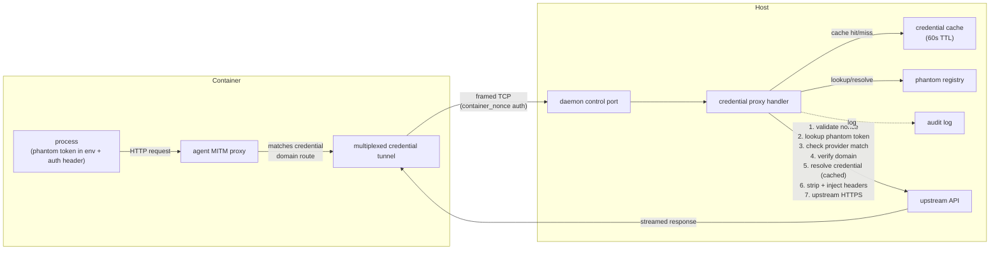

# Credential Protection

## Executive Summary

Credential protection prevents dev container processes from accessing real API keys and tokens. Instead of forwarding credentials as environment variables, cella injects opaque **phantom tokens** (UUID-based placeholders) that are meaningless outside the host daemon. When a container process makes an API request to a known credential domain, the in-container agent's MITM proxy intercepts the request, tunnels it over a multiplexed TCP connection to the host daemon, which replaces the phantom token with the real credential and makes the upstream HTTPS request.

The core security property: **real credentials never enter container memory, filesystem, or environment variables.** The daemon is the sole holder of credential material and the sole HTTPS client for credential-bearing requests.

Enable with `credentials.protect = true` in `cella.toml`.

## Threat Model

### Adversary Classes

#### Class A: Runtime Adversary

A runtime adversary operates inside a running container through compromised code. They can read environment variables, inspect `/proc`, scan filesystems, intercept network traffic, and make arbitrary HTTP requests — but they cannot modify the host-side configuration files that control which providers are registered.

**Attack vectors:**

- **Compromised dependencies** — supply chain attacks via backdoored npm packages, PyPI libraries, or Cargo crates that harvest environment variables or tokens at import time
- **Malicious VS Code extensions** — extensions running inside the container with access to the terminal, filesystem, and environment
- **Backdoored devcontainer features** — features that execute arbitrary code during container lifecycle hooks
- **Container escape via Docker socket** — processes that abuse a mounted Docker socket or API access to read host-side secrets from other containers

**Real-world incidents motivating this design:**

| Incident | Vector | Impact |
|---|---|---|
| Nx Console (May 2026) | VS Code extension update included credential-harvesting code targeting `~/.claude/settings.json` and AI coding tool credentials | Direct validation of this threat model |
| TanStack npm packages | Supply chain compromise targeting API keys in CI environments | Env var exfiltration via dependency |
| axios RAT | Backdoor in popular HTTP library exfiltrating environment variables | Runtime credential harvesting |
| Shai-Hulud | Containerized crypto-miner that escalated through Docker socket access | Container escape to host |

**Mitigations:** Phantom tokens replace real credentials in the container environment. The MITM proxy intercepts requests to credential domains and tunnels them to the daemon. The daemon validates every request against the phantom registry before resolving real credentials. Fail-closed: if the tunnel is unavailable, the request returns 502 — phantom tokens are never forwarded upstream.

#### Class B: Configuration Adversary

A configuration adversary controls the project's `cella.toml` or `devcontainer.json` but does not have runtime access to the container. They exploit the custom provider mechanism to redirect credential resolution to attacker-controlled infrastructure.

**Primary attack:** Define a `[[credentials.providers]]` entry with `env = "AWS_SECRET_ACCESS_KEY"` and `domain = "attacker.example"`, causing the daemon to resolve the real credential and send it to an attacker-controlled domain in a legitimate-looking HTTPS request. This bypasses all runtime protections because the daemon itself makes the exfiltrating request.

**Mitigations:** User consent prompt. The first time a custom provider is encountered, cella prompts the user to review and approve the provider's environment variable and target domain. Approvals are cached in a host-side allowlist (`~/.cella/approved-providers.json`). See [Custom Provider Configuration](#custom-provider-configuration) for the full consent flow.

### Trust Boundaries

| Boundary | Trust Level | Justification |
|---|---|---|
| Host daemon process | Fully trusted | Holds real credentials, performs resolution, makes upstream requests |
| Host filesystem | Trusted | Stores state file (0600 perms), approved providers, audit log |
| Host-side config (`cella.toml`) | Semi-trusted | User-authored but may contain untrusted project contributions; custom providers require consent |
| Agent (in-container) | Semi-trusted | Bridges MITM proxy to daemon tunnel, never sees real credentials, authenticated by per-container nonce |
| Container processes | Untrusted | Only see phantom tokens via environment variables |
| Upstream APIs | External | TLS-protected; daemon is the HTTPS client |

### In Scope / Out of Scope

| In Scope (v1) | Out of Scope (v1) |
|---|---|
| Phantom token substitution for all built-in and approved custom providers | Credential **abuse** — using real keys via the daemon proxy for unauthorized purposes |
| Daemon-side credential resolution with TTL cache | Rate limiting or policy-based access control on proxied requests |
| Per-provider enable/disable toggles | Multi-account credential profiles |
| Custom provider registration with user consent | `.env` file interception |
| Per-container identity binding via nonce | Per-container credential scoping beyond provider-level |
| Multiplexed credential tunnel | HTTP/2, HTTP/3, WebSocket upstream |
| Streaming request and response bodies | Credential rotation or TTL-based phantom token renewal |
| Structured JSONL audit logging | Browser-based OAuth flows |
| State persistence with file locking | Vault/keychain credential sources |

Credential abuse (a container using the daemon proxy to make excessive or unauthorized API calls with real credentials) is an acknowledged non-goal for v1. The system prevents credential *disclosure* — it does not prevent credential *use* through the authorized proxy channel. A policy engine for method/path/rate restrictions is planned as a future feature.

### Security Invariants

These properties must hold at all times when credential protection is active:

1. **Non-disclosure** — Real credentials never enter container memory, filesystem, or environment variables. Only phantom tokens (opaque UUIDs) are visible inside the container.
2. **Opacity** — Phantom tokens are bearer capabilities scoped to a single container registration. They cannot be used to derive, reconstruct, or correlate with real credentials.
3. **Fail-closed** — When credential protection is active, requests to credential domains that cannot be tunneled to the daemon receive HTTP 502. There is no fallback to passing phantom tokens through to upstream APIs.
4. **Identity binding** — Each container is authenticated by a per-container nonce generated at registration. The nonce is used for tunnel authentication instead of a global daemon token.
5. **Domain confinement** — Real credentials are only sent to domains explicitly registered for that provider. A phantom token for provider X cannot be used to send provider X's real credential to an unregistered domain.
6. **Provider isolation** — A phantom token registered for provider X cannot be used to resolve provider Y's credential, even within the same container.

## Architecture

### System Overview



### Crate Responsibilities

| Crate | Role |
|---|---|
| `cella-config` | `[credentials]` TOML schema, `AiCredentials` per-provider toggles, `CustomCredentialProvider` validation |
| `cella-env` | Built-in provider registry (`CREDENTIAL_PROVIDERS`), proxy config injection, `CredentialRouteConfig`, provider merging |
| `cella-protocol` | `CredentialProxyHandshake`, `PhantomTokenEntry`, `RegisterPhantomTokens`/`GetPhantomTokens` management messages, frame types |
| `cella-orchestrator` | Phantom token generation, daemon registration (with nonce retrieval), credential route building, container label injection |
| `cella-daemon` | Phantom registry (persistence + lookup), credential proxy handler (validation + upstream request), credential resolver (with TTL cache), audit logger, custom provider consent |
| `cella-agent` | MITM proxy credential domain routing, multiplexed credential tunnel, connection management |
| `cella-cli` | Wires credential protection into `up`/`exec` flows |
| `cella-doctor` | Docker Engine version checks for security-relevant thresholds |

### Design Rationale

**Daemon-side injection** — The daemon holds real credentials and makes upstream requests. No credential material ever enters the container, even transiently. This eliminates the entire class of env-var/file/memory-scanning attacks that motivated this system (see Nx Console, TanStack incidents).

**Structured envelope** — The credential tunnel uses a framed binary protocol (magic byte prefix + JSON + chunked bodies) rather than raw HTTP proxying. This gives the daemon full control over header injection, body streaming, and resource limits without the complexity of a general-purpose HTTPS MITM on the host side.

**Fail-closed** — When credential protection is active, requests to credential domains that cannot be tunneled receive a 502. There is no fallback to passing phantom tokens upstream — they would be rejected by the API anyway, and failing silently would mask configuration errors.

**MITM over BASE_URL rewriting (rejected)** — An alternative approach would rewrite `ANTHROPIC_BASE_URL` etc. to point at a local credential proxy. This was rejected because: (1) not all SDKs support base URL overrides, (2) it requires per-SDK knowledge of env var names, (3) it doesn't protect tools that construct URLs directly. The MITM approach is transparent to all HTTP clients.

**TTL cache over per-request resolution** — Resolving credentials per-request (especially `gh auth token` which spawns a subprocess) adds 100–500ms latency. A 60-second TTL cache in daemon memory eliminates this for burst traffic while still picking up credential rotation within a minute. Cache entries are zeroized on eviction.

**Per-container nonce over Docker API verification** — Verifying container identity via the Docker API on every request adds latency and a runtime dependency. A per-container nonce generated at registration provides equivalent identity binding with O(1) validation.

## Built-in Providers

12 providers ship built-in. Custom providers can override any built-in by matching the `name`/`id`.

| ID | Env Var | Domains | Header | Prefix |
|---|---|---|---|---|
| `github` | `GH_TOKEN` | `github.com`, `api.github.com` | `Authorization` | `token ` |
| `anthropic` | `ANTHROPIC_API_KEY` | `api.anthropic.com` | `x-api-key` | _(none)_ |
| `openai` | `OPENAI_API_KEY` | `api.openai.com` | `Authorization` | `Bearer ` |
| `gemini` | `GEMINI_API_KEY` | `generativelanguage.googleapis.com` | `x-goog-api-key` | _(none)_ |
| `groq` | `GROQ_API_KEY` | `api.groq.com` | `Authorization` | `Bearer ` |
| `mistral` | `MISTRAL_API_KEY` | `api.mistral.ai` | `Authorization` | `Bearer ` |
| `deepseek` | `DEEPSEEK_API_KEY` | `api.deepseek.com` | `Authorization` | `Bearer ` |
| `xai` | `XAI_API_KEY` | `api.x.ai` | `Authorization` | `Bearer ` |
| `fireworks` | `FIREWORKS_API_KEY` | `api.fireworks.ai` | `Authorization` | `Bearer ` |
| `together` | `TOGETHER_API_KEY` | `api.together.xyz` | `Authorization` | `Bearer ` |
| `perplexity` | `PERPLEXITY_API_KEY` | `api.perplexity.ai` | `Authorization` | `Bearer ` |
| `cohere` | `COHERE_API_KEY` | `api.cohere.com` | `Authorization` | `Bearer ` |

**GitHub special-casing:** The GitHub provider uses `gh auth token -h <hostname>` for credential resolution instead of reading an env var directly. This supports GitHub Enterprise multi-host configurations and respects the user's `gh` CLI authentication state. The GitHub provider is gated on `credentials.gh` (default: `true`) and `gh auth status` succeeding at container startup.

**Provider gating logic:**

| Provider Type | Gating Conditions |
|---|---|
| GitHub | `credentials.gh = true` AND `gh auth status` succeeds |
| AI providers | `credentials.ai.enabled = true` AND per-provider toggle is `true` (default) AND host env var is set and non-empty |
| Custom providers | Host env var is set and non-empty AND user has approved the provider (consent flow) |

## Custom Provider Configuration

### TOML Schema

Add custom providers in `cella.toml` with `[[credentials.providers]]`:

```toml
[[credentials.providers]]
name = "internal-api"
env = "INTERNAL_API_KEY"
domain = "api.internal.corp"
header = "Authorization"
prefix = "Bearer "
```

| Field | Type | Required | Default | Constraints | Description |
|---|---|---|---|---|---|
| `name` | `string` | yes | — | Non-empty, ASCII alphanumeric + `-_` | Short identifier; if it matches a built-in ID, overrides that provider |
| `env` | `string` | yes | — | Non-empty, valid env var name | Host environment variable holding the real credential |
| `domain` | `string` | yes | — | Non-empty, valid hostname (no port, no scheme) | Target domain this provider protects |
| `header` | `string` | yes | — | Non-empty, valid HTTP header name | HTTP header name for credential injection |
| `prefix` | `string` | no | `""` | — | Value prefix prepended to the credential (e.g. `"Bearer "`) |

**Override semantics:** A custom provider with the same `name` as a built-in completely replaces the built-in. The built-in's domains, header, and env var are discarded.

Unknown fields in `[[credentials.providers]]` are rejected (`deny_unknown_fields`).

### User Consent Flow

Custom providers introduce a configuration adversary risk: a malicious `cella.toml` can define a provider that exfiltrates real credentials to an attacker-controlled domain.

**Consent protocol:**

1. During `cella up`, when a custom provider is encountered for the first time (not in the approved-providers list), cella pauses and prompts the user:
   ```
   Custom credential provider requires approval:
     Name:   internal-api
     Env:    INTERNAL_API_KEY
     Domain: api.internal.corp
   This will send the value of INTERNAL_API_KEY to api.internal.corp.
   Approve? [y/N]
   ```
2. If approved, the provider is added to `~/.cella/approved-providers.json`:
   ```json
   {
     "approved": [
       {
         "name": "internal-api",
         "env": "INTERNAL_API_KEY",
         "domain": "api.internal.corp",
         "approved_at": "2026-05-25T12:00:00Z"
       }
     ]
   }
   ```
3. If denied, the provider is skipped — no phantom token is generated, no credential route is registered. The container starts without that provider's protection.
4. On subsequent runs, approved providers are loaded from the allowlist and proceed without prompting.
5. If a provider's `env` or `domain` changes from the approved version, re-approval is required.
6. Built-in providers never require consent — they are implicitly trusted.

**Approval file permissions:** `0600` on Unix. The file is user-scoped (not project-scoped) to prevent a project from pre-populating approvals.

## Configuration Reference

Full `[credentials]` section in `cella.toml`:

```toml
[credentials]
# Forward gh CLI credentials (default: true)
gh = true

# Enable phantom token protection (default: false)
protect = true

# Credential resolution cache TTL in seconds (default: 60, 0 = disabled)
cache_ttl_seconds = 60

# Credential profile name (reserved for future multi-account support)
# profile = "work"

# AI provider forwarding
[credentials.ai]
enabled = true       # Global toggle (default: true)
openai = false       # Disable specific providers
groq = false

# Custom providers
[[credentials.providers]]
name = "internal-api"
env = "INTERNAL_API_KEY"
domain = "api.internal.corp"
header = "x-api-key"

[[credentials.providers]]
name = "anthropic"        # Overrides the built-in anthropic provider
env = "MY_ANTHROPIC_KEY"
domain = "custom-anthropic.corp"
header = "Authorization"
prefix = "Bearer "
```

| Field | Type | Default | Description |
|---|---|---|---|
| `gh` | `bool` | `true` | Forward GitHub credentials via `gh auth token` |
| `protect` | `bool` | `false` | Enable phantom token credential protection |
| `cache_ttl_seconds` | `u32` | `60` | Credential resolution cache TTL in seconds. `0` disables caching (per-request resolution). |
| `profile` | `string?` | `null` | _(Reserved)_ Credential profile name for multi-account scoping |
| `ai.enabled` | `bool` | `true` | Global toggle for AI provider key forwarding |
| `ai.<provider_id>` | `bool` | `true` | Per-provider override (e.g. `ai.openai = false`) |
| `providers` | `array` | `[]` | Custom provider definitions (see above) |

## Wire Protocol

### Connection Framing

Three connection types share the daemon's control TCP port. A 1-byte magic byte prefix discriminates connection types before any JSON parsing:

| Magic Byte | Value | Connection Type | Description |
|---|---|---|---|
| `0x01` | AgentHello | Agent control connection | Protocol negotiation, management messages |
| `0x02` | TunnelHandshake | Reverse tunnel | Port forwarding tunnel connection |
| `0x03` | CredentialProxy | Credential tunnel | Multiplexed credential proxy connection |

The magic byte is the first byte on the TCP stream. After reading it, the daemon knows which parser to invoke for the remainder of the connection.

**Backward compatibility:** If the first byte is `{` (0x7B, start of JSON), the daemon falls back to field-based trial deserialization for agents that predate magic byte framing:

1. Try `CredentialProxyHandshake` (has `provider_id` + `request_id`)
2. Try `TunnelHandshake` (has `connection_id`)
3. Try `AgentHello` (has `protocol_version`)
4. Reject with "unrecognized first message"

### Multiplexed Credential Tunnel

After the `0x03` magic byte selects the credential connection type, all subsequent bytes on the stream are framed messages. Each agent maintains one persistent TCP connection to the daemon for credential proxying. Multiple concurrent requests are multiplexed over this connection using request-ID framed messages.

**Frame format:**

```
┌──────────────────┬──────────────┬──────────────────┬─────────────────┐
│ request_id (4B)  │ frame_type   │ payload_len (4B) │ payload         │
│ big-endian u32   │ (1B)         │ big-endian u32   │ (variable)      │
└──────────────────┴──────────────┴──────────────────┴─────────────────┘
```

**Frame types:**

| Type | Value | Direction | Payload | Description |
|---|---|---|---|---|
| `HANDSHAKE` | `0x01` | agent → daemon | JSON `CredentialProxyHandshake` | Initiate a new proxied request |
| `REQUEST_ENVELOPE` | `0x02` | agent → daemon | JSON `HttpRequestEnvelope` | HTTP request metadata |
| `REQUEST_CHUNK` | `0x03` | agent → daemon | Raw bytes | Request body chunk |
| `REQUEST_END` | `0x04` | agent → daemon | Empty | End of request body |
| `RESPONSE_ENVELOPE` | `0x05` | daemon → agent | JSON `HttpResponseEnvelope` | HTTP response metadata |
| `RESPONSE_CHUNK` | `0x06` | daemon → agent | Raw bytes | Response body chunk |
| `RESPONSE_END` | `0x07` | daemon → agent | Empty | End of response body |
| `ERROR` | `0x08` | daemon → agent | JSON `ErrorEnvelope` | Request-scoped error |
| `CANCEL` | `0x09` | agent → daemon | Empty | Cancel in-flight request |

**Flow for a single request:**

1. Agent sends `HANDSHAKE` frame with `CredentialProxyHandshake` payload
2. Agent sends `REQUEST_ENVELOPE` frame with `HttpRequestEnvelope` payload
3. Agent sends zero or more `REQUEST_CHUNK` frames with body data
4. Agent sends `REQUEST_END` frame (empty payload)
5. Daemon validates, resolves credential, makes upstream request
6. Daemon sends `RESPONSE_ENVELOPE` frame with `HttpResponseEnvelope` payload
7. Daemon sends zero or more `RESPONSE_CHUNK` frames with response body data
8. Daemon sends `RESPONSE_END` frame (empty payload)

Multiple requests with different `request_id` values can be in flight simultaneously. The daemon processes them concurrently and may respond out of order.

**Backpressure:** If the agent stops reading, TCP flow control applies naturally. The daemon does not buffer more than `MAX_RESPONSE_CHUNK` bytes per frame. If the daemon's write buffer fills, it pauses reading from the upstream response.

### CredentialProxyHandshake

Sent as the payload of a `HANDSHAKE` frame to initiate a credential proxy request.

| Field | Type | Max Length | Description |
|---|---|---|---|
| `container_nonce` | `string` | 64 bytes | Per-container nonce for authentication (replaces global auth token) |
| `container_name` | `string` | 256 bytes | Container name for registry lookups |
| `request_id` | `string` | 64 bytes | Unique request ID for multiplexing and logging |
| `domain` | `string` | 253 bytes | Target API domain (e.g. `api.anthropic.com`) |
| `provider_id` | `string` | 128 bytes | Provider ID (e.g. `anthropic`) |

```json
{"container_nonce":"a1b2c3...","container_name":"cella-myapp-main","request_id":"cred-1","domain":"api.anthropic.com","provider_id":"anthropic"}
```

### HttpRequestEnvelope

Sent as the payload of a `REQUEST_ENVELOPE` frame.

| Field | Type | Max Length | Description |
|---|---|---|---|
| `method` | `string` | 16 bytes | HTTP method (`GET`, `POST`, etc.) |
| `uri` | `string` | 8192 bytes | Request path + query (e.g. `/v1/messages`). Must be relative (no scheme/authority). No fragments. No control characters. |
| `headers` | `[string, string][]` | 100 entries, 64KB per line | HTTP header key-value pairs |

The request body is streamed via `REQUEST_CHUNK` frames — no `body_len` field in the envelope.

### Streamed Request Body

Request bodies are streamed as a sequence of `REQUEST_CHUNK` frames:

- Each chunk payload contains raw body bytes, up to `MAX_REQUEST_CHUNK` (16 MB)
- The agent sends `REQUEST_END` (empty payload) to signal the body is complete
- Total request body across all chunks must not exceed `MAX_REQUEST_BODY` (256 MB)
- If the total exceeds the limit, the daemon sends an `ERROR` frame and discards remaining chunks

### HttpResponseEnvelope

Sent as the payload of a `RESPONSE_ENVELOPE` frame.

| Field | Type | Description |
|---|---|---|
| `status` | `u16` | HTTP response status code |
| `headers` | `[string, string][]` | Response header key-value pairs (max 100 entries, 64KB per line) |

### Streamed Response Body

Response bodies are streamed as a sequence of `RESPONSE_CHUNK` frames:

- Each chunk payload contains raw body bytes, up to `MAX_RESPONSE_CHUNK` (16 MB)
- The daemon sends `RESPONSE_END` (empty payload) to signal the body is complete
- Total response body across all chunks must not exceed `MAX_RESPONSE_TOTAL` (1 GB)
- If the upstream response exceeds the limit, the daemon truncates and sends `RESPONSE_END`

### Error Envelope

Sent as the payload of an `ERROR` frame. Also returned as an HTTP response body on error, with the `X-Cella-Error` header set to the error category.

```json
{
  "category": "token_invalid",
  "message": "Phantom token not found in registry",
  "request_id": "cred-1"
}
```

| Field | Type | Description |
|---|---|---|
| `category` | `string` | Error category (see [Error Taxonomy](#error-taxonomy)) |
| `message` | `string` | Human-readable diagnostic message. Never contains credentials or phantom tokens. |
| `request_id` | `string` | Request ID from the handshake |

**Error categories:**

| Category | Meaning |
|---|---|
| `token_invalid` | Phantom token not found in registry or not present in request |
| `provider_mismatch` | Handshake `provider_id` does not match the token's registered provider |
| `domain_unregistered` | Request domain is not in the provider's registered domain list |
| `credential_unavailable` | Real credential could not be resolved (env var unset, `gh auth token` failed) |
| `upstream_error` | Upstream API request failed (DNS, TLS, timeout, connection refused) |
| `protocol_violation` | Malformed envelope, invalid frame, or unexpected frame sequence |
| `body_exceeded` | Request or response body exceeded size limit |
| `timeout` | Per-phase or total timeout exceeded |
| `nonce_invalid` | Container nonce does not match the registered nonce |

### Resource Limits

| Limit | Value | Scope |
|---|---|---|
| `MAX_HEADER_LINE` | 64 KB | Single serialized header key+value pair |
| `MAX_HEADERS` | 100 | Maximum number of headers per request or response envelope |
| `MAX_REQUEST_CHUNK` | 16 MB | Maximum payload size per `REQUEST_CHUNK` frame |
| `MAX_RESPONSE_CHUNK` | 16 MB | Maximum payload size per `RESPONSE_CHUNK` frame |
| `MAX_REQUEST_BODY` | 256 MB | Total request body across all chunks |
| `MAX_RESPONSE_TOTAL` | 1 GB | Total response body across all chunks |
| `MAX_HANDSHAKE_LINE` | 8 KB | Maximum size of JSON handshake line |
| `MAX_ENVELOPE_LINE` | 256 KB | Maximum size of JSON envelope line |
| `MAX_CONCURRENT_REQUESTS` | 64 | Maximum in-flight requests per multiplexed connection |

### Timeout Policy

| Phase | Timeout | Description |
|---|---|---|
| Handshake | 5 s | Time to receive and validate `CredentialProxyHandshake` |
| Envelope | 10 s | Time to receive `HttpRequestEnvelope` after handshake |
| Body read | 30 s | Time to receive complete request body (all chunks) |
| Upstream connect | 10 s | Time to establish TCP+TLS connection to upstream API |
| Upstream headers | 30 s | Time to receive response status + headers from upstream |
| Streaming idle | 60 s | Maximum gap between response body chunks |
| Total | 5 min | Maximum wall-clock time for a single proxied request |

Timeouts are per-request within the multiplexed connection. A timeout on one request does not affect other in-flight requests.

### Management Messages

**`register_phantom_tokens`** — Register phantom tokens for a container. Returns the per-container nonce.

Request:

| Field | Type | Description |
|---|---|---|
| `container_name` | `string` | Container name |
| `tokens` | `PhantomTokenEntry[]` | Phantom token entries to register |

```json
{"type":"register_phantom_tokens","container_name":"cella-myapp-main","tokens":[{"provider_id":"anthropic","phantom_token":"pt-abc","env_var":"ANTHROPIC_API_KEY","domains":["api.anthropic.com"],"header":"x-api-key","prefix":""}]}
```

Response: `phantom_tokens_registered`

| Field | Type | Description |
|---|---|---|
| `container_name` | `string` | Container name confirmed |
| `container_nonce` | `string` | Per-container nonce for tunnel authentication |

**`get_phantom_tokens`** — Retrieve phantom token env var mappings for exec-time injection.

Request:

| Field | Type | Description |
|---|---|---|
| `container_name` | `string` | Container name |

Response: `phantom_token_values`

| Field | Type | Description |
|---|---|---|
| `tokens` | `map<string, string>` | Env var name → phantom token value |

```json
{"type":"phantom_token_values","tokens":{"ANTHROPIC_API_KEY":"pt-abc-123","OPENAI_API_KEY":"pt-def-456"}}
```

**`PhantomTokenEntry`** — Used in registration and the state file.

| Field | Type | Default | Description |
|---|---|---|---|
| `provider_id` | `string` | — | Provider identifier |
| `phantom_token` | `string` | — | Opaque replacement token (`pt-<uuid>`) |
| `env_var` | `string` | — | Host env var name |
| `domains` | `string[]` | — | API domains this token is valid for |
| `header` | `string` | `""` | HTTP header name for injection |
| `prefix` | `string` | `""` | Header value prefix |

## Phantom Token Lifecycle

### 1. Generation

During `cella up`, `generate_phantom_tokens()` iterates all merged providers (built-in + approved custom). For each provider where the host credential is available, it generates a UUID v4-based phantom token:

```
pt-550e8400-e29b-41d4-a716-446655440000
```

The `pt-` prefix makes phantom tokens visually distinguishable from real credentials. UUID v4 provides 122 bits of entropy — sufficient to prevent brute-force guessing across the token space.

### 2. Registration

Phantom tokens are registered with the daemon via the management socket (`RegisterPhantomTokens`). The daemon:

1. Stores each entry in the phantom registry, indexed by `(container_name, phantom_token) → provider_id`
2. Generates a cryptographically random per-container nonce (32 bytes, hex-encoded to 64 characters)
3. Stores the nonce in the registry, associated with `container_name`
4. Returns the nonce in the `phantom_tokens_registered` response
5. Persists the updated registry to the state file

If registration fails, the orchestrator logs a warning and continues — credential protection is best-effort at registration time but fail-closed at request time.

### 3. Container Injection

Credential routes and authentication info are injected into the agent's proxy config (`CELLA_PROXY_CONFIG` JSON):

| Field | Type | Description |
|---|---|---|
| `credential_routes` | `[{domain, provider_id}]` | Array of domain → provider mappings for MITM routing |
| `daemon_addr` | `string` | Host daemon TCP address (e.g. `127.0.0.1:9876`) |
| `container_nonce` | `string` | Per-container nonce for tunnel authentication |
| `container_name` | `string` | Container identifier for registry lookups |

Container labels are added for mode signaling:

| Label | Value | Purpose |
|---|---|---|
| `dev.cella.credential_protect` | `"true"` | Indicates phantom token protection is active |
| `dev.cella.container_name` | Container name | Links the container to its phantom registry entry |

### 4. Exec-time Injection

On `cella exec` or `cella shell`, the CLI queries the daemon (`GetPhantomTokens`) and injects phantom tokens as environment variables:

```
ANTHROPIC_API_KEY=pt-550e8400-e29b-41d4-a716-446655440000
```

The container process sees what looks like an API key in its environment but the value is an opaque phantom token.

### 5. Request-time Resolution

When a container process makes an HTTP request to a credential domain (e.g. `api.anthropic.com`):

1. The agent's MITM proxy intercepts the HTTPS request (see proxy spec for CA/TLS details)
2. The agent matches the request domain against its credential routes
3. The agent sends a `HANDSHAKE` frame on the multiplexed tunnel with a new unique `request_id`
4. The agent sends a `REQUEST_ENVELOPE` frame with the HTTP method, URI, and headers
5. The agent streams the request body as `REQUEST_CHUNK` frames, ending with `REQUEST_END`
6. The daemon validates the handshake:
   a. Verify `container_nonce` matches the registered nonce for `container_name`
   b. Extract the phantom token from the auth header (stripping `Bearer `, `token `, or raw value)
   c. Look up `(container_name, phantom_token)` → `provider_id` in the registry
   d. Verify handshake `provider_id` matches the resolved `provider_id`
   e. Verify `domain` is in the provider's registered domain list
7. The daemon resolves the real credential:
   a. Check the TTL cache for `(provider_id, domain)`
   b. On cache miss: read the host env var (or run `gh auth token -h <hostname>` for GitHub)
   c. On cache hit: use the cached value
   d. Store/refresh the cache entry with the configured TTL
8. The daemon strips the phantom token auth header and injects the real credential header
9. The daemon makes the upstream HTTPS request (no redirect following)
10. The daemon streams the response back via `RESPONSE_ENVELOPE`, `RESPONSE_CHUNK`, and `RESPONSE_END` frames
11. The daemon writes an audit log entry

### 6. Persistence

The phantom registry is persisted to `~/.cella/phantom-registry.state` on every registration and removal.

**State file format:**

```json
{
  "schema_version": 1,
  "daemon_pid": 12345,
  "written_at_unix_sec": 1748131200,
  "containers": {
    "cella-myapp-main": {
      "nonce": "a1b2c3d4...",
      "tokens": [
        {
          "provider_id": "anthropic",
          "phantom_token": "pt-550e8400-e29b-41d4-a716-446655440000",
          "env_var": "ANTHROPIC_API_KEY",
          "domains": ["api.anthropic.com"],
          "header": "x-api-key",
          "prefix": ""
        }
      ]
    }
  }
}
```

**Persistence hardening:**

- **Atomic writes** — Write to a temporary file, then rename. Prevents partial writes on crash.
- **File permissions** — `0600` on Unix (owner read/write only).
- **Advisory file locking** — Acquire an `fd-lock` advisory lock before writing the state file. Prevents concurrent daemon instances from corrupting the file.
- **Recovery with Docker API reconciliation** — On daemon startup, after restoring from the state file, verify each container still exists via the Docker API. Remove stale entries for containers that no longer exist.
- **Single-daemon enforcement** — A PID file (`~/.cella/daemon.pid`) prevents multiple daemon instances. On startup, check if the recorded PID is still running; if not, reclaim.

**Schema version:** The `schema_version` field enables forward-compatible state file evolution. If the daemon reads a state file with an unknown schema version, it logs a warning and starts with an empty registry rather than corrupting data.

### 7. Cleanup

When a container is deregistered, `remove_container()` clears all phantom tokens and the container nonce for that container and persists the updated state. Re-registration (e.g. `cella up` on an existing container) replaces all tokens and generates a new nonce atomically.

## Security

### Container Identity Binding

Each container is authenticated by a per-container nonce rather than a global daemon token. This prevents a compromised container from impersonating another container's credential access.

**Nonce lifecycle:**

1. The daemon generates a 32-byte cryptographically random nonce at registration time
2. The nonce is returned to the orchestrator in the `phantom_tokens_registered` response
3. The orchestrator injects the nonce into the agent's proxy config
4. The agent includes the nonce in every `CredentialProxyHandshake`
5. The daemon validates the nonce against the registry before processing any request
6. On re-registration, a new nonce is generated (the old one is invalidated)

**Security properties:**
- Nonces are scoped to a single container — compromise of container A's nonce does not grant access to container B's credentials
- Nonces are not stored in environment variables — they are delivered via the proxy config (a file upload to the agent, not exposed to container processes)
- Nonce validation is O(1) via the registry HashMap

### Phantom Token Validation

Every credential proxy request passes through a four-step validation:

1. **Token lookup** — The phantom token is extracted from the auth header (stripping `Bearer `, `bearer `, `token `, `Token ` prefixes, or using the raw value). Looked up in the registry by `(container_name, phantom_token)` → `provider_id`.
2. **Provider mismatch check** — The resolved `provider_id` must match the `provider_id` in the `CredentialProxyHandshake`. Prevents a container from using one provider's phantom token to access another provider's credential.
3. **Domain verification** — The `domain` in the handshake must be in the provider's registered domain list. Prevents tunneling requests to arbitrary domains.
4. **Credential resolution** — The real credential is resolved (cache lookup, then env var read or `gh auth token` on miss). If the credential is unavailable, the request fails.

Any validation failure returns an `ERROR` frame with the appropriate category and an HTTP response with `X-Cella-Error` header.

### Credential Resolution

Credentials are resolved with a short-TTL in-memory cache to balance latency and freshness.

| Parameter | Value | Notes |
|---|---|---|
| TTL | 60 s (default) | Configurable via `credentials.cache_ttl_seconds` |
| Cache key | `(provider_id, hostname)` | Per-provider, per-domain caching |
| Eviction | On TTL expiry | Cache entries are zeroized (overwritten with zeros) before deallocation |
| Cache miss | Read env var / run `gh auth token -h <hostname>` | Subprocess spawn for GitHub only |
| Cache scope | Daemon process memory only | Never persisted to disk |
| Disable | Set `cache_ttl_seconds = 0` | Falls back to per-request resolution |

**Zeroization:** When a cached credential expires or is evicted, its memory is overwritten with zeros before deallocation. This prevents stale credentials from lingering in process memory after rotation.

**GitHub special case:** `gh auth token -h <hostname>` is invoked on cache miss. The subprocess is spawned with a 5-second timeout. Empty or whitespace-only output is treated as a failure.

### Header Sanitization

The daemon applies an explicit strip list to the outgoing upstream request. Headers not on the strip list are forwarded as-is from the container's original request.

**Strip list** (removed before upstream request):

| Header | Reason |
|---|---|
| Phantom token auth header (provider-specific) | Replaced with real credential |
| `Host` | Set by reqwest from the upstream URL |
| `Connection` | Hop-by-hop; not meaningful for upstream |
| `Transfer-Encoding` | Body is re-framed by the daemon |
| `Proxy-Authorization` | Proxy auth is agent-side only |
| `Proxy-Connection` | Non-standard proxy header |
| `TE` | Hop-by-hop transfer encoding negotiation |
| `Upgrade` | Protocol upgrades not supported |
| `Keep-Alive` | Hop-by-hop connection persistence |

**Injected headers:**

| Header | Value | When |
|---|---|---|
| Provider's credential header | `{prefix}{real_credential}` | Always (after stripping phantom) |

Header matching for the strip list is case-insensitive per HTTP/1.1 specification.

### Domain Matching Rules

Domain matching for credential routing uses these rules:

| Rule | Detail |
|---|---|
| **Exact match** | The request's `Host` header (or SNI) must exactly match a registered domain |
| **Case-insensitive** | Per RFC 4343 — `API.Anthropic.COM` matches `api.anthropic.com` |
| **No port matching** | Only the hostname is compared; port is ignored (default HTTPS/443 assumed) |
| **No subdomain wildcards** | `*.anthropic.com` is not supported; each subdomain must be registered explicitly |
| **IDNA domains** | Internationalized domain names must be in ASCII form (punycode, e.g. `xn--...`) |
| **No scheme** | Domain strings contain no `https://` prefix |

### MITM Requirement

Credential domains are routed through the agent's MITM proxy. The proxy spec (see `docs/network-proxy.md`) defines CA lifecycle, certificate generation, and trust store injection. This spec covers only credential-specific MITM behavior.

**Credential-domain-specific behavior:**
- When a request matches a credential route, the agent opens a credential tunnel to the daemon instead of forwarding the request upstream
- The MITM proxy terminates TLS from the container process, reads the plaintext HTTP request, and tunnels it over the framed protocol
- If the credential tunnel is unavailable (daemon unreachable, nonce validation fails), the request returns HTTP 502 with body `"Credential proxy unavailable"`
- There is no fallback to direct pass-through — this is fail-closed by design

**Known limitations of the MITM approach:**
- **ECH (Encrypted Client Hello)** — future TLS extension that encrypts the SNI field, preventing domain-based routing decisions. When ECH is widely deployed, the MITM proxy will need alternative routing (e.g. DNS-based).
- **Certificate pinning** — tools that pin certificates (e.g. some `curl` builds, mobile SDKs) will reject the MITM certificate. This is expected and acceptable — those tools cannot use credential protection.
- **Non-HTTP protocols** — the MITM proxy only handles HTTP/1.1 over TLS. gRPC, WebSocket, and other protocols over the same domains are not intercepted.

### Request Hardening

| Control | Implementation | Rationale |
|---|---|---|
| No redirect following | `reqwest::redirect::Policy::none()` | Prevents open-redirect attacks that leak credentials to attacker-controlled domains |
| Streamed request body | Chunked `REQUEST_CHUNK` frames, no full buffering | Eliminates 256 MB memory allocation per request |
| Header sanitization | Explicit strip list (see above) | Prevents phantom token and hop-by-hop header leakage |
| URI validation | Reject absolute URIs (with scheme/authority), fragments, control characters | Prevents request smuggling and URL confusion |
| Body size limits | `MAX_REQUEST_BODY` = 256 MB, `MAX_REQUEST_CHUNK` = 16 MB | Prevents memory exhaustion on the daemon |
| Timeout enforcement | Per-phase timeouts (see [Timeout Policy](#timeout-policy)) | Prevents resource exhaustion from slow clients/servers |

### Custom Provider Trust

Custom providers are subject to the user consent flow described in [Custom Provider Configuration](#custom-provider-configuration). The consent mechanism is the primary mitigation against configuration adversary attacks.

**Trust properties:**
- A custom provider cannot exfiltrate credentials without explicit user approval of the `(env, domain)` pair
- Approval is per-user, not per-project — a project cannot pre-approve its own custom providers
- Changes to a provider's `env` or `domain` invalidate the approval
- The approval file is protected by filesystem permissions (0600)
- Built-in providers are implicitly trusted and never require consent

### Container Labels

Credential-protected containers are labeled for mode signaling and introspection:

| Label | Value | Purpose |
|---|---|---|
| `dev.cella.credential_protect` | `"true"` | Indicates phantom token protection is active |
| `dev.cella.container_name` | Container name | Links the container to its phantom registry entry |

Labels are set at container creation and are immutable for the container's lifetime (Docker limitation).

## Operational Guide

### Error Taxonomy

| Condition | HTTP Status | Error Category | X-Cella-Error | Diagnostic Message |
|---|---|---|---|---|
| Container nonce invalid or missing | 401 | `nonce_invalid` | `nonce_invalid` | "Container nonce does not match registered nonce" |
| Phantom token not in auth header | 403 | `token_invalid` | `token_invalid` | "No phantom token found in {header} header" |
| Phantom token not in registry | 403 | `token_invalid` | `token_invalid` | "Phantom token not found in registry for container {name}" |
| Provider ID mismatch | 403 | `provider_mismatch` | `provider_mismatch` | "Handshake provider {a} does not match token provider {b}" |
| Domain not registered | 403 | `domain_unregistered` | `domain_unregistered` | "Domain {domain} not registered for provider {id}" |
| Real credential unavailable | 403 | `credential_unavailable` | `credential_unavailable` | "Cannot resolve credential for provider {id}" |
| `gh auth token` fails | 403 | `credential_unavailable` | `credential_unavailable` | "GitHub CLI credential resolution failed" |
| Invalid request envelope | 502 | `protocol_violation` | `protocol_violation` | "Failed to parse request envelope" |
| Invalid frame sequence | 502 | `protocol_violation` | `protocol_violation` | "Unexpected frame type {type} in state {state}" |
| Request body exceeds limit | 502 | `body_exceeded` | `body_exceeded` | "Request body exceeds {MAX_REQUEST_BODY} bytes" |
| Response body exceeds limit | 502 | `body_exceeded` | `body_exceeded` | "Response body exceeds {MAX_RESPONSE_TOTAL} bytes" |
| Upstream DNS/TLS/connection failure | 502 | `upstream_error` | `upstream_error` | "Upstream request failed: {error}" |
| Upstream timeout | 502 | `timeout` | `timeout` | "Upstream request timed out after {duration}" |
| Handshake timeout | 502 | `timeout` | `timeout` | "Handshake not received within 5s" |
| Socket I/O failure | 502 | `upstream_error` | `upstream_error` | "Connection lost: {error}" |
| Daemon registration failure | — | — | — | Warning logged; container starts without protection for that provider |

### Audit Logging

Credential proxy requests are logged to a structured JSONL audit log for security monitoring and debugging.

**Log location:** `~/.cella/credential-audit.log`

**Log entry format (one JSON object per line):**

```json
{
  "timestamp": "2026-05-25T12:34:56.789Z",
  "container_name": "cella-myapp-main",
  "provider_id": "anthropic",
  "domain": "api.anthropic.com",
  "method": "POST",
  "path": "/v1/messages",
  "status": 200,
  "duration_ms": 142,
  "request_id": "cred-550e8400",
  "denial_reason": null
}
```

| Field | Type | Description |
|---|---|---|
| `timestamp` | `string` | ISO 8601 timestamp with milliseconds |
| `container_name` | `string` | Source container name |
| `provider_id` | `string` | Provider that handled the request |
| `domain` | `string` | Target domain |
| `method` | `string` | HTTP method |
| `path` | `string` | Request path (no query string) |
| `status` | `u16` | HTTP status returned to the container (upstream status or error status) |
| `duration_ms` | `u64` | Total request duration in milliseconds |
| `request_id` | `string` | Unique request identifier for correlation |
| `denial_reason` | `string?` | Error category if the request was denied, `null` if allowed |

**Log redaction rules:**
- Never log real credentials, phantom tokens, or request/response bodies
- Never log query strings (may contain tokens)
- Never log header values (only header names in trace-level daemon logs)

**Rotation policy:** The audit log is rotated when it exceeds 50 MB. The current log is renamed to `credential-audit.log.1` and a new file is created. Only one rotated file is retained (older rotations are deleted). Applications requiring longer retention should configure external log collection.

### Debugging

**Common failure patterns and diagnosis:**

| Symptom | Likely Cause | Diagnosis |
|---|---|---|
| All API calls return 502 | Daemon unreachable or nonce mismatch | Check daemon is running (`~/.cella/daemon.pid`), verify proxy config has correct `daemon_addr` |
| Specific provider returns 403 | Phantom token not registered or credential unavailable | Check audit log for `denial_reason`, verify host env var is set |
| Intermittent 403 on GitHub | `gh auth token` failing or timed out | Run `gh auth status` on host, check cache TTL |
| Slow API calls | Cache miss on every request, or `cache_ttl_seconds = 0` | Check `cache_ttl_seconds` in config, review audit log `duration_ms` |
| Custom provider not working | User consent not granted | Check `~/.cella/approved-providers.json` |

**Daemon log tracing:** The daemon emits structured tracing at multiple levels:

| Level | Content |
|---|---|
| `INFO` | Credential proxy request summary (provider, domain, status, duration) |
| `DEBUG` | Validation steps, cache hit/miss, upstream connection details |
| `TRACE` | Frame-level protocol details, header names (not values) |

**Proxy config inspection:** The agent's proxy config (injected as `CELLA_PROXY_CONFIG`) can be inspected inside the container to verify credential routes and daemon address. The config does not contain real credentials — only the container nonce and route mappings.

## Failure Modes

| Condition | Behavior | Status | Rationale |
|---|---|---|---|
| Container nonce invalid | Reject | 401 | Authentication failure |
| Phantom token not found in auth header | Reject | 403 | No credential to resolve |
| Phantom token not in registry | Reject | 403 | Unknown or expired token |
| Provider ID mismatch (handshake vs registry) | Reject | 403 | Prevents cross-provider credential access |
| Domain not in provider's registered domains | Reject | 403 | Prevents credential use on unregistered domains |
| Real credential unavailable (env var unset/empty) | Reject | 403 | Cannot resolve — fail closed |
| `gh auth token` fails or returns empty | Reject | 403 | GitHub CLI not authenticated |
| Custom provider not approved | Skip at registration | — | No phantom token generated; no route registered |
| Invalid request envelope (malformed JSON) | Error | 502 | Protocol violation |
| Invalid frame type or sequence | Error | 502 | Protocol violation |
| Request body exceeds 256 MB | Error | 502 | Body size limit exceeded |
| Response body exceeds 1 GB | Truncate + end | 502 | Response size limit exceeded |
| Per-phase timeout exceeded | Error | 502 | Timeout |
| Total request timeout (5 min) exceeded | Error | 502 | Timeout |
| Socket I/O failure | Error | 502 | Connection lost |
| Upstream request failure (DNS, TLS, timeout) | Error | 502 | Cannot reach upstream API |
| Daemon registration failure | Log warning, continue | — | Best-effort; fail-closed at request time |
| State file locked by another process | Retry with backoff, then warn | — | Advisory lock contention |
| State file corrupted or version mismatch | Warn, start empty | — | Forward compatibility |
| Stale container in state file | Remove on reconciliation | — | Container no longer exists in Docker |

## Container Hardening

`cella doctor` checks Docker Engine version for security-relevant thresholds:

| Version | Check | Detail |
|---|---|---|
| < 29.0 | Warning | Default seccomp profile does not block `AF_ALG` (CVE-2026-31431 mitigation). Credential protection benefits from 29+ hardening. |
| 29.0 – 29.3.0 | Warning | CVE-2026-34040: AuthZ bypass via oversized requests. Upgrade to 29.3.1+. |
| >= 29.3.1 | Pass | All known security-relevant patches applied. |

## Future Architecture

This section describes architectural provisions for planned features. Each subsection defines the data model extension points and integration strategy without committing to implementation details.

### Multi-account Profiles

Support for multiple credential profiles (e.g. `work`, `personal`) scoped via `credentials.profile`:

- **Config extension:** `credentials.profile = "work"` selects a named profile
- **Registry data model:** Add `profile` field to `PhantomTokenEntry` and registry keys. Container registration includes the active profile. Token lookup is scoped to `(container_name, profile, phantom_token)`.
- **Profile switching:** `cella profile switch <name>` re-registers phantom tokens with the new profile's credentials. Requires container re-injection (exec-time only; running processes keep old tokens until next exec).

### .env File Protection

Intercept `.env` file reads inside the container and inject phantom tokens instead of real credential values:

- **File-based injection:** Write phantom tokens to `/run/secrets/cella/<env_var>` on a tmpfs mount with `0400` permissions. Configure dev tools to read from this path.
- **FUSE-based interception (advanced):** Mount a FUSE filesystem at `.env` locations that returns phantom token values for known credential variables. Transparent to all tools that read `.env` files.
- **Container setup:** Create tmpfs mount at container start, write phantom token files during registration.

### Dynamic Provider Plugins

Load provider definitions from external files without modifying `cella.toml`:

- **Plugin registry format:** TOML or JSON files in `~/.cella/providers.d/` defining provider metadata (same schema as `[[credentials.providers]]`)
- **Discovery:** Scan the directory at daemon startup and on SIGHUP
- **Trust:** Plugin providers follow the same user consent flow as custom TOML providers

### HTTP/2 and HTTP/3

Upgrade the credential tunnel transport from the custom framed protocol:

- **HTTP/2 multiplexing:** Replace the custom frame protocol with HTTP/2 streams between agent and daemon. Each credential proxy request becomes an HTTP/2 request on a shared connection. This provides standardized flow control, prioritization, and multiplexing.
- **QUIC/HTTP/3:** For environments where TCP head-of-line blocking is a concern. Requires QUIC transport between agent and daemon.
- **Upstream HTTP/2:** Use HTTP/2 for upstream API requests when supported by the provider.

### Credential Rotation / TTL

Short-lived phantom tokens with automatic renewal:

- **TTL-scoped phantom tokens:** Phantom tokens have an expiry time. The agent requests a new token before expiry via a `RENEW_TOKEN` management message.
- **Re-registration protocol:** Daemon generates a new phantom token, updates the registry atomically, and notifies the agent. In-flight requests with the old token complete normally.
- **Rotation trigger:** Configurable per-provider (e.g. rotate every 15 minutes).

### Vault / Keychain Integration

Resolve credentials from sources beyond environment variables:

- **Async resolver trait:** `CredentialResolver` trait with methods `resolve(provider_id, hostname) → Option<String>`. Default implementation reads env vars; additional implementations for HashiCorp Vault, 1Password CLI, macOS Keychain, Windows Credential Manager.
- **Provider metadata extension:** `source` field in provider config: `env` (default), `vault`, `keychain`, `1password`. Each source has source-specific configuration fields.
- **Caching interaction:** Vault/keychain responses are cached with the same TTL mechanism as env var reads.

### Per-container Credential Scoping

Different credential sets per container within a workspace:

- **Config extension:** `credentials.containers.<name>.providers` overrides which providers are available to specific containers
- **Policy engine:** Per-provider access policies defining allowed HTTP methods, URL path patterns, and request rate limits
- **Implementation:** Registry lookup gains a container-scoped provider filter. Requests outside the allowed scope return 403 with `policy_denied` category.

### Browser-based OAuth Flows

Support providers that require interactive authentication:

- **OAuth callback server:** Daemon runs a temporary HTTP server on localhost for OAuth redirects
- **Authorization flow:** `cella auth <provider>` opens a browser for the OAuth consent screen, receives the callback, and stores the token
- **Token storage:** OAuth tokens stored in the daemon's credential cache with provider-specific refresh logic

### Network-level Enforcement

Prevent credential domain access that bypasses the MITM proxy:

- **iptables/nftables rules:** Block direct outbound connections to credential domains from the container network namespace. Only the agent's MITM proxy is allowed to connect.
- **CAP_NET_ADMIN requirement:** Container must have `CAP_NET_ADMIN` capability for iptables rules (or rules are applied from the host network namespace).
- **Fallback:** When network enforcement is unavailable (no capability, unsupported platform), fall back to transparent proxy mode and document the bypass risk.

### SPIFFE-style Workload Identity

Replace nonce-based container identity with cryptographic workload identity:

- **Container identity certificates:** The daemon issues short-lived X.509 certificates to each container at registration, encoding container name and allowed providers in the certificate's SPIFFE ID.
- **mTLS tunnel:** The credential tunnel uses mutual TLS with the container's identity certificate. The daemon validates the certificate on every connection.
- **Credential broker pattern:** Integrate with cloud provider workload identity federation (GCP Workload Identity, AWS IAM Roles Anywhere) to eliminate static credentials entirely.

### Policy Engine

Fine-grained access control for credential proxy requests:

- **Policy definition:** Per-provider policies specifying allowed HTTP methods, URL path patterns (glob), request body size limits, and rate limits (requests per minute).
- **Policy format:** TOML in `cella.toml` or external policy files. Future consideration for OPA/Cedar-style policy languages.
- **Evaluation:** Every credential proxy request is checked against the policy before upstream dispatch. Denied requests return 403 with `policy_denied` category.
- **Audit-only mode:** Policies can be set to `mode = "audit"` to log violations without blocking, enabling gradual rollout.

## Limitations (v1)

1. `credentials.protect` defaults to `false` — opt-in only.
2. `/proc/[pid]/environ` readability — phantom tokens injected as environment variables are readable by any process in the container with the same UID via `/proc`. This is an acceptable trade-off: phantom tokens are not real credentials, and a runtime adversary who can read `/proc` can already make HTTP requests through the MITM proxy.
3. **Proxy bypass** — a container process can unset `HTTPS_PROXY`, use raw sockets, or connect directly to credential domains, bypassing the MITM proxy. Without network-level enforcement (future work), credential protection relies on the proxy being the path of least resistance, not a hard boundary.
4. Custom providers support a single domain per entry. Multi-domain custom providers require multiple `[[credentials.providers]]` entries with the same `name`.
5. No HTTP/2, WebSocket, or non-standard port support for the credential tunnel or upstream requests.
6. Phantom tokens are static for the lifetime of a container registration. No rotation or TTL.
7. No audit log for credential usage beyond daemon tracing until the structured audit log is implemented.
8. State file is not encrypted — relies on filesystem permissions (0600) for protection.
9. No support for credentials stored in keychains, vaults, or secret managers (only env vars and `gh auth token`).
10. `credentials.profile` is plumbed in config but has no consumer. Multi-account scoping is deferred.
11. Credential resolution cache has no size limit — a daemon handling many providers could accumulate entries. Bounded by the number of registered providers (typically < 20).
12. No credential abuse prevention — a container can use the daemon proxy to make unlimited API calls with real credentials. This is an acknowledged non-goal for v1.
13. Network-level enforcement is not implemented — credential domain blocking via iptables/nftables is planned as a future feature.
