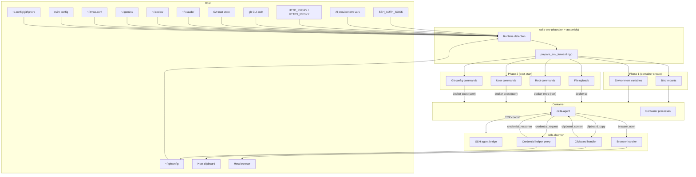

# Environment Forwarding

The key words "MUST", "MUST NOT", "REQUIRED", "SHALL", "SHALL NOT", "SHOULD", "SHOULD NOT", "RECOMMENDED", "MAY", and "OPTIONAL" in this document are to be interpreted as described in [RFC 2119](https://www.ietf.org/rfc/rfc2119.txt).

## Summary

cella transparently forwards host environment state into dev containers so that SSH, git, AI tools, proxy settings, clipboard, and browser integration work without manual configuration. Forwarding is best-effort: if a source is unavailable on the host, the container starts without it. No forwarding failure prevents container startup.

Environment forwarding operates in two phases:

- **Phase 1 (container creation)** -- Bind mounts and environment variables baked into the container at `docker create` time. Immutable after creation.
- **Phase 2 (post-start injection)** -- Files, git config commands, and shell commands executed after the container starts and UID remapping completes. Subdivided into four buckets: file uploads, root commands (executed as root, e.g., CA trust store updates), user commands (executed as the remote user), and git config commands (executed as the remote user).

The `cella-env` crate orchestrates detection and assembly. The orchestrator (`cella-orchestrator`) applies Phase 1 at container creation and Phase 2 via `docker exec` after start. The agent (`cella-agent`) and daemon (`cella-daemon`) mediate runtime forwarding (clipboard, browser, git credentials) over the IPC control connection.

## Architecture



### Crate Responsibilities

| Crate | Role |
|---|---|
| `cella-env` | Host environment detection, forwarding assembly, AI provider registry, proxy config generation, SSH strategy selection, git config filtering, CA bundle injection |
| `cella-orchestrator` | Applies Phase 1 (mounts, env) at container creation, Phase 2 (uploads, commands) after start, SSH fallback retry logic |
| `cella-daemon` | SSH agent TCP bridge, git credential helper proxy, clipboard handler, browser URL opener |
| `cella-agent` | In-container IPC client, port scanning, clipboard/browser message relay, credential helper binary |
| `cella-config` | `[credentials]` and `[network]` TOML schema parsing, AI provider toggles |
| `cella-network` | Proxy env var detection, proxy config structures, CA certificate generation |
| `cella-protocol` | Agent/daemon message types (clipboard, browser, credential, health) |

### Docker Runtime Detection

cella detects the Docker runtime to select platform-appropriate forwarding strategies. Detection follows a priority chain:

1. `DOCKER_HOST` env var -- pattern matching for runtime-specific socket paths
2. `DOCKER_CONTEXT` env var -- context name matching
3. `docker context inspect` -- active context endpoint query
4. Platform fallback -- Linux defaults to native, others to unknown

| Runtime | Label | SSH Strategy |
|---|---|---|
| Docker Desktop | `docker-desktop` | VM magic socket (`/run/host-services/ssh-auth.sock`) |
| OrbStack | `orbstack` | VM magic socket |
| Linux Native | `linux-native` | Direct bind-mount of `$SSH_AUTH_SOCK` |
| Colima | `colima` | Daemon-managed TCP bridge |
| Podman | `podman` | VM magic socket, then direct mount fallback |
| Rancher Desktop | `rancher-desktop` | VM magic socket, then direct mount fallback |
| Unknown | `unknown` | VM magic socket, then direct mount fallback |

## SSH Agent Forwarding

### Strategy Selection

SSH agent forwarding uses an ordered list of strategies per runtime. The orchestrator tries the primary strategy at container creation. If it fails with a bind-mount error, the orchestrator retries with the next strategy in the list, continuing until one succeeds or all strategies are exhausted.

**Docker Desktop / OrbStack:** These runtimes expose the host SSH agent inside their VM at `/run/host-services/ssh-auth.sock`. cella mounts this path directly into the container and sets `SSH_AUTH_SOCK` to the same path. This works regardless of whether `SSH_AUTH_SOCK` is set on the host, because the VM provides the socket independently.

**Linux Native:** The host's `$SSH_AUTH_SOCK` path is bind-mounted into the container at `/tmp/cella-ssh-agent.sock`. The socket file MUST exist on the host. If `SSH_AUTH_SOCK` is unset or the socket does not exist, SSH agent forwarding is skipped.

**Colima:** Lima's OpenSSH-based `forwardAgent` mechanism degrades with sandboxed SSH agents (1Password, Secretive) -- the magic socket at `/run/host-services/ssh-auth.sock` becomes connectable but returns no keys. Direct bind-mounting the host socket fails because virtiofs rejects `mkdir` for Unix socket paths on the macOS host. cella uses a daemon-managed TCP bridge to work around both issues.

**Rancher Desktop / Podman / Unknown:** Two strategies in preference order: (1) VM magic socket at `/run/host-services/ssh-auth.sock`, (2) direct bind-mount of the host `$SSH_AUTH_SOCK`. The second strategy is only available when `SSH_AUTH_SOCK` is set and the socket file exists.

### Daemon-Managed SSH Bridge

For runtimes where direct socket forwarding is unreliable, the daemon runs a per-workspace TCP bridge:

1. The orchestrator sends a `register_ssh_agent_proxy` management request with the workspace path and the host `SSH_AUTH_SOCK` path
2. The daemon binds a localhost TCP listener and bidirectionally forwards bytes to the upstream Unix socket
3. The daemon returns the bridge port in the `ssh_agent_proxy_registered` response
4. The orchestrator mounts the bridge socket into the container
5. Inside the container, the agent connects to the bridge port via `host.docker.internal`

**Refcounting:** The bridge is keyed by workspace path. Multiple containers in the same workspace share a single bridge listener. The refcount increments on each `register_ssh_agent_proxy` call and decrements on `release_ssh_agent_proxy`. The listener is torn down when the refcount reaches zero.

### SSH Config Forwarding

Host SSH configuration files (`~/.ssh/known_hosts` and `~/.ssh/config`) are copied into the container during Phase 2 via file upload. Files are placed at the remote user's `~/.ssh/` directory with `0600` permissions. Missing or empty files are silently skipped.

### User Override Detection

If the devcontainer configuration already specifies SSH agent forwarding -- via `SSH_AUTH_SOCK` in `containerEnv` or `remoteEnv`, or via a mount targeting a path containing `ssh-auth`, `ssh_auth`, or `SSH_AUTH` -- cella skips automatic forwarding entirely. This prevents conflicts with user-managed SSH setups.

### Fallback Warnings

When all strategies are exhausted, cella logs a runtime-specific warning with actionable remediation:

| Runtime | Remediation |
|---|---|
| Rancher Desktop | Create `override.yaml` with `ssh.forwardAgent: true`, restart |
| Colima | Start with `--ssh-agent` or set `forwardAgent: true` in config |
| Podman | Check Podman Machine SSH agent configuration |
| Unknown | Enable SSH agent forwarding in the VM configuration |

## Git Integration

### Git Config Forwarding

Host git global configuration is read via `git config --global --list --null` and filtered through a safe allowlist before injection into the container. Forwarded entries are applied as `git config --global` commands during Phase 2.

**Allowlisted keys (exact match):**

| Key | Description |
|---|---|
| `user.name` | Author name |
| `user.email` | Author email |
| `core.autocrlf` | Line ending conversion |
| `core.editor` | Default editor |
| `core.eol` | Line ending style |
| `core.filemode` | File permission tracking |
| `core.ignorecase` | Case sensitivity |
| `core.pager` | Pager program |
| `core.whitespace` | Whitespace handling |
| `init.defaultBranch` | Default branch name |
| `push.default` | Push behavior |
| `push.autoSetupRemote` | Auto-track remote branches |
| `pull.rebase` | Pull strategy |
| `pull.ff` | Fast-forward preference |
| `merge.ff` | Merge fast-forward |
| `diff.tool` | Diff program |
| `diff.algorithm` | Diff algorithm |
| `merge.tool` | Merge program |
| `rebase.autoSquash` | Auto-squash fixup commits |
| `rerere.enabled` | Recorded merge resolution |
| `fetch.prune` | Auto-prune on fetch |
| `commit.verbose` | Verbose commit messages |

**Allowlisted prefixes (all keys under these):**

| Prefix | Description |
|---|---|
| `alias.*` | Git aliases |
| `color.*` | Color configuration |

**SSH signing exception:** When `gpg.format=ssh` is detected in the host config, the following keys are additionally forwarded: `gpg.format`, `user.signingKey`, `commit.gpgSign`, `tag.gpgSign`, `gpg.ssh.allowedSignersFile`.

**Blocked keys** (never forwarded): `credential.*`, `gpg.*` (except SSH signing), `core.sshCommand`, `core.hooksPath`, `include.*`, `includeIf.*`, `safe.directory`, `http.*`, `url.*`, `remote.*`, `branch.*`. These are blocked because they reference host-specific paths, credentials, or network configuration that would be incorrect or dangerous inside the container.

### Safe Directory

`safe.directory=*` is always applied via `git config --global --replace-all`. This matches the official devcontainer CLI behavior: git operations succeed regardless of file ownership mismatches caused by UID remapping or bind-mount permission differences.

### Credential Helper

The cella credential helper is always installed in the container:

```
git config --global credential.helper "/cella/bin/cella-agent credential"
```

When a git operation needs credentials (e.g., `git clone https://github.com/...`):

1. Git invokes the credential helper with the `get` operation
2. The helper reads key=value fields from stdin (protocol, host, path)
3. The helper sends a `credential_request` message via the agent to the daemon
4. The daemon invokes the host-side `git credential fill` command with the same fields
5. The host credential helper resolves the credentials (from macOS Keychain, Windows Credential Manager, or other configured helpers)
6. The daemon returns the resolved fields in a `credential_response` message
7. The helper writes the response fields to stdout

The `store` and `erase` operations follow the same path, forwarding to the host's credential helper for persistence and cache management.

See [IPC Protocol](ipc-protocol.md) Layer 3 for the wire format.

### Global Gitignore

The host's global gitignore (`core.excludesFile` or `~/.config/git/ignore`) is forwarded into the container and merged with any existing container-side gitignore:

1. The host gitignore content is uploaded to `/tmp/.cella/host-gitignore` during Phase 2
2. A merge script combines the container's existing `~/.config/git/ignore` with the uploaded host patterns, using a `# --- forwarded from host ---` marker for idempotent merging
3. The merged result is written to `~/.config/git/cella-ignore`
4. `core.excludesFile` is set to point to the merged file

The merge is idempotent: running it multiple times produces the same result. Container-local patterns above the marker are preserved.

### GitHub CLI Forwarding

When the GitHub CLI (`gh`) is installed and authenticated on the host (`gh auth status` succeeds), cella forwards GitHub credentials into the container:

1. Workspace git remotes are parsed for GitHub hostnames (`github.com`, `*.github.com` for GHES)
2. For each hostname, a token is extracted via `gh auth token -h <hostname>`
3. A `hosts.yml` file is generated with the tokens and uploaded to `~/.config/gh/hosts.yml` in the container
4. The host's `~/.config/gh/config.yml` is copied if it exists

When [credential protection](credential-protection.md) is active, phantom tokens replace real OAuth tokens in `hosts.yml`. The daemon resolves the real token at proxy time via `gh auth token`.

## AI Provider Keys

### Env Var Forwarding

11 AI provider API keys are detected from the host environment and forwarded as container environment variables. Keys are read live from the host process on every `cella exec` / `cella shell` invocation -- they are never stored in container labels or baked at creation time.

| Provider | Env Var |
|---|---|
| Anthropic | `ANTHROPIC_API_KEY` |
| OpenAI | `OPENAI_API_KEY` |
| Gemini | `GEMINI_API_KEY` |
| Groq | `GROQ_API_KEY` |
| Mistral | `MISTRAL_API_KEY` |
| DeepSeek | `DEEPSEEK_API_KEY` |
| xAI | `XAI_API_KEY` |
| Fireworks | `FIREWORKS_API_KEY` |
| Together | `TOGETHER_API_KEY` |
| Perplexity | `PERPLEXITY_API_KEY` |
| Cohere | `COHERE_API_KEY` |

A key is forwarded when all of:

1. The provider is enabled via `credentials.ai.enabled` (global toggle) AND `credentials.ai.<provider_id>` (per-provider toggle, defaults to `true`)
2. The host environment variable is set and non-empty
3. The user has not already set the same variable in `containerEnv` or `remoteEnv`

### AI Tool Config Forwarding

Host configuration directories for AI coding tools are bind-mounted into the container during Phase 1 when they exist:

| Tool | Host Path | Container Path | Description |
|---|---|---|---|
| Claude Code | `~/.claude/` | `~/.claude/` | Settings, plugins, project memory |
| Claude Code | `~/.claude.json` | `~/.claude.json` | Global config file |
| OpenAI Codex | `~/.codex/` | `~/.codex/` | Codex CLI config |
| Google Gemini | `~/.gemini/` | `~/.gemini/` | Gemini CLI config |

Plugin manifest paths are rewritten during forwarding to reflect the container-side home directory (e.g., `/Users/alice/.claude/plugins/...` becomes `/home/vscode/.claude/plugins/...`).

### Phantom Token Interaction

When [credential protection](credential-protection.md) is enabled (`credentials.protect = true`), real API keys are never placed in the container environment. Instead:

1. Opaque phantom tokens (UUID-based placeholders with `pt-` prefix) are generated for each available provider
2. Phantom tokens are registered with the daemon's phantom registry
3. The container receives phantom tokens as env var values
4. The in-container agent's MITM proxy intercepts requests to known API domains
5. Requests are tunneled to the daemon, which replaces the phantom token with the real credential

GitHub uses `GH_TOKEN` as the phantom injection target but resolves the real credential via `gh auth token -h <hostname>`.

12 credential providers are protectable in total: the 11 AI providers above plus GitHub.

See [Credential Protection](credential-protection.md) for the full phantom token lifecycle, wire protocol, and security properties.

## Proxy Configuration

### Detection

Proxy settings are detected from the host environment and the cella network configuration (`[network.proxy]` in `cella.toml`). Detection follows the standard `HTTP_PROXY` / `HTTPS_PROXY` / `NO_PROXY` convention, checking both uppercase and lowercase variants.

### Direct Forwarding

When no blocking rules are configured, host proxy env vars are forwarded directly to the container at creation time. Both uppercase and lowercase variants are set:

- `HTTP_PROXY` / `http_proxy`
- `HTTPS_PROXY` / `https_proxy`
- `NO_PROXY` / `no_proxy`

### Safety Entries

`NO_PROXY` is always appended with safety entries to prevent proxy loops, regardless of forwarding mode (direct or agent proxy). The following entries are added if not already present:

| Entry | Purpose |
|---|---|
| `localhost` | Prevent proxying localhost traffic |
| `127.0.0.1` | Prevent proxying loopback IPv4 |
| `::1` | Prevent proxying loopback IPv6 |
| `127.0.0.1:<proxy_port>` | Prevent proxying the cella-agent proxy itself (agent proxy mode only) |

Existing user-specified `NO_PROXY` entries are preserved. Duplicates are suppressed by case-insensitive comparison.

### Agent Proxy Mode

When network blocking rules are active (allowlist or denylist mode), proxy env vars point to the cella-agent's in-container forward proxy instead of the upstream proxy:

```
HTTP_PROXY=http://127.0.0.1:<proxy_port>
HTTPS_PROXY=http://127.0.0.1:<proxy_port>
```

The agent proxy config is delivered as a JSON file at `/tmp/.cella/proxy-config.json` with `0600` permissions (the file contains the CA private key when path-level blocking rules require MITM inspection). The `CELLA_PROXY_CONFIG` env var tells the agent where to find this file.

The proxy config includes:

| Field | Description |
|---|---|
| `listen_port` | Agent proxy listen port |
| `mode` | `denylist` or `allowlist` |
| `rules` | Domain/path rules with `block`/`allow` actions |
| `upstream_proxy` | Upstream proxy URL (from host env or config) |
| `ca_cert_pem` | MITM CA certificate (when path rules are present) |
| `ca_key_pem` | MITM CA private key (when path rules are present) |

When credential protection is also active, credential routes and daemon connection info are injected into the same config file. See [Credential Protection](credential-protection.md) for details.

### CA Bundle Injection

When proxy settings are active, the host's CA trust store is injected into the container so TLS works behind corporate proxies that perform TLS inspection:

1. The host CA bundle is detected from the system trust store
2. Any additional CA certificate configured via `network.proxy.ca_cert` is appended
3. The combined PEM bundle is uploaded to the container's distro-appropriate CA path
4. A trust store update command runs as root

**Distro-specific CA paths:**

| Distro Family | CA Path | Update Command |
|---|---|---|
| Debian/Ubuntu/Alpine | `/usr/local/share/ca-certificates/cella-host-ca.crt` | `update-ca-certificates` |
| RHEL/Fedora/CentOS/SUSE | `/etc/pki/ca-trust/source/anchors/cella-host-ca.crt` | `update-ca-trust` |
| Unknown | Both paths | Both commands (first success wins) |

Container distro is detected from `/etc/os-release` by matching `ID=` and `ID_LIKE=` fields.

When path-level blocking rules require MITM, the generated MITM CA certificate is also injected and trusted via the same mechanism.

## Clipboard Synchronization

Clipboard operations are mediated by the agent-daemon IPC control connection. Container processes access the host clipboard through the agent, which relays messages to the daemon.

### Copy (Container to Host)

The agent sends a `clipboard_copy` message:

```json
{"type":"clipboard_copy","data":"<base64>","mime_type":"text/plain"}
```

| Field | Type | Description |
|---|---|---|
| `data` | `string` | Base64-encoded clipboard content |
| `mime_type` | `string` | Content MIME type |

The daemon decodes the content and writes it to the host clipboard. The daemon acknowledges with an `ack` message.

### Paste (Host to Container)

The agent sends a `clipboard_paste` request:

```json
{"type":"clipboard_paste","mime_type":"text/plain"}
```

The daemon reads the host clipboard and responds with a `clipboard_content` message:

```json
{"type":"clipboard_content","data":"<base64>","mime_type":"text/plain"}
```

### Supported MIME Types

| MIME Type | Description |
|---|---|
| `text/plain` | Plain text content |
| `image/png` | PNG image data |

Text content is the default. When `mime_type` is omitted from a paste request, `text/plain` is assumed.

See [IPC Protocol](ipc-protocol.md) for the full message definitions.

## Browser Integration

Container processes request host browser access via the agent-daemon control connection. The agent sends a `browser_open` message:

```json
{"type":"browser_open","url":"https://github.com/login"}
```

The daemon opens the URL in the host's default browser using the platform-appropriate mechanism (`open` on macOS, `xdg-open` on Linux, `start` on Windows).

Two mechanisms expose browser opening to container processes:

1. **`BROWSER` env var** -- Set to `/cella/bin/cella-browser`, a shell script that execs `cella-agent browser-open "$1"`. Tools that respect `$BROWSER` (e.g., Claude Code) use this path.
2. **`xdg-open` shim** -- An `xdg-open` shim at `/cella/bin/xdg-open` delegates to the same `cella-agent browser-open` command. Since `/cella/bin` is prepended to `PATH`, the shim shadows any real `xdg-open`. This handles tools like Wrangler that call `xdg-open` directly on Linux without checking `$BROWSER`.

This enables OAuth flows, documentation links, and preview URLs from container processes to open in the host browser seamlessly.

See [IPC Protocol](ipc-protocol.md) for the message definition.

## Editor and Tool Config Forwarding

Host editor and tool configurations are bind-mounted into the container when detected:

| Tool | Host Path | Container Path |
|---|---|---|
| tmux | `~/.tmux.conf` | `~/.tmux.conf` |
| tmux (XDG) | `~/.config/tmux/` | `~/.config/tmux/` |
| neovim | `~/.config/nvim/` | `~/.config/nvim/` |

tmux config supports custom path overrides. If a custom config path is specified and the file or directory does not exist, the mount is skipped.

## Configuration Reference

### devcontainer.json

| Property | Effect on Forwarding |
|---|---|
| `containerEnv` | Variables set here skip auto-forwarding (e.g., `SSH_AUTH_SOCK` disables SSH auto-forward) |
| `remoteEnv` | Same override behavior as `containerEnv` for exec-time env vars |
| `mounts` | SSH-related mounts disable SSH auto-forward |
| `userEnvProbe` | Controls how the container user's shell environment is probed (`loginShell`, `interactiveShell`, `loginInteractiveShell`, `none`) |

### cella.toml

| Section | Key | Default | Description |
|---|---|---|---|
| `credentials` | `gh` | `true` | Forward GitHub credentials via `gh auth token` |
| `credentials` | `protect` | `false` | Enable phantom token credential protection |
| `credentials` | `cache_ttl_seconds` | `60` | Credential resolution cache TTL |
| `credentials.ai` | `enabled` | `true` | Global toggle for AI provider key forwarding |
| `credentials.ai` | `<provider_id>` | `true` | Per-provider toggle |
| `credentials.providers` | (array) | `[]` | Custom credential providers |
| `network.proxy` | `enabled` | `true` | Proxy forwarding toggle |
| `network.proxy` | `ca_cert` | (none) | Additional CA certificate path |
| `network.proxy` | `proxy_port` | (default) | Agent proxy listen port |
| `network` | `mode` | `denylist` | Network rule mode (`denylist` or `allowlist`) |
| `network` | `rules` | `[]` | Domain/path blocking rules |

## Error Handling

Environment forwarding follows a **never-fails** principle: `prepare_env_forwarding()` MUST NOT return an error. Individual forwarding features log warnings and are silently skipped when their source is unavailable on the host.

| Feature | Failure Behavior |
|---|---|
| SSH agent socket not found | Skip forwarding, log runtime-specific remediation hint |
| SSH bind-mount fails | Retry with next strategy in the ordered list; skip with warning if all exhausted |
| Git not installed on host | Skip git config forwarding |
| No global git config | Skip (empty config is valid) |
| `gh` not installed or not authenticated | Skip GitHub credential forwarding |
| AI provider env var unset | Skip that provider (others still forwarded) |
| No proxy env vars detected | Skip proxy forwarding |
| CA bundle detection fails | Skip CA injection |
| SSH config files absent | Skip (common in CI) |
| Global gitignore absent | Skip |
| Claude/Codex/Gemini config dir absent | Skip bind-mount |
| tmux/nvim config absent | Skip bind-mount |
| Phase 2 file upload fails | Log warning, continue with remaining uploads |
| Phase 2 git config command fails | Log warning, continue with remaining commands |
| Phase 2 root command fails | Log warning, continue (commands use `|| true` internally) |

The orchestrator's SSH fallback retry logic is the only case where a Phase 1 failure triggers a retry cycle. All other Phase 1 failures are prevented by pre-checking (e.g., socket file existence) during detection.

## Extensible Git Config Forwarding

The git config forwarding allowlist is user-extensible via `git.forward_config_keys` in `cella.toml`. Users specify additional git config keys (e.g., organization-specific keys) beyond the built-in safe subset. Keys are validated against a denylist of security-sensitive keys (`core.sshCommand`, `core.gitProxy`, etc.) that are never forwarded regardless of user configuration.

## Compressed Clipboard Transport

Clipboard payloads exceeding 64 KB are zstd-compressed before JSON encoding. The receiving end detects the compression header and decompresses transparently. Maximum payload size is 16 MB (post-compression). Payloads exceeding this limit are rejected with a diagnostic message.

## Browser Response Channel

The `browser_open` message includes a response that reports whether the URL was successfully opened and which handler was used. The agent surfaces this to tools that requested the browser open. Timeout: 5 seconds; if no response, the message is treated as successful (backward compatible with fire-and-forget behavior).

## Rootless CA Injection

When the container user lacks root access, CA certificates are injected via `SSL_CERT_FILE` and `REQUESTS_CA_BUNDLE` environment variables pointing to a user-writable certificate bundle. This covers Python (requests, urllib3), Node.js, curl, and wget. Applications using system trust stores without environment variable support still require root access.

## Windows SSH Agent Transport

On Windows hosts, SSH agent forwarding uses Windows named pipes (`\\.\pipe\openssh-ssh-agent`) instead of Unix domain sockets. The daemon bridges between the named pipe and the TCP-based agent connection. Both OpenSSH for Windows and 1Password SSH agent are supported.

### .env File Protection

When credential protection is active, `.env` files inside the container that contain known provider env var names are intercepted to inject phantom tokens instead of real values. See [Credential Protection](credential-protection.md#env-file-protection).

### User Environment Probing

The `userEnvProbe` devcontainer property controls how the container user's shell environment is probed after start. cella runs the appropriate shell invocation (`-l`, `-i`, or `-li`) and parses the null-delimited `env -0` output. Probed environment variables are merged with `remoteEnv` overrides for exec-time injection.

| Probe Type | Shell Flags | Description |
|---|---|---|
| `loginInteractiveShell` (default) | `-li` | Login + interactive shell |
| `loginShell` | `-l` | Login shell only |
| `interactiveShell` | `-i` | Interactive shell only |
| `none` | (skipped) | No environment probing |

## Limitations

1. **Phase 1 immutability** -- Bind mounts and environment variables set at container creation cannot be changed without recreating the container. If a host path (e.g., `SSH_AUTH_SOCK`) changes location, the container must be rebuilt.
2. **Security: API keys read at exec time** -- API keys are read from the host process environment on each `exec`/`shell` invocation. Keys are never baked into the container image, labels, or persistent environment. If the host shell has not sourced the updated environment, new keys are not visible.
