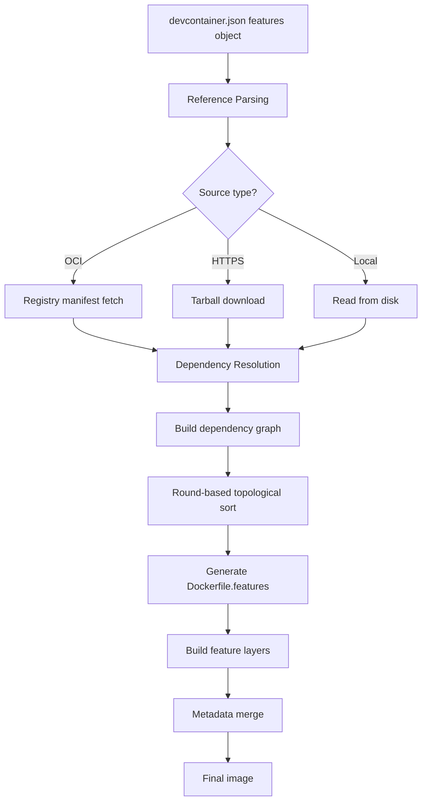

# Dev Container Features

The key words "MUST", "MUST NOT", "REQUIRED", "SHALL", "SHALL NOT", "SHOULD", "SHOULD NOT", "RECOMMENDED", "MAY", and "OPTIONAL" in this document are to be interpreted as described in [RFC 2119](https://www.ietf.org/rfc/rfc2119.txt).

## Summary

Dev container Features are self-contained, shareable units of installation code and container configuration. cella implements the full [devcontainer Features specification](https://containers.dev/implementors/features/), including OCI distribution, dependency resolution, installation ordering, metadata merging, caching, lockfile integrity, and feature-contributed lifecycle scripts. Features MUST install after the base image build but before `devcontainer.json` configuration merge.

## Architecture



| Crate | Responsibility |
|---|---|
| `cella-features` | Feature resolution, dependency ordering, Dockerfile generation, caching, lockfile |
| `cella-config` | `devcontainer-feature.json` schema types, option validation |
| `cella-orchestrator` | Feature resolution invocation during container creation |

## Feature Metadata Schema

Feature metadata is defined in `devcontainer-feature.json`, located in the root folder of the Feature. This file follows the [devcontainer Feature properties specification](https://containers.dev/implementors/features/#devcontainer-featurejson-properties).

### Required Properties

The schema MUST require `id`, `version`, and `name` fields. cella MUST reject a Feature if any of these three fields is missing.

| Property | Type | Constraints |
|---|---|---|
| `id` | string | MUST be lowercase. MUST match the directory name containing the `devcontainer-feature.json`. MUST be unique within the repository context. |
| `version` | string | MUST be valid [semantic versioning](https://semver.org/) (`major.minor.patch`). |
| `name` | string | Human-readable display name. |

Feature identifiers MUST be normalized to lowercase by implementing tools. All lookups MUST be case-insensitive: different casings MUST resolve to the same entry.

### Optional Properties

| Property | Type | Description |
|---|---|---|
| `description` | string | Human-readable overview of the Feature. |
| `documentationURL` | string | URL to Feature documentation. |
| `licenseURL` | string | URL to Feature license. |
| `keywords` | string[] | Search-relevant terms. |
| `deprecated` | boolean | When `true`, the Feature SHOULD be hidden from UI listings but MUST remain OCI-resolvable. |
| `legacyIds` | string[] | Previously used identifiers. Preserves all previous IDs after a Feature rename. |
| `options` | object | Option definitions (see [Feature Option Types](#feature-option-types)). |
| `entrypoint` | string | Container startup script path. When set, persists as the container entrypoint override. |
| `init` | boolean | When `true`, adds a tiny init process to the container. |
| `privileged` | boolean | When `true`, enables Docker privileged mode. |
| `capAdd` | string[] | Linux kernel capabilities to add. |
| `securityOpt` | string[] | Container security options (e.g., seccomp profiles). |
| `mounts` | (string \| object)[] | Cross-orchestrator mount definitions. Supports `${devcontainerId}` substitution. |
| `containerEnv` | object | Environment variable name-value pairs added as `ENV` commands in the Dockerfile. |
| `customizations` | object | Product-specific configuration, namespaced by tool. |
| `installsAfter` | string[] | Soft dependency: influences install order when the target Feature is present. |
| `dependsOn` | object | Hard dependency: auto-pulls and installs dependencies recursively. Keys are Feature references, values are option objects. |
| `onCreateCommand` | string \| string[] \| object | Lifecycle hook contributed by the Feature. |
| `updateContentCommand` | string \| string[] \| object | Lifecycle hook contributed by the Feature. |
| `postCreateCommand` | string \| string[] \| object | Lifecycle hook contributed by the Feature. |
| `postStartCommand` | string \| string[] \| object | Lifecycle hook contributed by the Feature. |
| `postAttachCommand` | string \| string[] \| object | Lifecycle hook contributed by the Feature. |

### Feature Renaming and Legacy IDs

When a Feature is renamed:

1. The `id` property and source directory name MUST be updated to the new identifier.
2. The `legacyIds` array MUST include all previously used identifiers.
3. The `version` MUST continue from the previous version sequence -- it MUST NOT restart at `1.0.0`.
4. Renamed Features MUST still satisfy `installsAfter` references using any of their previous IDs.
5. Existing `devcontainer.json` files referencing a deprecated Feature MUST still resolve successfully.
6. A Feature's primary `id` MUST NOT collide with any `legacyId` of another Feature in the same set.

## Feature Option Types

Feature options are defined in the `options` object of `devcontainer-feature.json`. Each option key is the option identifier; the value is a schema object describing the option.

### Type Discriminator

The `type` field MUST accept only two values: `"boolean"` or `"string"`. All other type values MUST be rejected. The option schema uses `anyOf` dispatch across three variants; input MUST match exactly one variant.

### Schema Variants

**Boolean option:**

```json
{
  "type": "boolean",
  "default": false,
  "description": "Enable feature X"
}
```

Boolean values are converted to the strings `"true"` or `"false"` in environment variables.

**String option (with proposals):**

```json
{
  "type": "string",
  "default": "lts",
  "proposals": ["lts", "current", "18"],
  "description": "Node.js version"
}
```

Proposals are suggestions; any string value is accepted.

**String option (with enum):**

```json
{
  "type": "string",
  "default": "stable",
  "enum": ["stable", "nightly", "beta"],
  "description": "Release channel"
}
```

Enum restricts values to the listed choices only.

All three variants MUST enforce `additionalProperties: false`. Every option MUST have a `default` value defined in metadata. Omitted options MUST receive their declared default value.

### Option Name to Environment Variable Transformation

Option names are transformed into environment variables for use in `install.sh`. The transformation MUST produce valid identifiers matching `[A-Z_][A-Z0-9_]*`:

1. Replace all non-word characters (anything not `[a-zA-Z0-9_]`) with `_`.
2. Strip leading digits and underscores from the result.
3. Convert the entire result to uppercase.
4. Prepend the sanitized, uppercased Feature ID followed by `_`.

Example: Feature `my-feature`, option `optionIdGoesHere` becomes `MY_FEATURE_OPTION_ID_GOES_HERE`.

## Feature Reference Types

Features are referenced in the `features` object of `devcontainer.json`. Each reference MUST resolve to exactly one of three mutually exclusive distribution types, unambiguously determined by the reference format.

### Reference Format Detection

| Prefix | Type | Example |
|---|---|---|
| `./` | Local | `./myFeature` |
| `https://` | HTTPS tarball | `https://example.com/devcontainer-feature-go.tgz` |
| Everything else | OCI registry | `ghcr.io/devcontainers/features/node:1` |

The reference parser MUST NOT misclassify OCI references as local paths or vice versa. Feature reference type is unambiguously determined by prefix (`./` or `https://`).

### OCI Registry Features

OCI Feature references follow the format `<registry>/<namespace>/<feature>[:<version>]`.

- The OCI namespace MUST be lowercase per the [OCI distribution-spec](https://github.com/opencontainers/distribution-spec) repository name regex.
- Omitted version tag MUST default to `latest`.
- Version MAY be pinned to `major`, `major.minor`, or `major.minor.patch` granularity.
- Template OCI namespace MUST be distinct from Feature namespace within the same organization.

OCI features MUST resolve via registry digest. The `dev.containers.metadata` annotation on the manifest MUST contain the full escaped JSON of the entire `devcontainer-feature.json` content. If no annotation is present, the implementing tool MUST fall back to downloading and extracting the Feature tarball to read metadata.

### HTTPS Tarball Features

HTTPS Feature references point directly to a `.tgz` archive URL. The tarball MUST be fully downloaded and extracted before reading `dependsOn` metadata. HTTPS features MUST resolve via the URL itself.

### Local Features

Local Features use unix-style relative path syntax (e.g., `./myFeature`).

- Unix-style path separators (`/`) MUST be used regardless of host OS.
- The path MUST resolve relative to the folder containing the active `devcontainer.json`.
- The Feature sub-folder MUST be contained within `.devcontainer/`.
- The sub-folder name MUST exactly match the `id` field in `devcontainer-feature.json`.
- The sub-folder MUST contain both `devcontainer-feature.json` and `install.sh` at minimum.
- The `.devcontainer/` folder MUST exist at the workspace root before local Feature validation.

Local Features and deprecated GitHub-release Features MUST be skipped in the lockfile -- no entry is recorded.

## Dependency Resolution

Feature dependency resolution constructs a directed graph and produces a deterministic installation order. The algorithm follows the [feature dependencies specification](https://github.com/devcontainers/spec/blob/main/docs/specs/feature-dependencies.md).

### Edge Types

The dependency graph MUST store two distinct edge types:

| Edge type | Property | Semantics |
|---|---|---|
| Hard | `dependsOn` | Auto-pulls missing dependencies. Recursive. Blocks installation until satisfied. |
| Soft | `installsAfter` | Reorders only. Not recursive. Only applies when target Feature is already queued; edges to absent Features are filtered before sorting. |

### Graph Construction (B1)

From the user-defined Features in `devcontainer.json`, the implementing tool MUST build a dependency graph:

1. For each Feature, fetch its metadata (from OCI annotation, tarball extraction, or local disk).
2. For `dependsOn` entries: add a hard edge and enqueue the dependency for recursive resolution. The dependency is auto-pulled if not already present.
3. For `installsAfter` entries: add a soft edge. `installsAfter` MUST NOT be evaluated recursively -- only direct edges are added.
4. Maintain a Feature accumulator. Duplicate Features (by [Feature Equality](#feature-equality)) MUST NOT be added twice.
5. After the worklist is exhausted, all transitively reachable Features MUST be in the accumulator.

Circular `dependsOn` chains MUST be detected and rejected without infinite recursion. Circular dependencies via `installsAfter` (including through `legacyIds` resolution) MUST also be detected and rejected.

### Round Priority Assignment (B2)

Each node in the graph has a default `roundPriority` of `0`.

When `overrideFeatureInstallOrder` is present in `devcontainer.json`, priority is assigned as follows: given `n` Features in the array, Feature at zero-based index `idx` receives `roundPriority = n - idx`.

```
overrideFeatureInstallOrder = ["foo", "bar", "baz"]
roundPriority: foo=3, bar=2, baz=1
```

Features listed in `overrideFeatureInstallOrder` MUST exist in the dependency graph. If a listed Feature is not queued for installation, the implementing tool MUST produce a fatal error.

`overrideFeatureInstallOrder` MUST NOT contradict the dependency graph edges -- it cannot pull a Feature forward until all its dependencies (both hard and soft) are installed. Features in `overrideFeatureInstallOrder` install before unlisted features (which retain `roundPriority` of `0`).

### Round-Based Topological Sort (B3)

The sort operates on a `worklist` (all Features from B2) and produces an `installationOrder` list:

1. Before sorting begins, remove all `installsAfter` edges whose target Feature is not in the worklist.
2. For each round, find all Features in the `worklist` whose dependencies (both `dependsOn` and `installsAfter`) are already in `installationOrder`. These are the eligible Features for this round.
3. From the eligible set, commit only those with the maximum `roundPriority` in this round.
4. Lower-priority eligible Features MUST be returned to the worklist for subsequent rounds.
5. Among Features with equal `roundPriority` in the same round, apply the [Round Stable Sort](#round-stable-sort) comparator.
6. Append the committed Features to `installationOrder`.
7. Repeat until the worklist is empty.

If a round produces zero committed Features (no Feature is eligible), this MUST be detected as a circular dependency error -- the algorithm MUST terminate with an error, not loop infinitely.

After the sort completes successfully, `installationOrder` MUST contain every Feature from the worklist. The `installationOrder` MUST grow monotonically -- committed Features are never removed or reordered. Every Feature in the worklist MUST appear in `installationOrder` or trigger an error.

### Feature Equality

Two Features are considered equal if both their content identity AND option values match:

| Source type | Content identity | Options |
|---|---|---|
| OCI registry | Identical manifest digests | All option values match |
| HTTPS tarball | Identical tgz content hash (SHA-256) | All option values match |
| Local | Never equal to any other Feature | N/A |

Features with different reference types (OCI, HTTPS, local) are never equal. Omitted options use the Feature-defined default and MUST NOT count as user-defined in sort comparison.

### Round Stable Sort

When multiple Features are committed in the same round, deterministic ordering MUST be applied using the following comparator chain:

1. Lexicographic comparison by fully qualified resource name (for OCI Features, the ID without version or digest).
2. Oldest to newest tag (`latest` is the "most new").
3. Greatest number of user-defined options first.
4. Lexicographic sort of provided option keys.
5. Lexicographic sort of provided option values.
6. Canonical name (for OCI Features, the ID resolved to the digest hash).

The sort comparator MUST be total -- no two distinct Features may compare as equal at the final tiebreak.

## Installation Execution

Feature installation occurs during image build, after base image resolution and before `devcontainer.json` configuration merge.

### Execution Environment

Feature scripts MUST execute inside the container, never on the host filesystem. `install.sh` MUST run as `root` to enable system-level modifications.

The following environment variables MUST be set before `install.sh` execution begins:

| Variable | Description |
|---|---|
| `_REMOTE_USER` | Configured remote user value |
| `_CONTAINER_USER` | Container's user account |
| `_REMOTE_USER_HOME` | Remote user home directory |
| `_CONTAINER_USER_HOME` | Container user home directory |

The container user MUST be fully resolved before Feature environment variable computation begins.

### Installation Process

1. Feature options are resolved: user-provided values override defaults, omitted options receive their declared default.
2. Options are emitted to `devcontainer-features.env` as `<OPTION_NAME>=<value>` pairs.
3. `devcontainer-features.env` MUST be sourced before `install.sh` execution begins.
4. `install.sh` executes as root with the option environment variables available.
5. Each Feature installation creates a separate Docker image layer for caching optimization.

Feature install scripts SHOULD NOT be persisted beyond the initial container build phase. Feature authors who need scripts at runtime MUST copy them to a persistent location during `install.sh`.

### Tarball Naming

Feature tarballs MUST be named `devcontainer-feature-{id}.tgz`, matching the `id` field exactly. This convention applies to both OCI layer annotations and HTTPS distribution.

### Tarball Extraction Safety

Feature tarball extraction MUST NOT write files outside the target extraction directory. Resolved include paths MUST NOT escape the Feature root directory. Symlinks in include paths MUST NOT resolve to locations outside the Feature root. These constraints prevent zip-slip-class path traversal attacks.

## Feature Metadata Merge

Features contribute configuration that is merged into the container setup. The merge follows a strict precedence order.

### Merge Precedence

Merge precedence order MUST be: image metadata < Feature metadata < `devcontainer.json`. Features MUST install after base image build but before `devcontainer.json` config merge. Feature installation order determines merge precedence among Features: later Features override earlier ones.

Per-property merge rules MUST apply at each Feature merge step, not just at the final merge.

### Per-Property Merge Rules

| Property | Merge behavior |
|---|---|
| `privileged` | OR logic across all installed Features. If any Feature sets `true`, the container runs privileged. |
| `init` | OR logic across all installed Features. If any Feature sets `true`, a tiny init process is added. |
| `capAdd` | Concatenated across Features, not deduplicated. |
| `securityOpt` | Concatenated across Features, not deduplicated. |
| `containerEnv` | Added as `ENV` commands in the Dockerfile before the Feature's `install.sh` executes. |
| `mounts` | Concatenated across Features. |
| `entrypoint` | Last Feature to set it wins (installation order). |

After Feature installation, each Feature's contributed metadata MUST be present in the merged config stored in the `devcontainer.metadata` label.

## Feature-Contributed Lifecycle Scripts

Features MAY declare lifecycle hooks in `devcontainer-feature.json`, following the [feature lifecycle scripts specification](https://github.com/devcontainers/spec/blob/main/docs/specs/features-contribute-lifecycle-scripts.md). The supported hooks are:

- `onCreateCommand`
- `updateContentCommand`
- `postCreateCommand`
- `postStartCommand`
- `postAttachCommand`

`initializeCommand` is deliberately excluded from Feature lifecycle hooks.

### Execution Order

All Feature commands for a given hook MUST complete before any user command for that same hook. Within Features, commands execute sequentially in Feature installation order. If a Feature's lifecycle command fails (non-zero exit), subsequent lifecycle commands (including later hooks) MUST NOT execute.

Commands use the same format as `devcontainer.json` lifecycle hooks: string (shell-interpreted), array (direct exec), or object (parallel execution within the Feature's command group). All commands execute from the project workspace folder context.

### Script Persistence

Feature authors who bundle scripts for use in lifecycle hooks MUST copy those scripts to a persistent container location during `install.sh`. Implementations are not required to persist Feature install directories beyond the initial build.

## Feature Packaging and Distribution

### Packaging Requirements

A Feature directory MUST contain at minimum:

- `devcontainer-feature.json` -- metadata file
- `install.sh` -- installation entrypoint script

Additional files are permitted and packaged alongside. The Feature directory name MUST exactly match the `id` field in `devcontainer-feature.json`.

### Source Layout

Feature JSON resolution MUST check `./src/feature-id/` before the top-level location. Exactly one `devcontainer-feature.json` MUST be resolved per Feature. Each Feature MUST be packaged separately under `./src/feature-id/` in the archive.

### OCI Distribution

After a Feature push, all four semver tags MUST exist in the registry:

| Tag | Example |
|---|---|
| `major` | `1` |
| `major.minor` | `1.2` |
| `major.minor.patch` | `1.2.3` |
| `latest` | `latest` |

The OCI manifest MUST include a `dev.containers.metadata` annotation containing the full escaped JSON of `devcontainer-feature.json`.

### Collection Metadata

The collection `features` array MUST contain metadata from every Feature in the namespace. The declared Feature count MUST match the actual `features` array length.

## Feature Caching

Feature caching accelerates rebuilds by reusing previously resolved and installed Features.

### Cache Equality

A cached Feature is reusable only when BOTH conditions hold:

| Source type | Content check | Options check |
|---|---|---|
| OCI registry | Identical manifest digest | Identical option values |
| HTTPS tarball | Identical content hash (SHA-256 of tgz bytes) | Identical option values |
| Local | Always rebuild (never cached) | N/A |

Cached Feature resolution results MUST include `legacyIds` in the cache key to ensure renamed Features do not produce stale cache hits.

### Cache Layout

> **cella-specific:** The cache directory structure below is a cella implementation detail, not mandated by the devcontainer spec.

Features are cached on disk at `$CACHE_DIR/cella/features/`:

- **OCI features** -- `oci/<registry>/<repository>/<digest>`
- **URL features** -- `urls/<sha256-prefix-16>`
- **Build contexts** -- `builds/<config_hash>`

All writes use atomic staging: content is written to `<name>.partial-<pid>`, then committed via `rename()`. Concurrent fetches of the same Feature are safe -- the first writer wins, subsequent renames overwrite with identical content.

## Feature Lockfile

The Feature lockfile provides reproducible builds by recording resolved digests on first use (trust on first use) and verifying them on subsequent builds. The lockfile follows the [devcontainer CLI lockfile format](https://containers.dev/implementors/features/).

### Location

The lockfile MUST be at `.devcontainer/devcontainer-lock.json`.

### Format

Entries are nested under a `"features"` key:

```json
{
  "features": {
    "ghcr.io/devcontainers/features/node:1": {
      "version": "1.5.0",
      "resolved": "ghcr.io/devcontainers/features/node@sha256:abc123...",
      "integrity": "sha256:abc123..."
    }
  }
}
```

### Key Normalization

All Feature keys stored in the lockfile MUST be lowercase-normalized. `dependsOn` entries MUST be lowercase-normalized before lockfile lookup.

### Integrity

- **OCI features** -- `integrity` is the SHA-256 digest of the downloaded artifact bytes.
- **HTTPS features** -- `integrity` is the SHA-256 of the tarball content.
- **Local features** -- MUST be skipped; no lockfile entry is recorded.
- **Deprecated GitHub-release features** -- MUST be skipped; no lockfile entry is recorded.

### Trust on First Use (TOFU)

On first resolution, the lockfile entry is recorded with the resolved digest and integrity hash. On subsequent builds, the resolved digest MUST be compared against the lockfile entry. A mismatch indicates tampering or unintended version drift and SHOULD produce a warning or error.

### Dependency Tracking

Every `dependsOn` entry MUST have a corresponding top-level record in the lockfile. The number of `dependsOn` declarations MUST match the number of recorded dependency entries. Version pinning MUST produce identical Feature resolution across repeated builds.

## Error Handling

| Condition | Behavior |
|---|---|
| Missing `id` or `version` or `name` | MUST reject with schema validation error |
| Malformed `devcontainer-feature.json` | MUST produce a graceful error, not a process crash |
| Circular `dependsOn` | MUST detect and terminate with error, reporting the cycle |
| Circular `installsAfter` | MUST detect and reject |
| Empty sort round (no eligible Features) | MUST terminate as circular dependency error |
| Feature in `overrideFeatureInstallOrder` not in graph | MUST produce fatal error |
| Tarball path traversal attempt | MUST reject extraction |
| Symlink escape attempt | MUST reject resolution |
| OCI annotation missing | MUST fall back to tarball extraction for metadata |

## Limitations

- Feature install scripts are ephemeral -- they are not persisted beyond the initial build phase. Runtime scripts must be copied to a persistent location by the Feature author.
- `initializeCommand` is not available as a Feature lifecycle hook.
- Local Features cannot be cached or lockfile-tracked.
- Since two Features with different options are considered different, a single Feature may be installed more than once. Feature authors should write idempotent install scripts.
