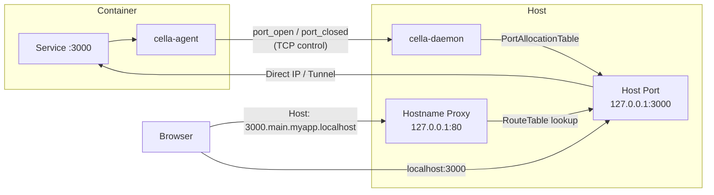

# Port Forwarding

The key words "MUST", "MUST NOT", "REQUIRED", "SHALL", "SHALL NOT", "SHOULD", "SHOULD NOT", "RECOMMENDED", "MAY", and "OPTIONAL" in this document are to be interpreted as described in [RFC 2119](https://www.ietf.org/rfc/rfc2119.txt).

## Summary

cella automatically detects listening ports inside dev containers, allocates non-conflicting host ports, and exposes them through both traditional `localhost:<port>` URLs and stable hostname-based URLs. An HTTP reverse proxy routes requests by `Host` header so that every project, branch, and port combination gets a deterministic, human-readable address. Reverse tunnels bridge runtimes that lack direct container-IP routing.

## Architecture



Three crates implement this system:

| Crate | Responsibility |
|---|---|
| `cella-port` | `/proc/net/tcp` parsing, port allocation table |
| `cella-proxy` | Hostname parsing, route table, HTTP reverse proxy server, error pages |
| `cella-daemon` | Port manager, proxy coordinator, tunnel broker, route table lifecycle |

**Proxy modes.** The daemon selects one of three modes per container based on the runtime environment:

| Mode | When | Connection path |
|---|---|---|
| `DirectIp` | Linux native, OrbStack | `proxy -> container_ip:port` |
| `Localhost` | Host-port proxy already bound | `proxy -> 127.0.0.1:host_port` |
| `AgentTunnel` | Colima, Docker Desktop for Mac | `proxy -> reverse tunnel -> container:port` |

## Port Detection

### Proc scanning

The in-container agent periodically scans `/proc/net/tcp` and `/proc/net/tcp6` for sockets in the LISTEN state (`st = 0A`). Each entry yields:

| Field | Source | Description |
|---|---|---|
| `port` | `local_address` hex (after `:`) | Listening port number |
| `protocol` | File path | `tcp` for both IPv4 and IPv6 proc files |
| `bind` | `local_address` hex (before `:`) | `localhost` or `all` (see below) |
| `inode` | Field 9 | Socket inode for process identification |

**Bind address classification:**

| Address | Hex pattern | Classification |
|---|---|---|
| `127.0.0.1` | `0100007F` (8 chars, little-endian) | `localhost` |
| `::1` | `00000000000000000000000001000000` (32 chars) | `localhost` |
| `::ffff:127.0.0.1` | `0000000000000000FFFF00000100007F` (32 chars) | `localhost` |
| Any other address | All other patterns | `all` |

### Agent messages

When the agent detects a new listener, it MUST send a `port_open` message to the daemon. When a previously detected listener disappears, it MUST send `port_closed`. See [IPC Protocol -- Port Management](ipc-protocol.md#port-management) for message schemas.

The `port_open` message includes an optional `proxy_port` field. When set, the daemon connects to `container_ip:proxy_port` instead of `container_ip:port`, enabling the agent to proxy localhost-bound services to a container-wide address.

### Process identification

The agent attempts best-effort process identification by scanning `/proc/<pid>/fd/` for symlinks matching `socket:[<inode>]`. When found, it reads `/proc/<pid>/cmdline` and extracts the binary name. This information is advisory -- port forwarding proceeds regardless of whether the process name is resolved.

## Port Allocation

### Host port selection

The daemon's `PortAllocationTable` assigns a host-side port for each detected container port. The allocation range is `1024..=65535`.

**Strategy:**

1. Try the native port (container port == host port). If free in both the allocation table and at the OS level, use it.
2. If the native port is taken and `requireLocalPort` is `false`, scan sequentially from `container_port + 1` through the end of the range, then wrap to `1024` and scan up to `container_port`. The first port free in both the allocation table and the OS is selected.
3. If `requireLocalPort` is `true` and the native port is unavailable, allocation fails with `PortInUse`.
4. If no port in the entire range is free, allocation fails with `NoAvailablePorts`.

The OS-level check uses a synchronous `TcpListener::bind("127.0.0.1", port)` probe to verify the port is not held by another process.

### Conflict resolution

When multiple containers expose the same port, each gets a distinct host port. The first container registered gets the native port; subsequent containers receive the next available port.

### Preallocation

Ports listed in `forwardPorts` are pre-allocated at container registration time, before the agent connects. This guarantees stable host ports for explicitly configured services. Pre-allocated ports register hostname routes and set the default port (first entry wins) immediately.

### Deduplication

If the agent re-reports a port that is already tracked for the same container (e.g., after reconnection), the existing allocation is returned without creating a duplicate entry.

### Re-registration

When a container re-registers (e.g., after restart), all previous port allocations for that container are released before accepting new reports. This ensures the agent can reclaim native ports without silent remapping.

## Hostname Routing

### Hostname scheme

```
{port}.{branch}.{project}.localhost            -- standard
{port}.{branch}.{project}.localhost:{proxy}    -- fallback when port 80 unavailable
{branch}.{project}.localhost                   -- bare (default port)
{branch}.{project}.local                       -- OrbStack default web port
```

| Component | Source | Example |
|---|---|---|
| `{port}` | Container port number | `3000` |
| `{branch}` | Sanitized git branch name | `feature-auth` |
| `{project}` | `devcontainer.json` `name` field, fallback to repo directory | `myapp` |
| `{proxy}` | Hostname proxy listener port (omitted when 80) | `49180` |

When port is omitted (`{branch}.{project}.localhost`), the proxy routes to the default port: the first `forwardPorts` entry registered for that project/branch pair, or the first auto-detected port if no `forwardPorts` are configured.

### Branch name sanitization

Git branch names are transformed into valid DNS labels through six ordered steps:

1. Lowercase the entire string
2. Replace `/`, `_`, `.` with `-`
3. Replace any remaining non-alphanumeric, non-hyphen characters with `-`
4. Collapse consecutive hyphens into a single hyphen
5. Strip leading and trailing hyphens
6. Truncate to 63 characters (DNS label limit), stripping any trailing hyphen created by truncation

**Examples:**

| Branch | Sanitized |
|---|---|
| `feature/auth-v2` | `feature-auth-v2` |
| `bugfix_login.flow` | `bugfix-login-flow` |
| `feat@v2#patch` | `feat-v2-patch` |
| `Feature/Auth` | `feature-auth` |
| `a---b` | `a-b` |
| `main` | `main` |

### Collision handling

When two distinct branch names produce the same sanitized label (e.g., `a/b` and `a-b` both sanitize to `a-b`), the second branch to register receives a disambiguation suffix: a hyphen followed by the first 4 characters of the branch name's SHA-256 hex digest.

The base label is truncated to at most 58 characters (63 minus 5 for `-XXXX`) before appending the suffix, ensuring the result fits within the DNS label limit.

The first branch registered keeps the plain label; the collision suffix is deterministic and stable across restarts.

### Proxy behavior

The hostname proxy is a hyper-based HTTP/1.1 reverse proxy (`cella-proxy` crate). It binds to `127.0.0.1:80` by default. If port 80 is unavailable, it binds to an ephemeral loopback port and includes that port in all generated URLs.

**Request handling:**

1. Extract the `Host` header. Strip any `:<port>` suffix.
2. Parse the hostname against `.localhost` and `.local` TLDs.
3. For 3-label hostnames (`{port}.{branch}.{project}`), look up the exact route.
4. For 2-label hostnames (`{branch}.{project}`), resolve the default port for that project/branch pair, then look up the route.
5. If no route matches, return a 404 HTML error page listing all registered services.
6. If the route exists but the backend is unreachable, return a 502 HTML error page.

**Forwarding headers.** The proxy sets the following headers on forwarded requests:

| Header | Value |
|---|---|
| `X-Forwarded-Host` | Original `Host` header value |
| `X-Forwarded-Proto` | `http` |
| `X-Forwarded-For` | Client IP address |

**Hop-by-hop headers.** The proxy strips these headers from forwarded requests (except during WebSocket upgrades):

`Connection`, `Keep-Alive`, `Proxy-Authenticate`, `Proxy-Authorization`, `TE`, `Trailer`, `Transfer-Encoding`, `Upgrade`

**Response streaming.** The proxy streams response bodies without buffering -- chunks are forwarded to the client as they arrive from the backend.

### Route table

The `RouteTable` maps `(project, branch, port)` tuples to backend targets. Routes are managed through four lifecycle events:

| Event | Action |
|---|---|
| Container registration | Pre-allocate `forwardPorts`, insert routes, set default port |
| Port detected (`port_open`) | Allocate host port, insert or update route |
| Port closed (`port_closed`) | Remove route, release host port allocation |
| Container deregistered | Remove all routes for that container, release all allocations |

Each route stores a `ProxyMode` indicating how to reach the backend. The daemon updates the mode for all routes belonging to a container when the connectivity path changes (e.g., when an agent tunnel becomes available).

## Reverse Tunnels

On runtimes without direct container-IP routing (Colima, Docker Desktop for Mac), the daemon uses reverse tunnels to reach container services. The tunnel lifecycle:

1. A host-side client connects to `localhost:<host_port>`.
2. The TCP proxy coordinator accepts the connection and requests a tunnel from the `TunnelBroker`, which allocates a monotonically increasing `connection_id`.
3. The daemon sends a `tunnel_request` message to the agent over the control connection, specifying the `connection_id` and `target_port`. See [IPC Protocol -- Reverse Tunnel](ipc-protocol.md#reverse-tunnel).
4. The agent opens a **new** TCP connection to the daemon's control port and sends a `TunnelHandshake` with the matching `connection_id` and the container's `auth_token`. See [IPC Protocol -- Connection Multiplexing](ipc-protocol.md#connection-multiplexing) for the `0x02` magic byte framing.
5. The `TunnelBroker` matches the incoming connection to the pending request via `connection_id` and delivers the `TcpStream` to the waiting proxy task.
6. Bidirectional byte copying begins between the host client and the tunnel stream.
7. The tunnel connection has a 5-second setup timeout. If the agent does not deliver a matching connection within that window, the broker cancels the request and the proxy returns a connection error.

## WebSocket Support

The hostname proxy supports WebSocket upgrades transparently:

1. The proxy detects upgrade requests by inspecting `Connection: Upgrade` and `Upgrade: websocket` headers (case-insensitive).
2. During WebSocket upgrades, hop-by-hop headers are **preserved** on the forwarded request (they are required by the upgrade handshake).
3. After the backend responds with `101 Switching Protocols`, both sides of the connection are upgraded.
4. Bidirectional byte copying runs between the client and backend upgraded streams until either side closes.

## OrbStack Integration

On OrbStack, containers are directly reachable by IP. The daemon detects OrbStack at startup and adjusts behavior:

**Native domains.** OrbStack provides `.local` domain resolution for the default web port. cella sets Docker labels `dev.orbstack.domains` and `dev.orbstack.http-port` so that `{branch}.{project}.local` resolves to the container's default port via OrbStack's built-in DNS.

**Port proxies.** On OrbStack the daemon uses `DirectIp` mode, so host-port TCP proxy listeners connect directly to the container IP rather than through an agent tunnel. The hostname HTTP proxy is not started on OrbStack; hostname routing relies on OrbStack's native `.local` DNS resolution.

**Fallback.** Additional forwarded ports beyond the default web port are accessible via the hostname proxy's `.localhost` URLs and `localhost:<host_port>` URLs as shown by `cella ports`.

## devcontainer.json Properties

### forwardPorts

An array of port numbers to forward. These ports are pre-allocated at container registration -- before the agent detects them -- guaranteeing stable host port assignments.

```jsonc
{
  "forwardPorts": [3000, 8080, 5432]
}
```

The first entry becomes the default port for bare hostname access (`{branch}.{project}.localhost`).

### portsAttributes

Per-port configuration keyed by port number or pattern. Each entry MAY specify:

| Property | Type | Default | Description |
|---|---|---|---|
| `onAutoForward` | `OnAutoForward` | `notify` | Behavior when the port is auto-detected |
| `label` | `string` | -- | Display label for the port |
| `protocol` | `string` | `http` | Protocol hint for URL generation |
| `requireLocalPort` | `bool` | `false` | Require the exact host port; fail if unavailable |
| `elevateIfNeeded` | `bool` | `false` | Attempt elevated access for privileged ports |

**`onAutoForward` values:**

| Value | Behavior |
|---|---|
| `notify` | Show a notification (default) |
| `openBrowser` | Open in the default browser |
| `openBrowserOnce` | Open in browser on first detection only |
| `openPreview` | Treated as `openBrowser` in CLI context |
| `silent` | Forward without notification |
| `ignore` | Do not forward this port |

Ports with `onAutoForward: ignore` are not allocated and do not appear in the route table.

Port patterns support exact matches (`"3000"`) and ranges.

```jsonc
{
  "portsAttributes": {
    "3000": {
      "label": "Frontend",
      "onAutoForward": "openBrowser",
      "protocol": "http"
    },
    "5432": {
      "label": "Database",
      "onAutoForward": "silent"
    },
    "9229": {
      "onAutoForward": "ignore"
    }
  }
}
```

### otherPortsAttributes

Default attributes applied to any auto-detected port that does not match a specific `portsAttributes` entry.

```jsonc
{
  "otherPortsAttributes": {
    "onAutoForward": "silent"
  }
}
```

## Configuration Reference

| Setting | Source | Effect |
|---|---|---|
| `name` | `devcontainer.json` | `{project}` component in hostname URLs |
| `forwardPorts` | `devcontainer.json` | Pre-allocated ports, first entry is default |
| `portsAttributes` | `devcontainer.json` | Per-port forwarding behavior |
| `otherPortsAttributes` | `devcontainer.json` | Default behavior for unmatched ports |
| Branch name | Git | `{branch}` component in hostname URLs |
| Proxy bind address | Daemon startup | `127.0.0.1:80`, fallback to ephemeral port |

The `cella ports` command displays all forwarded ports for the current container (or `--all` for all worktrees), including hostname URLs when the proxy is running.

## Error Handling

### Error pages

The hostname proxy serves styled HTML error pages:

**404 -- No service found.** Displayed when the `Host` header does not match any registered route. The page lists all registered services with clickable links, including the proxy port suffix when port 80 is not in use.

**502 -- Service unavailable.** Displayed when the route exists but the backend cannot be reached (connection refused, timeout, or agent tunnel unavailable). Shows the container name and requested port.

All error pages escape HTML entities in user-supplied values (hostnames, container names) to prevent injection.

### Diagnostic errors

| Error | Code | Cause |
|---|---|---|
| `PortInUse` | `cella::port::port_in_use` | `requireLocalPort` is `true` and the port is taken |
| `NoAvailablePorts` | `cella::port::no_available_ports` | All ports in `1024..=65535` are allocated |
| `Detection` | `cella::port::detection` | Cannot read `/proc/net/tcp` or `/proc/net/tcp6` |
| `ControlSocket` | `cella::port::control_socket` | Agent-daemon communication failure |
| `Protocol` | `cella::port::protocol` | JSON serialization/deserialization error |

## Extensions

### HTTPS termination

The proxy architecture accommodates a TLS termination layer in front of the HTTP proxy. A future implementation could generate per-project certificates and configure a local CA trust store, serving `https://{port}.{branch}.{project}.localhost` with valid certificates.

### LAN access

The proxy binds to `127.0.0.1` (loopback only). A network exposure mode could bind to `0.0.0.0` or a specific interface, enabling access from other machines on the local network. This would require authentication and access control to prevent unauthorized access to container services.

### Non-HTTP protocols

Port forwarding via `localhost:<host_port>` works for any TCP protocol (databases, gRPC, custom binary protocols). The hostname proxy handles HTTP traffic only. Non-HTTP protocols that need hostname-based routing could be supported through SNI-based TLS routing or protocol-specific proxy implementations.

## Limitations

- **HTTP only.** The hostname proxy routes HTTP/1.1 traffic. Non-HTTP TCP services are accessible via `localhost:<host_port>` only.
- **Cookie leakage.** Cookies set with `Domain=myapp.localhost` are shared across all branches of the same project. Applications SHOULD use path-scoped or session-scoped cookies to avoid cross-branch state leakage.
- **Safari `.localhost` resolution.** Safari may not resolve deep `.localhost` subdomains consistently. Chrome and Firefox resolve `*.localhost` to `127.0.0.1` per the IETF special-use domain specification. Users on Safari can add explicit `/etc/hosts` entries.
- **Host header validation.** Dev servers that validate the `Host` header (Vite, Next.js, Django, Rails) may reject requests with `.localhost` hostnames. The server MUST be configured to accept `*.localhost`.

---

**Cross-references:**
- [IPC Protocol](ipc-protocol.md) -- `port_open`, `port_closed`, `port_mapping`, `tunnel_request`, `TunnelHandshake` message schemas
- [Container Backends](container-backends.md) -- runtime-specific behavior (DirectIp vs AgentTunnel selection, OrbStack detection)
- [Worktrees](../guides/worktrees.md) -- per-worktree port isolation and branch container lifecycle
