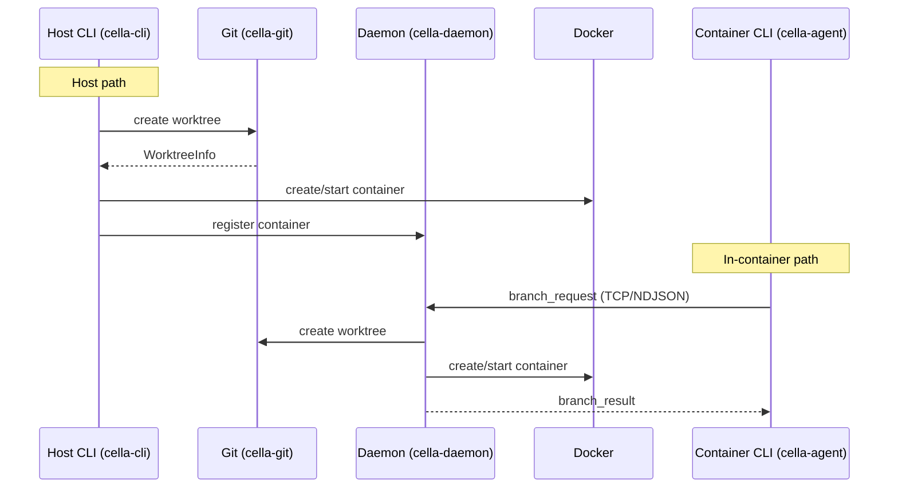

# Worktrees

The key words "MUST", "MUST NOT", "REQUIRED", "SHALL", "SHALL NOT", "SHOULD", "SHOULD NOT", "RECOMMENDED", "MAY", and "OPTIONAL" in this document are to be interpreted as described in [RFC 2119](https://www.ietf.org/rfc/rfc2119.txt).

## Summary

cella's worktree-container binding system maps each git worktree to its own dev container, enabling parallel branch development with isolated environments. A single devcontainer configuration produces multiple independent containers -- one per active branch -- with non-conflicting port assignments, separate filesystems, and full lifecycle management from either the host or any container.

The system spans four crates: `cella-git` (worktree creation, listing, removal, path computation), `cella-daemon` (task manager, worktree operation dispatch, port coordination), `cella-cli` (host-side command parsing and container pipeline), and `cella-agent` (in-container CLI mode with daemon delegation). See [architecture.md](architecture.md) for full crate responsibilities.

## Architecture

Two execution paths converge on the same container operations depending on where the command originates.



**Host path:** The CLI calls `cella-git` directly for worktree operations and the container backend for Docker operations. The daemon is contacted only for registration and port management.

**In-container path:** The agent CLI serializes every operation as an IPC message (see [ipc-protocol.md](ipc-protocol.md#worktree-operations)) and delegates to the daemon. The daemon has direct access to host-side git and Docker, executes the operation, and streams results back over the TCP control connection.

## Worktree-Container Binding

### Docker Labels

Each worktree container carries three labels that establish the binding between a git worktree and its container. These labels are set at container creation and are immutable for the container's lifetime.

| Label | Type | Description |
|---|---|---|
| `dev.cella.worktree` | `"true"` | Discriminator -- marks this container as a worktree-backed branch container |
| `dev.cella.branch` | string | The git branch name, preserved verbatim (e.g. `feature/auth/oauth2`) |
| `dev.cella.parent_repo` | string | Canonicalized absolute path to the parent repository root on the host |

The `worktree_labels()` function in `cella-backend` produces these labels. Implementations MUST call this function (or produce equivalent labels) when creating worktree containers.

Labels with the `dev.cella.*` and `devcontainer.*` prefixes are reserved. User-supplied `--label` flags MUST be rejected if they use a reserved prefix.

### Container Naming

Worktree containers follow the same naming scheme as primary containers: `cella-{name}-{hash}`, where `{name}` is derived from the devcontainer.json `name` field (falling back to the directory name) and `{hash}` is an 8-character SHA-256 hex digest of the canonicalized workspace path. Because each worktree occupies a distinct directory, the hash naturally differs per branch.

### Worktree Path Computation

Worktree directories are placed using a sibling pattern by default:

```
{repo_parent}/{repo_dir_name}-worktrees/{sanitized_branch}
```

Example: for a repo at `/Users/you/projects/myapp` and branch `fix/login-timeout`, the worktree path is:

```
/Users/you/projects/myapp-worktrees/fix-login-timeout-a1b2
```

If a `worktree_root` is configured, worktrees are placed under that root instead.

### Branch Name Sanitization

Branch names are converted to filesystem-safe directory names by `branch_to_dir_name()`:

1. Replace `/` with `-`
2. Collapse consecutive dashes
3. Trim leading and trailing dashes
4. Append a 4-character SHA-256 hex suffix of the original branch name

The hash suffix prevents collisions between branches that sanitize identically (e.g. `feature/auth` vs `feature-auth`).

**Backward compatibility:** If a legacy-format directory (without the hash suffix) already exists at the computed path, `worktree_path()` returns the legacy path. New worktrees always use the hash-suffixed format.

### Discovery

Worktree-container associations are discovered by:

1. **Git side:** `git worktree list --porcelain` enumerates all linked worktrees with their paths and branch names.
2. **Docker side:** Containers are located by workspace path via `find_container()` or by scanning `dev.cella.worktree` labels via `list_cella_containers()`.
3. **Join:** `cella list` correlates worktree entries with container state to produce a unified view showing branch, container name, state, path, and ports.

For linked worktrees, `parent_git_dir()` reads the `.git` file (not directory) to resolve the pointer back to the parent repository's `.git/worktrees/<name>` entry, enabling the daemon to locate the parent repo from inside any worktree.

## Branch Lifecycle

### Create (`cella branch <name>`)

Creation is a multi-step pipeline with automatic rollback on failure.

1. **Discover repository.** Resolve the git repository root from the current working directory.
2. **Acquire advisory lock.** `BranchLock::acquire()` takes a per-branch file lock under the repo's `.git` directory to prevent concurrent `cella branch` invocations for the same branch from racing.
3. **Resolve branch state.** Determine whether the branch is new, exists locally, or exists on a remote. For existing branches, the worktree checks out the existing ref rather than creating a new branch.
4. **Create worktree.** `cella_git::worktree::create()` calls `git worktree add` with the appropriate arguments. This operation is idempotent by default -- if the worktree already exists with the correct branch, it returns the existing `WorktreeInfo`.
5. **Remove leftover containers.** If a previous attempt left an orphaned container for this worktree path, deregister it from the daemon and remove it before proceeding.
6. **Run container pipeline.** Delegate to the standard `cella up` pipeline (see [container-lifecycle.md](container-lifecycle.md)) with worktree labels attached. For compose-backed projects, this builds the compose image, creates a standalone container, and connects it to the parent project's compose network.
7. **Execute post-creation command.** If `--exec <cmd>` was provided, run the command in the new container and forward its exit code.

**Rollback:** If step 6 fails and the worktree was freshly created (not pre-existing), the worktree directory is removed to leave a clean state.

**Idempotency:** By default, `cella branch` is idempotent. If the worktree already exists for the named branch, it ensures the container is running rather than erroring. The `--fail-if-exists` flag overrides this behavior.

### Start (`cella up --branch <name>`)

1. Resolve the branch name to its worktree path via `git worktree list`.
2. If the container exists but is stopped, start it.
3. If the container was removed but the worktree directory still exists, create a new container using the existing worktree as the workspace.
4. If neither worktree nor container exists, error with guidance to use `cella branch`.

The `--rebuild` flag rebuilds the container image before starting.

### Stop (`cella down --branch <name>`)

1. Resolve the branch name to its worktree path.
2. Check `shutdownAction` from the container's `dev.cella.shutdown_action` label. If set to `"none"`, refuse to stop unless `--force` is provided.
3. Deregister the container from the daemon (releases ports, tears down proxies).
4. Stop the container via the Docker API.
5. If `--rm` was provided:
   a. Remove the container (with volumes if `--volumes`).
   b. Clean up the per-workspace network if no other containers are attached.
   c. Remove the worktree directory and clean stale git records.
6. If no cella containers remain, stop the daemon.

### Remove

Container and worktree removal is triggered by `cella down --branch <name> --rm`. There is no separate remove command. The `--volumes` flag additionally removes Docker volumes associated with the container.

## Cross-Container Operations

### Exec (`cella exec <branch> -- <cmd>`)

Executes a command in another branch's container. The exit code from the command is forwarded to the caller. The agent CLI serializes this as an `exec_request` IPC message (see [ipc-protocol.md](ipc-protocol.md#worktree-operations)); the daemon resolves the branch to a container and runs `docker exec` with proper user, working directory, and environment context.

### Switch (`cella switch [branch]`)

Opens an interactive PTY-backed shell session in another branch's container.

**Host behavior:** If no branch name is provided, an interactive fuzzy picker displays all worktree branches with their container states. The selected container receives a shell session via `exec_interactive()` with full environment forwarding (probed env, label env, SSH agent, terminal variables).

**In-container behavior:** The branch name is required (no fuzzy picker). The agent sends a `switch_request` to the daemon, which responds with a `stream_ready` message containing a TCP port for raw TTY forwarding via the stream bridge.

Shell detection follows the standard resolution order: CLI flag, preferred shells from container labels, probing `/etc/shells` in the target container.

## Background Tasks

Background tasks enable running commands in worktree containers asynchronously. The task manager lives in `cella-daemon` and is keyed by branch name -- one active task per branch at a time.

### Dispatch (`cella task run <branch> -- <cmd>`)

1. The agent sends a `task_run_request` to the daemon.
2. The daemon resolves the branch to a running container.
3. If the branch does not exist, the daemon creates the worktree and container first (using the optional `--base` ref).
4. The daemon spawns `docker exec` with proper user/env/workdir context and begins capturing output.
5. A `task_run_result` is returned with the task ID (branch name) and container name.

### Monitoring (`cella task list`)

Returns all tracked tasks with their branch, container, status, command, and elapsed time. The daemon maintains this state in-memory via the `TaskManager`.

### Output Streaming (`cella task logs`)

Task output is captured in a 1 MB ring buffer (`TaskOutput`). Two access modes:

- **Snapshot** (`cella task logs <branch>`): Returns the current buffer contents.
- **Live stream** (`cella task logs -f <branch>`): Streams output as it arrives via a broadcast channel, then terminates when the task completes. Delivered as `task_logs_data` messages with a `done` flag on the final chunk.

### Lifecycle

| Status | Wire Value | Description |
|---|---|---|
| Running | `"running"` | Task is actively executing |
| Done | `"done"` | Task completed with exit code 0 |
| Failed | `"failed"` | Task completed with non-zero exit code |

**Wait** (`cella task wait <branch>`): Blocks until the task transitions out of `running`. Returns the exit code via `task_wait_result`. Implemented via a `tokio::sync::watch` channel so multiple waiters are supported without polling.

**Stop** (`cella task stop <branch>`): Aborts the task by canceling the tokio task handle and killing the `docker exec` child process via its recorded PID. Returns `task_stop_result` on completion.

### State Lifetime

Task state persists to SQLite via the daemon's state database. Task output is stored with configurable retention (default: keep last 10 MB per task). Older output is pruned on task completion. Completed tasks remain in the database for post-completion log retrieval.

Depends on: [Architecture § Daemon State Persistence](architecture.md#daemon-state-persistence)

## In-Container CLI Mode

When the `cella` binary detects it is running inside a container (via the `CELLA_CONTAINER_NAME` environment variable), it enters agent CLI mode. In this mode, every command is serialized as an IPC message and sent to the host daemon over the agent's TCP control connection.

The in-container CLI supports the full worktree command surface: `branch`, `list`, `down`, `up`, `exec`, `switch`, `prune`, and all `task` subcommands. See [ipc-protocol.md](ipc-protocol.md#worktree-operations) for the complete message catalog.

### Self-Target Protection

The in-container CLI MUST prevent a container from stopping itself. Before executing `cella down <branch>`, the agent:

1. Reads `CELLA_CONTAINER_NAME` from the environment.
2. Sends a `list_request` to the daemon to retrieve the worktree-container mapping.
3. If the target branch's container name matches `CELLA_CONTAINER_NAME`, rejects the operation with: `"Cannot stop the container you are inside."`.

This check runs client-side in the agent before the `down_request` is dispatched. The host CLI does not perform this check because host commands do not run inside containers.

### Command Differences

| Aspect | Host CLI | In-container CLI |
|---|---|---|
| Branch targeting | `--branch <name>` (optional flag, defaults to current workspace) | `<branch>` (required positional argument) |
| Fuzzy picker | Available for `switch` when branch omitted | Not available |
| `--volumes` flag | Supported on `down --rm` | Not supported |
| `--build-no-cache` | Supported on `up` | Not supported |
| `--force` on `prune` | Supported (skips confirmation) | Not supported |
| `--exec` on `branch` | Supported (synchronous) | Not supported |

## Prune Logic

Pruning removes worktrees whose branches are no longer needed, along with their associated containers.

### Candidate Selection

`build_prune_candidates()` determines which worktrees are eligible:

1. Run `git fetch --prune` to synchronize remote tracking refs.
2. List all linked worktrees (excluding the main worktree, which is never pruned).
3. Classify each branch:

| Reason | Wire Value | Condition |
|---|---|---|
| Merged | `"merged"` | Branch is fully merged into the default branch (via `git branch --merged`) |
| Gone | `"gone"` | Remote tracking ref was deleted (squash-merge or manual remote deletion) |
| Unmerged | `"unmerged"` | Neither merged nor gone -- only included when `--all` is specified |

Without `--all`, only `Merged` and `Gone` branches are candidates. The `--all` flag includes `Unmerged` branches.

### Execution Order

When `--dry-run` is specified, no destructive operations are performed -- the result describes what would be pruned.

For each candidate, the prune sequence is:

1. **Deregister container** from the daemon's management table (releases ports, tears down proxies).
2. **Remove container:**
   - Compose containers: `docker compose down` via the `PruneHooks::compose_down()` callback.
   - Non-compose containers: `docker stop` then `docker rm` via the backend.
3. **Clean up workspace network** -- remove the per-workspace `cella-net-*` Docker network if no other containers are attached.
4. **Remove worktree** via `cella_git::remove()` (`git worktree remove --force`).
5. **Delete local branch** via `cella_git::delete_branch()`. Failures are logged and tolerated (the branch may already be gone).

After all candidates are processed:

6. **Prune stale git records** via `git worktree prune`.
7. **Stop daemon** if no cella containers remain.

### Hooks

The `PruneHooks` trait bridges the orchestrator to host-side operations it cannot own directly (daemon IPC, compose CLI). The CLI provides the real implementation; the daemon or test harnesses provide stubs.

```rust
trait PruneHooks: Send + Sync {
    fn deregister_container(&self, container: &ContainerInfo) -> Future<()>;
    fn compose_down(&self, project_name: &str) -> Future<Result<(), String>>;
    fn cleanup_daemon(&self);
}
```

## Port Allocation

Each worktree container receives independent port allocations managed by the daemon's `PortManager` and the `PortAllocationTable` in `cella-port`. See [port-forwarding guide](../guides/port-forwarding.md) for user-facing port forwarding documentation.

### Allocation Strategy

1. **Native port first.** The first container to expose port N gets host port N.
2. **Increment on conflict.** If port N is already allocated (or unavailable at the OS level), scan upward from N+1 until a free port is found, wrapping around from `range_start` if the end of the range is reached.
3. **OS-level verification.** The daemon's port checker performs a synchronous TCP bind probe to confirm the host port is actually free before committing the allocation.

The allocation range defaults to 1024--65535. Ports below 1024 are excluded to avoid privileged port conflicts.

### Per-Worktree Isolation

Because each worktree container registers independently with the daemon, port allocations are naturally isolated:

- The main container may hold port 3000 -> 3000.
- A worktree container exposing the same internal port 3000 receives 3000 -> 3001 (or the next available port).
- `cella list` displays the host port mapping for each container.

The `requireLocalPort` attribute from `devcontainer.json` `portsAttributes` causes allocation to fail if the exact host port is unavailable, rather than remapping.

### Release

Ports are released when a container is deregistered from the daemon (via `release_container()` on the allocation table). This happens during `cella down`, `cella prune`, and daemon shutdown.

### Hostname Routing

When hostname-based port forwarding is active (see [Port Forwarding](port-forwarding.md)), each worktree container gets unique hostnames derived from its branch name:

```
{port}.{branch}.{project}.localhost
```

Branch names are sanitized for DNS compatibility: `/`, `_`, `.` replaced with `-`, collapsed, trimmed, truncated to 63 characters, lowercased.

## Configuration Reference

Worktree behavior is controlled through the standard cella configuration layers (see [configuration guide](../guides/configuration.md)).

| Setting | Location | Description |
|---|---|---|
| `worktree_root` | `cella_git::worktree_path()` parameter | Override the default sibling directory pattern for worktree placement |
| `shutdownAction` | `devcontainer.json` | Controls whether `cella down` requires `--force` when set to `"none"` |
| `portsAttributes` | `devcontainer.json` | Per-port forwarding attributes (applies independently to each worktree container) |
| `forwardPorts` | `devcontainer.json` | Ports pre-allocated at container registration |

Worktree containers inherit the same `devcontainer.json` configuration as the parent container. Per-worktree configuration overrides are not supported -- all containers for a repository share the same devcontainer definition.

## Error Handling

| Error | Cause | Resolution |
|---|---|---|
| `WorktreeAlreadyExists` | Worktree directory exists at the computed path | Default: idempotent return. With `--fail-if-exists`: error |
| `BranchCheckedOut` | Branch is already checked out in another worktree | Use the existing worktree or switch to a different branch |
| `WorktreeNotFound` | Path is not a recognized git worktree | Verify the path or use `cella branch` to create |
| Self-target rejection | `cella down <branch>` targets the container the CLI is running inside | Run the command from the host or a different container |
| No worktree for `up` | `cella up --branch <name>` when no worktree exists | Use `cella branch <name>` to create the worktree first |
| Advisory lock contention | Concurrent `cella branch` for the same branch name | Wait and retry -- the lock serializes concurrent operations |
| Compose network absent | Worktree container created before parent compose project | Run `cella up` first to create the parent compose network |
| Daemon unavailable | In-container commands when daemon is not running | Restart the daemon via `cella up` on the host |

Git command failures are retried with exponential backoff when caused by lock contention (`.git/index.lock`). Other git errors propagate immediately.

## Task Dependencies

The task system supports dependency graphs between background tasks. `cella task run <branch-b> --after <branch-a>` sequences operations: the `TaskManager` tracks predecessor-successor relationships and defers dispatch until dependencies complete.

## Task Timeout

Background tasks accept an optional `--timeout` flag specifying maximum runtime in seconds. When a task exceeds its timeout, it is stopped as if `cella task stop` were invoked.

## Extensions

### Worktree Templates

Worktree containers MAY support per-branch devcontainer overrides via a template mechanism. A `worktree_template` configuration key would specify a devcontainer.json variant applied to new worktrees, enabling branch-specific resource limits, environment variables, or feature sets without modifying the shared configuration.

### Shared Volumes

Worktree containers within the same repository MAY share read-only volumes for expensive build artifacts (dependency caches, compiled intermediates). A `shared_volumes` configuration would declare named volumes mounted across all worktree containers for the repository, reducing duplication without sacrificing isolation.

## Limitations

- **One task per branch.** The task manager keys on branch name, so only one background task can run per worktree at a time.
- **Shared devcontainer config.** All worktree containers for a repository use the same `devcontainer.json`. Per-branch configuration requires the worktree templates extension.
