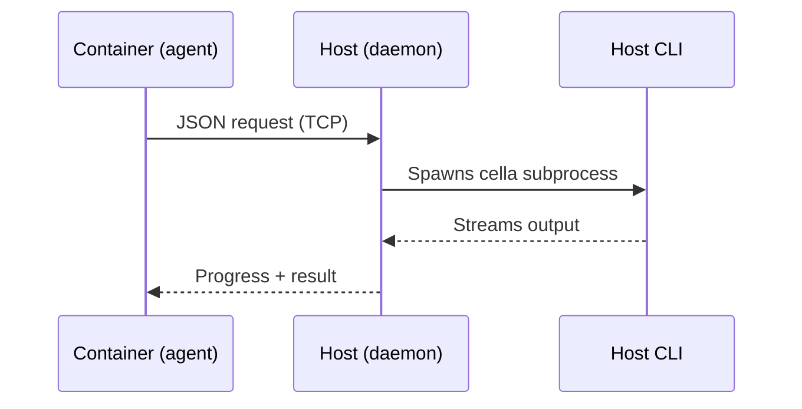

# Worktrees

Every git worktree gets its own dev container. Create a branch, get an isolated environment — same devcontainer config, separate filesystem, independent ports. Manage the full lifecycle from the host or from inside any container.

## Quick Reference

### Host

| Command | Description |
|---------|-------------|
| `$ cella branch <name> [--base <ref>]` | Create a worktree-backed branch with its own container |
| `$ cella down --branch <name> [--rm]` | Stop (or remove) a worktree container |
| `$ cella up --branch <name>` | Start or restart a worktree container |
| `$ cella prune [--all] [--dry-run]` | Remove stale worktrees and their containers |

### Inside a Container

| Command | Description |
|---------|-------------|
| `container$ cella branch <name> [--base <ref>]` | Create a worktree-backed branch with its own container |
| `container$ cella list` | List all worktree branches with status |
| `container$ cella down <branch> [--rm]` | Stop (or remove) another branch's container |
| `container$ cella up <branch>` | Start or restart another branch's container |
| `container$ cella exec <branch> -- <cmd...>` | Run a command in another branch's container |
| `container$ cella switch <branch>` | Open an interactive shell in another branch's container |
| `container$ cella prune [--all] [--dry-run]` | Remove stale worktrees and their containers |
| `container$ cella task run <branch> -- <cmd...>` | Run a background task in a branch's container |
| `container$ cella task list` | List background tasks |
| `container$ cella task logs [-f] <branch>` | View or stream task output |
| `container$ cella task wait <branch>` | Wait for a task to complete |
| `container$ cella task stop <branch>` | Stop a running task |

> On the host, `--branch` is an optional targeting flag — `cella down` and `cella up` default to the current workspace. Inside a container there is no implicit workspace, so the branch name is always a required positional argument.

## Getting Started

Start a dev container as usual:

```sh
$ cella up
```

Create a worktree-backed branch for a bugfix while your main work continues:

```sh
$ cella branch fix/login-timeout --base main
Creating worktree for 'fix/login-timeout'...
Building container...
Ready: fix/login-timeout (container: cella-myapp-a3b4c5d6)
```

Check what's running:

```sh
$ cella list
NAME                    ID           STATE    BRANCH                  WORKSPACE                    PORTS   AGE
cella-myapp-5fcac63f    8e3d...      running  main                    /Users/you/projects/myapp            2h
cella-myapp-a3b4c5d6    f21e...      running  fix/login-timeout       /Users/you/projects/myapp-worktrees/fix-login-timeout   5m
```

Run a command in the new branch's container:

```sh
# From the host
$ cella exec --branch fix/login-timeout -- cargo test

# From inside another container
container$ cella exec fix/login-timeout -- cargo test
```

Stop the branch when you're done working on it:

```sh
$ cella down --branch fix/login-timeout
Stopped branch 'fix/login-timeout'
```

Restart it later:

```sh
$ cella up --branch fix/login-timeout
Ready: fix/login-timeout (container: cella-myapp-a3b4c5d6)
```

After merging, clean up:

```sh
$ cella prune
Removing fix/login-timeout (merged into main)...
Pruned 1 worktree
```

## Command Reference

### `cella branch`

Create a new worktree-backed branch with its own container.

```sh
# Host
$ cella branch <name> [--base <ref>] [--exec <cmd>]

# In-container
container$ cella branch <name> [--base <ref>]
```

| Flag | Description |
|------|-------------|
| `--base <ref>` | Base ref to branch from (default: HEAD) |
| `--exec <cmd>` | Command to run in the new container after creation (host only) |

If the branch already exists locally or on a remote, cella checks it out into a new worktree instead of creating a new branch. On failure, the worktree is rolled back automatically.

### `cella list`

List all worktree branches and their container status. Available from inside containers.

```sh
container$ cella list
BRANCH               STATE      CONTAINER                      PATH
main               * running    cella-myapp-5fcac63f           /Users/you/projects/myapp
fix/login-timeout    running    cella-myapp-a3b4c5d6           /Users/you/projects/myapp-worktrees/fix-login-timeout
feat/dashboard       exited     cella-myapp-7e8f9a0b           /Users/you/projects/myapp-worktrees/feat-dashboard
```

The `*` marks the branch you're currently inside.

### `cella down`

Stop a worktree branch's container.

```sh
# Host
$ cella down --branch <name> [--rm] [--volumes] [--force]

# In-container
container$ cella down <branch> [--rm] [--force]
```

| Flag | Description |
|------|-------------|
| `--rm` | Remove the container and worktree directory after stopping |
| `--volumes` | Also remove associated volumes (requires `--rm`, host only) |
| `--force` | Force stop even when `shutdownAction` is `"none"` |

Without `--rm`, the container is stopped but preserved — restart it with `cella up`. You cannot stop the container you are currently inside.

### `cella up`

Start or restart a stopped worktree container.

```sh
# Host
$ cella up --branch <name> [--rebuild] [--build-no-cache]

# In-container
container$ cella up <branch> [--rebuild]
```

| Flag | Description |
|------|-------------|
| `--rebuild` | Rebuild the container image before starting |
| `--build-no-cache` | Skip Docker build cache (host only) |

If the container was removed but the worktree still exists, `cella up` creates a new container. If no worktree exists, it errors — use `cella branch` to create one.

### `cella exec`

Run a command in another branch's container.

```sh
container$ cella exec <branch> -- <cmd...>
```

Use `exec` for scripted or automated commands. The exit code from the command is forwarded.

### `cella switch`

Open an interactive shell in another branch's container.

```sh
container$ cella switch <branch>
```

Use `switch` for interactive exploration — it gives you a full PTY-backed shell session in the target container. For scripted use, prefer `exec`.

### `cella prune`

Remove worktrees and their containers.

```sh
# Host
$ cella prune [--all] [--dry-run] [--force]

# In-container
container$ cella prune [--all] [--dry-run]
```

| Flag | Description |
|------|-------------|
| `--dry-run` | Show what would be removed without doing it |
| `--all` | Include unmerged worktrees (not just merged ones) |
| `--force` | Skip confirmation prompt (host only) |

By default, only worktrees for branches that have been merged into the default branch are candidates.

> [!WARNING]
> `--all` removes worktrees for **unmerged** branches. Use `--dry-run` first to preview what will be removed.

## Background Tasks

Run commands in other worktree containers as background tasks. Monitor progress, stream logs, and collect results — all from inside your current container.

### Dispatch

```sh
container$ cella task run fix/login-timeout -- cargo test --workspace
Task 'fix/login-timeout' started in container cella-myapp-a3b4c5d6
```

### Monitor

```sh
container$ cella task list
BRANCH               STATUS     TIME     COMMAND
fix/login-timeout    running    12s      cargo test --workspace
feat/dashboard       done       45s      cargo clippy --workspace
```

### Stream output

```sh
# Snapshot of output so far
container$ cella task logs fix/login-timeout

# Live stream (follows until task completes)
container$ cella task logs -f fix/login-timeout
```

### Wait for completion

```sh
container$ cella task wait fix/login-timeout
```

Blocks until the task finishes. Useful in scripts that need to collect results.

### Stop a task

```sh
container$ cella task stop fix/login-timeout
```

### Parallel workflow example

Run tests and linting in parallel across two worktree branches:

```sh
# Dispatch both tasks
container$ cella task run feat/auth -- cargo test --workspace
container$ cella task run feat/ui -- cargo clippy --workspace -- -D warnings

# Monitor progress
container$ cella task list

# Wait for both to finish
container$ cella task wait feat/auth
container$ cella task wait feat/ui

# Check results
container$ cella task logs feat/auth
container$ cella task logs feat/ui
```

The host equivalent for fire-and-forget execution is `cella branch --exec <cmd>`, which creates the branch and runs a command in one step.

## How It Works

Inside a container, the `cella` binary is a lightweight agent that delegates operations to the host via the cella daemon. The daemon runs the actual host CLI commands and streams results back.



The daemon starts automatically with `cella up` and manages all registered containers. In-container commands require the daemon to be running.

## Troubleshooting

**"Cannot stop the container you are inside"**

Self-target protection. Stop your own container from the host (`$ cella down`) or from another container.

**"No worktree for branch 'X'. Use `cella branch X` to create one."**

`cella up` restarts existing worktrees — it doesn't create new ones. Use `cella branch` first.

**Container was removed but worktree still exists**

`cella up --branch <name>` creates a new container for the existing worktree. No need to re-create the branch.

**After a reboot, all containers are stopped**

Restart each branch you need:

```sh
$ cella up --branch feat/auth
$ cella up --branch feat/ui
```

**In-container commands hang or time out**

The daemon may have crashed. Restart it:

```sh
$ cella daemon stop
$ cella up  # restarts daemon automatically
```
